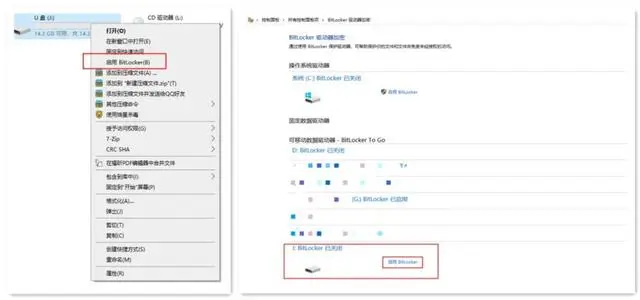

# Bitlocker加密与解密

## 介绍

BitLocker加密是Windows的一种数据保护功能，主要用于解决由于计算机设备的物理丢失导致的数据失窃或恶意泄漏，能够同时支持FAT和NTFS两种格式，可以加密电脑的整个系统分区，也可以加密可移动的便携存储设备，如U盘和移动硬盘等。

BitLocker使用AES（高级加密标准/Advanced Encryption Standard）128位或256位的加密算法进行加密，其加密的安全可靠性得到了保证，通常情况下，只要密码有足够强度，这种加密就很难被破解。 **因此，当取证中遇到涉案的电脑、U盘等被Bitlocker加密的情况，破解加密获取涉案数据就变得尤为重要。**

## 注意

1. 家庭版无此功能  
2. 分区可用空间会变小 

## 加密过程

1. 对一个磁盘进行BitLocker加密的方法很简单，打开资源管理器，在想要加密的磁盘分区上点击右键，选择“启用BitLocker”即可。（在“控制面板”-“系统和安全”-“BitLocker驱动器加密”里也可以启用和管理加密。）

2. 点击“启用BitLocker”之后，在新弹出的窗口中设置加密驱动器密码，输入完成后点“下一步”，然后选择保存恢复密钥的位置。
   
3. 一般来说，恢复密钥存放在USB闪存驱动器或打印出来安全系数更高，因为这样操作的话，加密驱动器与恢复密钥分离保管，安全性更好。不过实际情况中，有些时候为了省事，会将恢复密钥保存在硬盘中，这也给了我们解密的可能性。
   
4. 然后BitLocker就开始对整个驱动器进行加密，BitLocker对于驱动器的加密解密耗时较长，用户需要等待相当长的时间。加密完成之后，可以看到原先的磁盘图标上多了一把锁，此时表示驱动器已经加密完成。加密后，磁盘驱动器上会显示一把没有上的锁，这时驱动器是可以打开的。
   
5. 我们需要重启电脑，驱动器锁会彻底锁上，需要输入密码或者验证密钥才能打开。
   

## 取证解密思路分析[¶](https://www.forensics-wiki.com/Windows取证/第7节：Bitlocker加解密/#_4)

**思路1：通过密码查找解密**

从所有涉案介质中获取与密码相关的数据，将这些数据整理成字典后，再通过相应的解密工具解密或暴力破解，因为此方法存在很大的不确定性，所以视情况选择。

**思路2：通过恢复密钥解密**

- 通过BitLocker加密的过程，我们可以知道在加密设置时会产生恢复密钥，通常大家会以“保存到文件”的方式存放恢复密钥（一般不会选择注册Microsoft账户，而打印又容易丢失，所以更多时候选择保存到文件），这种方式恢复密钥会以TXT文件的方式存放到存储介质中；
- TXT文本数据在介质中存放时，底层是以明文的方式存放的，就算是TXT被删除，只要底层数据没有被覆盖，我们就可以通过底层关键字查找、正则匹配的方式找到恢复密钥进行解密。
  

**思路3：其它**

- 在一些案件中，通过特定的涉案介质如：加密的U盘或移动硬盘，可以在相关的电脑上启动自动解锁功能，我们只需将涉案介质接到相应的电脑上即可解锁加密介质； 
- 从解密过Bitlocker加密的电脑内存镜像中提取BitLocker密钥，此方法不做描述，可自行查找相应资料；