> **原文作者：** [WXjzc](https://www.cnblogs.com/WXjzc)
>
> **原文链接：** https://www.cnblogs.com/WXjzc/p/18361882

在进行网站分析时的一大重点就是如何登录到管理后台，这就需要我们去绕过/获取管理员的密码，在php、nodejs等站点中就很简单，我们只需要找到目标逻辑所在的代码，直接修改代码就可以实现目的。但是当我们遇到java类站点时，没有办法很轻松地修改代码，只能去分析密文的算法，从而自己生成对应的密文，接下来我就分享一下我在处理java网站绕密时的一些方式。（我默认你已经找到密码的判断逻辑）

###  1.日志类

这个是最简单的方式，部分开发者在开发时，习惯在终端打印内容，此时可能会输出密码对应的密文，或是数据库中存储的密文解密后的明文（部分站点密文是可解密的，很不安全），对于这样的站点，只需要在终端中找到对应的日志即可

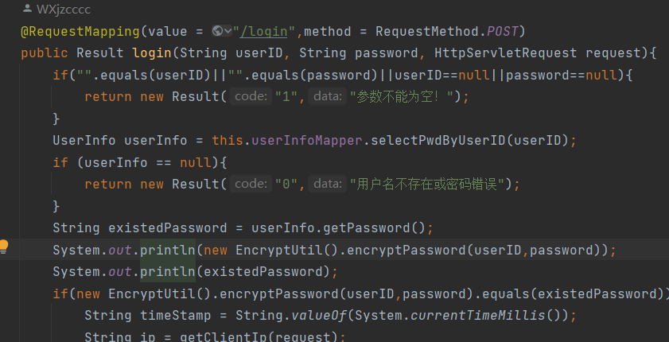

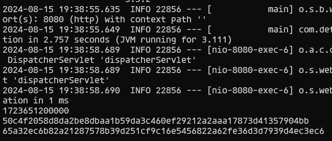

又或者是程序本身没有输出相关的日志，但是在判断密码是否正确时，采用的是数据库判断，即在数据库中查询是否存在符合账号密文都符合输入的用户，就像这样

对于此类判断方式，我们可以监听数据库的日志，例如mysql就是查看general_log，会完整记录查询内容，直接获得输入对应的密文

### 2.分析算法/模拟执行

这一个方法呢，就是我们可以很轻松地通过分析代码，得出密文的生成方式，或是直接将密文生成的代码扣出来，补全环境后运行

这里可以看到，密文的生成其实就是sha256(salt+md5(salt+password))

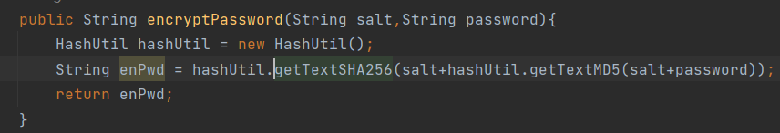

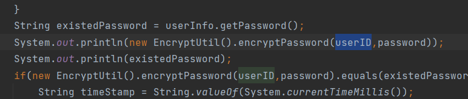

以123456为例，密文就是1dd4d822b0f29eadef8cfce4525a52b04194a6af9fdea481153711b13dbe5be

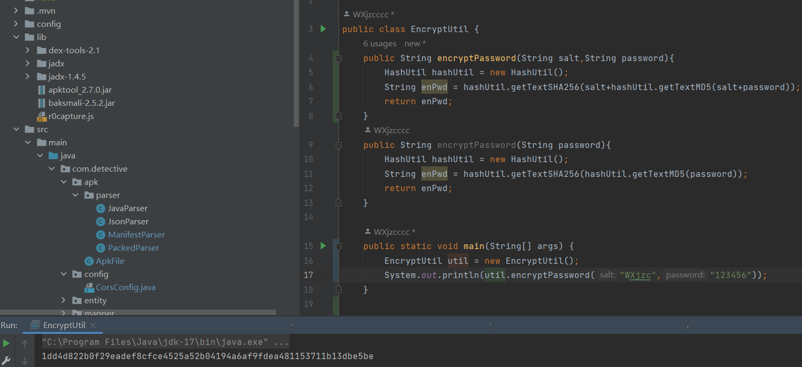

### 3.修改代码

修改java的代码比较困难，我们需要补全环境，然后编译出class文件，替换jar包中的文件，就像下面这样修改代码，我这边是有源码，所以直接在源码上修改，idea中运行后会自动编译出class文件，我用这个文件去替换

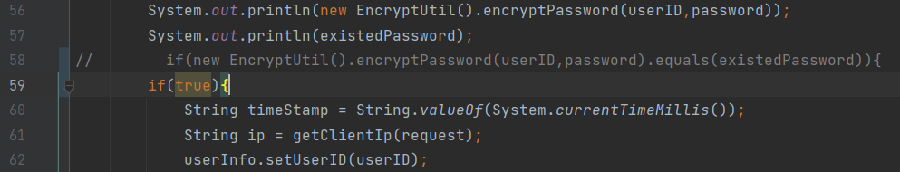

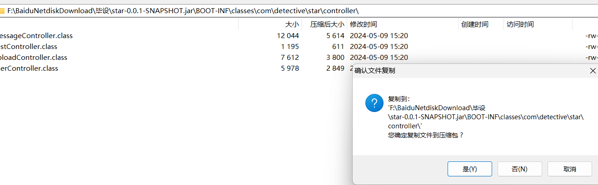

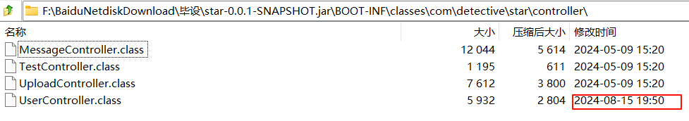

此时就可以任意密码登录成功

验证权限都是没问题的

但是这个方式的难点就在于，我们需要补全目标类的所有依赖和包，但是在一般的项目中，这个包通常都是巨大的，很难完全补全，更别说部分逻辑jadx还无法反编译出来，导致反编译出来的代码无法编译，这个方式基本都是碰运气，用的也是最少的

 4.利用javaagent直接打印

利用javaagent技术，对目标方法进行插柱，打印出方法的参数和返回值，这个方法只需要我们可以找到目标方法就可以无脑运行，不必要分析里面的逻辑，也无须修改代码

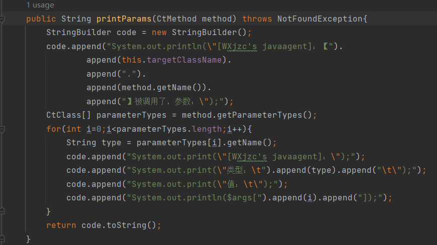

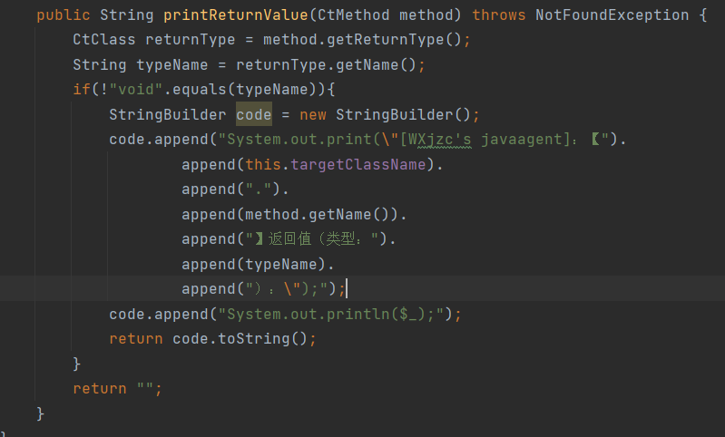

这样我们就可以直接拿到对应的密文

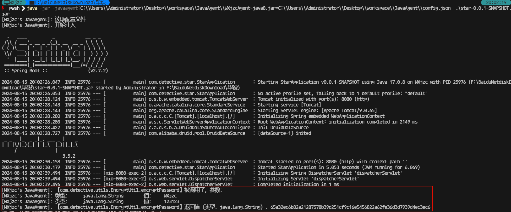

甚至还可以修改返回值，可操作性一下子就高了不少

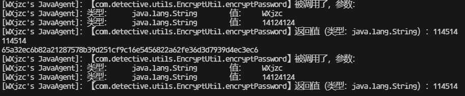

以上4种方式我个人推荐排序的话就是1->4->2->3，别人已经弄好的就是最简单的