> **原文作者：** [WXjzc](https://www.cnblogs.com/WXjzc)
>
> **原文链接：** https://www.cnblogs.com/WXjzc/p/18180161

最近宝塔的数据架构改了，部分数据被加密，于是我就一通分析，发现这个版本更新了架构，并且对密码的加解密是通过调用二进制依赖进行实现的

我这里就以mysql的密码为例，在新版本中，mysql的密码主要会出现在3个地方，涉及2个sqlite文件（另外，宝塔的主要数据存储数据库default.db的文件路径也改到了/www/server/panel/data/db/default.db，但其中很多部分都被摘除，另建数据库保存）

一般用户的账号密码（database.db）

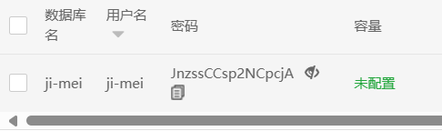

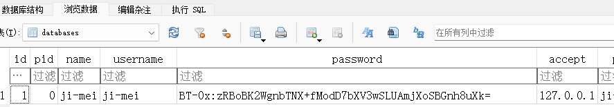

远程数据库的账号密码（database.db）

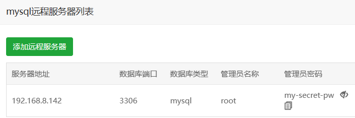

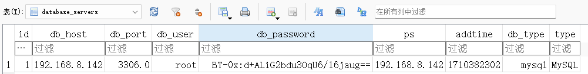

本地数据库root密码（panel.db）

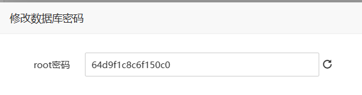

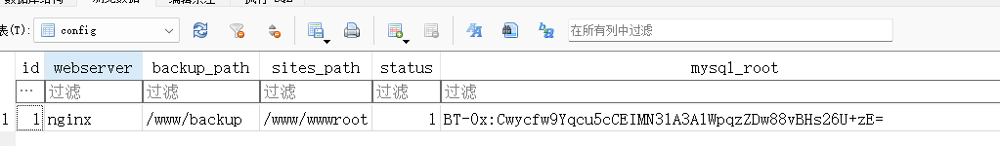

可以看到很明显的特征BT-0x:，后面跟了一段密文

通过不断的跟代码，可以找到python中的解密函数

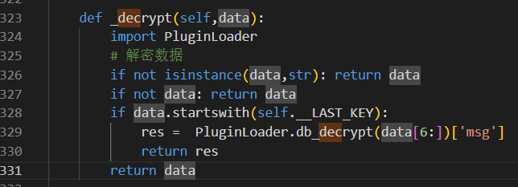

这里导入了一个模块PluginLoader，可以找到是一个so，也就是说数据的加解密被放到了二进制程序中

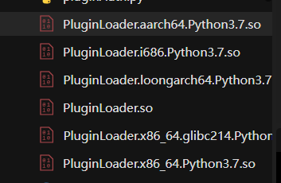

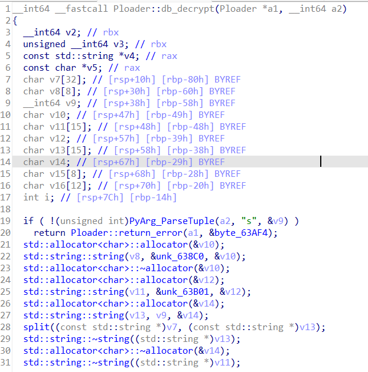

可以在db_decrypt中找到解密代码

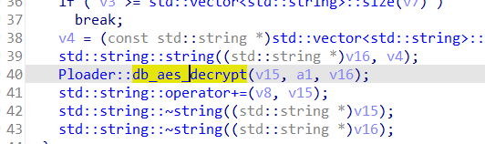

很明显可以看到key和iv的获取方式

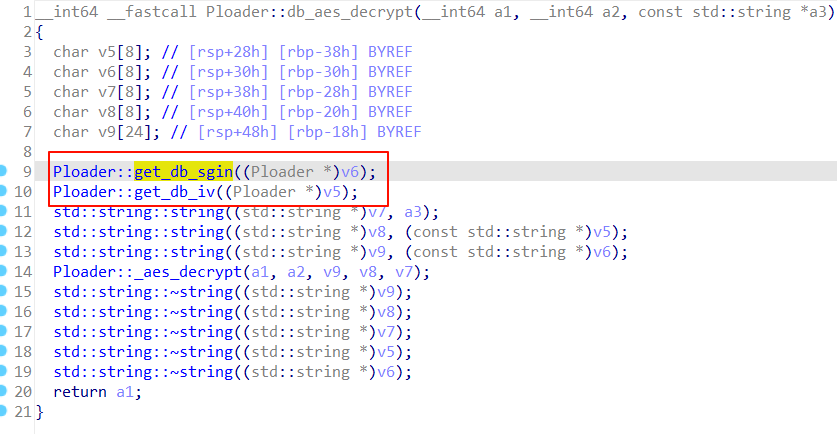

可以看到key就是一眼顶针，取偶数位的字符，得到key为3P+_lN3+jPW6Kgt#

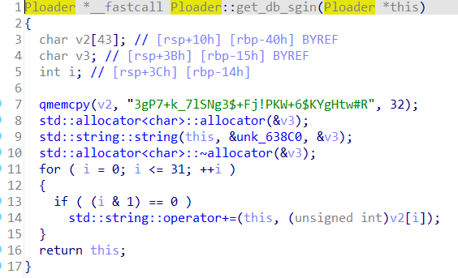

iv的情况就比较复杂，需要先判断是否存在/www/server/panel/data/div.pl文件，如果不存在，还需要从数据库中读取div再写入文件（所以div.pl和db目录或许是检测这个版本较好的方式）

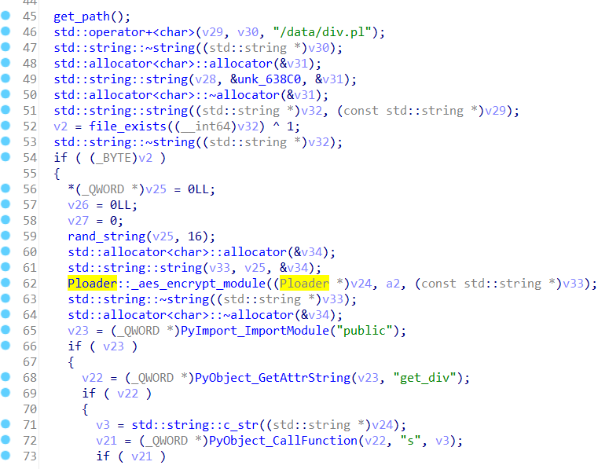

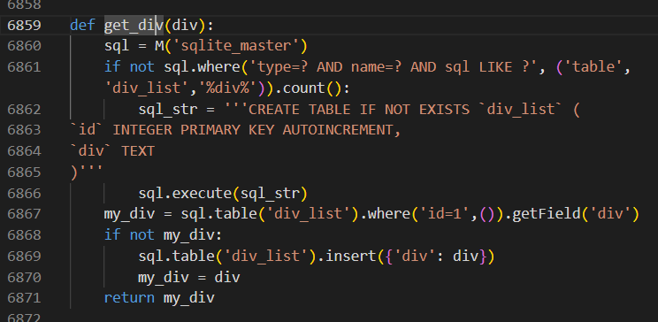

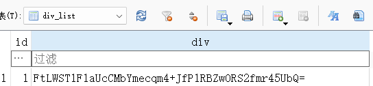

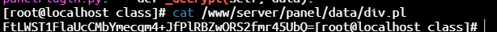

实际上，如果没有div.pl，还会有个默认的iv（但是前面无论如何都会保证div.pl存在，所以这里保留的iv4HpOz4pT^4Hh-Lfl应该永远用不上）

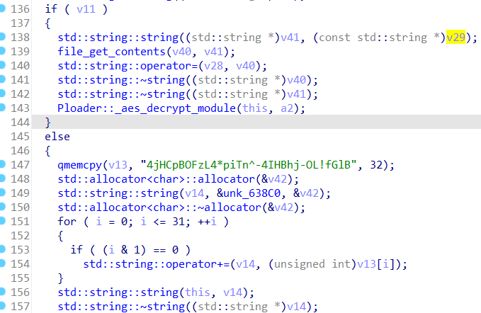

很明显可以看到div是加密的，仍需要解密，所以跟进_aes_decrypt_module函数看后续操作

很明显用_get_sgin_key函数获得了解密div所需要的key和iv

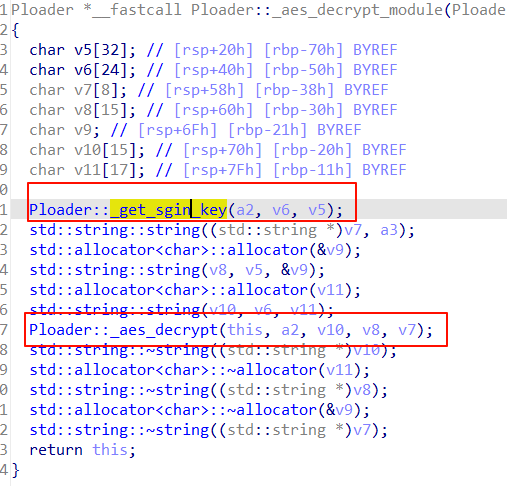

根据逻辑来看，就是把v4劈开，分成了key和iv

解一下

此时可以解密div

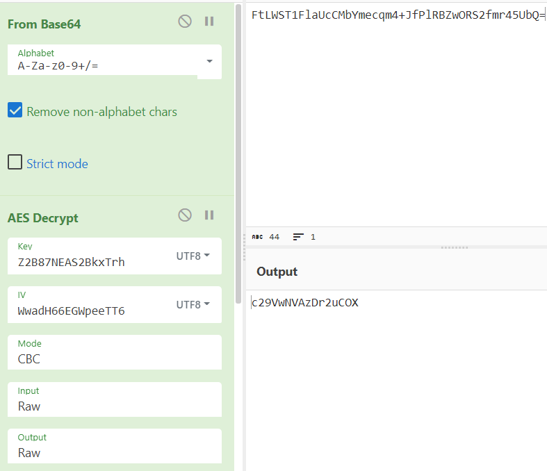

随后可以用解密后的iv去解密一开始的密文

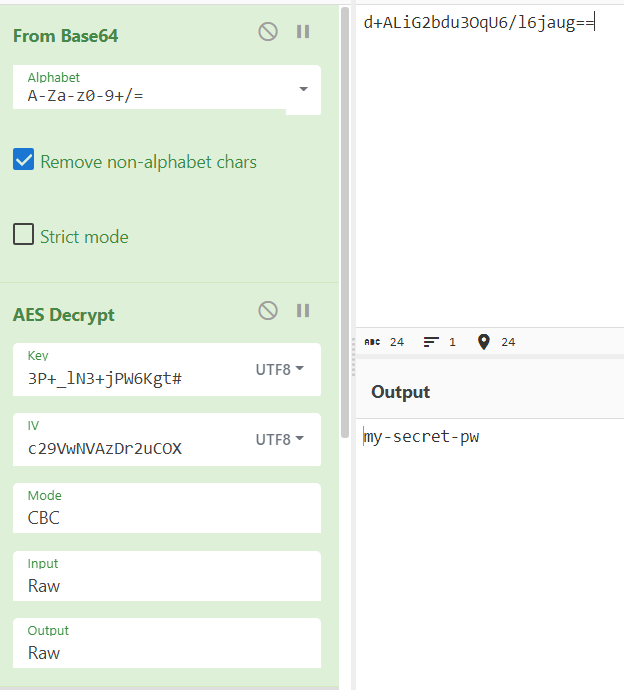

成功解密

