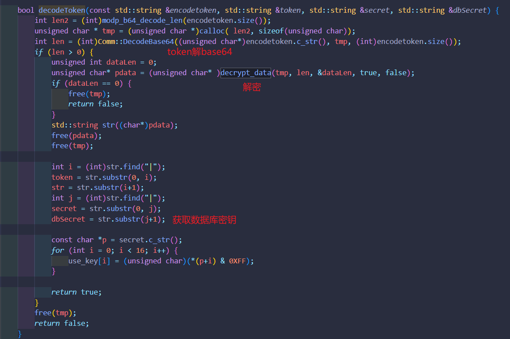
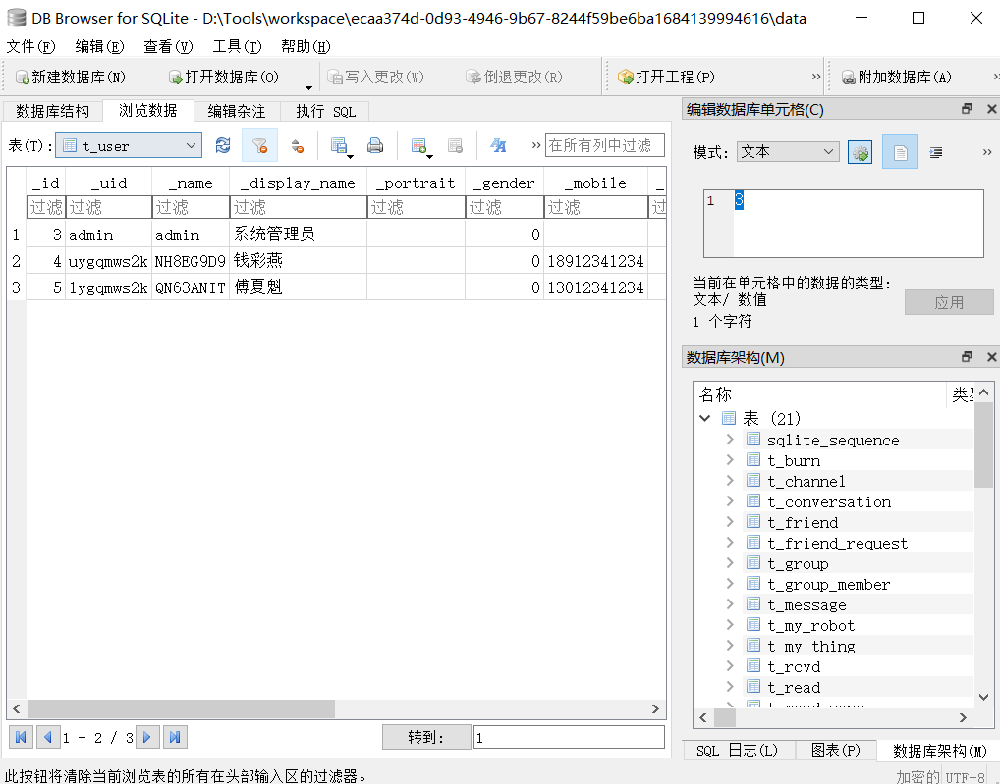
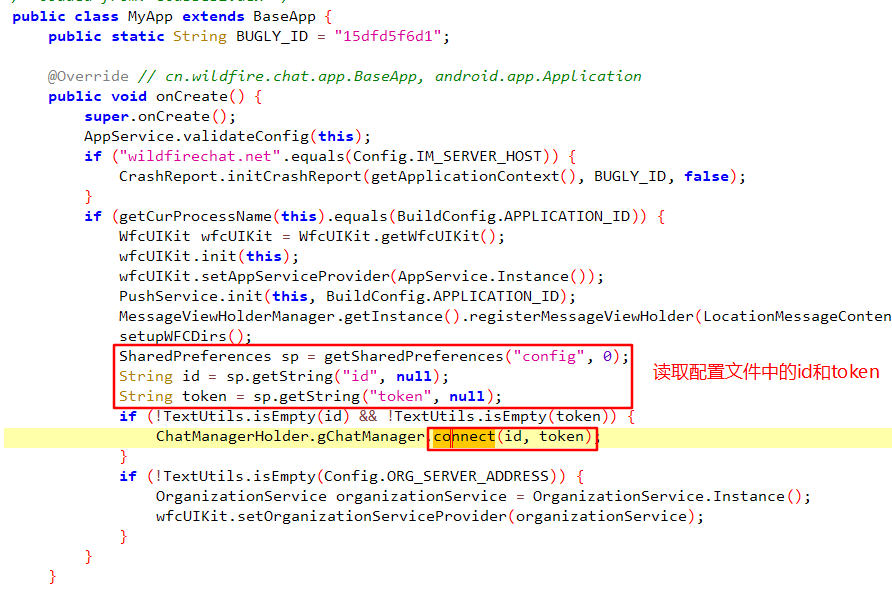
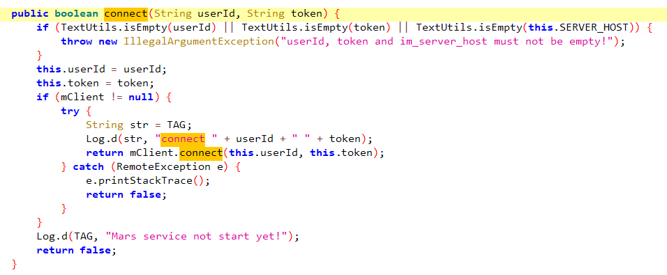
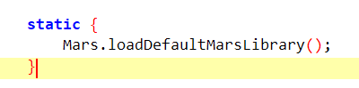

> 转自：WXjzc-再战野火IM  
>原文链接：https://www.cnblogs.com/WXjzc/p/17770436.html

> 起因是在盘古石决赛时，有一个手机取证的APP是基于野火IM进行的开发。当时未按照正常方式解出，没找出数据库密钥。
> 后续又在以前的某一次全国比武中发现了野火IM的考点，直接问密码如何来。
> 当时使用frida来做，但是发现要处理多进程，就暂时搁置了。
> 近期看到弘连的取证实录中详细介绍了如何获取密钥，参考学习。
> 不得不说弘连在技术分享这块，做的是真的好，不像其他厂商喜欢藏着掖着。

一开始复盘时，考虑到野火IM是开源产品，因此在GitHub中查找，但并未找到其so的源码。这次参考实录中的内容，得知源码的开源地址为[野火开源协议栈](https://github.com/LeonDevLifeLog/proto)
因此先来源码分析，后面用frida来做。不过通过正面的源码分析后，已经可以知道密钥的生成方式，frida那里是用于往后遇到其他闭源产品时，能通过frida去处理。

## 源码

克隆源码仓库并阅读，在`proto`目录下可以看到`MessageDB.h`，往src目录翻，可以看到`MessageDB.cc`，在这个代码文件中，可以看到生成sql语句的代码


而`db`则由`DB2`这个类创建


`DB2::Open`中传入数据库密钥


搜索调用，能发现是在`business.cc`中打开了数据库


在`setAuthInfo`函数中，调用`decodeToken`函数来解密token并生成密钥


`decodeToken`中，先对token解base64，随后调用`decrypt_data`进行解密，该函数的定义在`libemqtt.cc`中




很明显用了aes来解密，key是常量`0x00,0x11,0x22,0x33,0x44,0x55,0x66,0x77,0x78,0x79,0x7A,0x7B,0x7C,0x7D,0x7E,0x7F`


又可以看到iv的生成方式，由于解密传入的`uiKeyLen`就是key的长度，根据生成方式，iv与key相同


接下来需要获取token，逆一下apk，很容易就能找到位置，在app的data目录下的`shared_prefs/config.xml`中


得到token为`800MdqKouy0Fb557abV+xAP112wQHm22bTVrr+VwQsh555Q+OCKgUQanxCX2HgAUbztEbl+RduchQfy8Msi14v8+6BATZWCIBmo3W9av2u8v4+ovfLh0mcKSDZomvFzUhYWt53KHWXp4bWmdVtG3kCKGOtsKmZDuAA3rnVy5pUA=`

cyberchef直接解，按照生成方式，解密后的内容以`|`区分，密钥为最后一个，即`62a9e3e2-7ffc-42e1-aa65-d6046e009d6b`


尝试解密数据库，`DB Browser for SQLite`使用`SQLCipher 4`的默认参数即可解密




## 逆向

读取`id`和`token`传入`connect`，读取的配置文件是`sharedPreferences`目录下的`config.xml`



不断跟进`connect`方法，在`cn.wildfirechat.remote.ChatManager`类中



在`cn.wildfirechat.client.IRemoteClient`接口中


它的内部类`Stub`的内部类`Proxy`中有实现


跟踪`Stub`，最终将`id`和`token`传入`initProto`方法


将token传入了`setAuthInfo`，是native层的方法，这就和之前源码分析那里对上了


找到加载的so，通过查看exports中是否存在`setAuthInfo`的方式确定待分析的so为`libabab.so`




在这里正向看很难看出什么东西，慢慢跟进`sub_ADD80`


可以看到一些字符串，显然是通过`sub_30830`和源码中的函数产生了某些关联，可以直接查它的引用


能找到`Open`函数了，进一步通过上面的`open db`来找函数，hook这些函数的参数，就能找到密钥


由于应用采用多进程的方式，网上找个脚本来跑，稍微改一下，能找到`libjavacore.so`去加载了`libabab.so`，但是没办法搞到`libabab.so`的module对象，并且监听数据库也没有监听到打开记录，后来发现是模拟器原因，在模拟器中没法找到。。真机中就可以找到了


```python
# -*- coding: utf-8 -*-
import codecs
import frida
import sys
import threading

device = frida.get_device_manager().enumerate_devices()[-1]
print(device)

pending = []
sessions = []
scripts = []
event = threading.Event()

jscode = """
Java.perform(function () {
    Interceptor.attach(Module.findExportByName(null, 'open'), {
  onEnter: function (args) {
    var path = Memory.readUtf8String(args[0]);
    console.log(Process.findModuleByAddress(this.returnAddress).name,path)
  }
});
});
"""

def on_spawned(spawn):
    print('on_spawned:', spawn)
    pending.append(spawn)
    event.set()

def spawn_added(spawn):
    print('spawn_added:', spawn)
    event.set()
    if(spawn.identifier.startswith('cn.wildfirechat.chat')):
        session = device.attach(spawn.pid)
        script = session.create_script(jscode)
        script.on('message', on_message)
        script.load()
        device.resume(spawn.pid)
        
def spawn_removed(spawn):
    print('spawn_added:', spawn)
    event.set()

def on_message(spawn, message, data):
    print('on_message:', spawn, message, data)
    
def on_message(message, data):
    if message['type'] == 'send':
        print("[*] {0}".format(message['payload']))
    else:
        print(message)

device.on('spawn-added', spawn_added)
device.on('spawn-removed', spawn_removed)
device.on('child-added', on_spawned)
device.on('child-removed', on_spawned)
device.on('process-crashed', on_spawned)
device.on('output', on_spawned)
device.on('uninjected', on_spawned)
device.on('lost', on_spawned)
device.enable_spawn_gating()
event = threading.Event()
print('Enabled spawn gating')

pid = device.spawn(["cn.wildfirechat.chat"])


session = device.attach(pid)
print("[*] Attach Application id:",pid)
device.resume(pid)
sys.stdin.read()
```


这是真机中的情况，这里换成了最新的野火IMdemo，可以看到确实加载了


接下来写脚本即可（地址基于最新的野火IMdemo中arm64架构的so文件)Z

```python
jscode = """
setImmediate(function () {
  Java.perform(function () {
    Interceptor.attach(Module.findExportByName(null, 'open'), {
      onEnter: function (args) {
        var path = Memory.readUtf8String(args[0]);
        if (path.indexOf("libmarsstn.so") != -1) {
          console.log(Process.findModuleByAddress(this.returnAddress).name, path)
          var targetModule = Process.findModuleByName("libmarsstn.so");
          var baseAddr = targetModule.base;
          var funcAddr = baseAddr.add(0x1F08EC);//函数地址
          Interceptor.attach(funcAddr, {
            onEnter: function (args1) {
              console.log(hexdump(args1[0]))
            },
            onLeave: function (retval1) {}
          });
        }
      },onLeave: function (retval) {}
    });
  });
})
"""
```

可以看到输出的密钥和解密结果一致


## 后记

需要注意野火IM的版本，如果使用的是老版本，那么加密库使用的是SQLCipher3，key和iv为 `0x7F,0x7E,0x7D,0x7C,0x7B,0x7A,0x79,0x78,0x77,0x66,0x55,0x44,0x33,0x22,0x11,0x00`