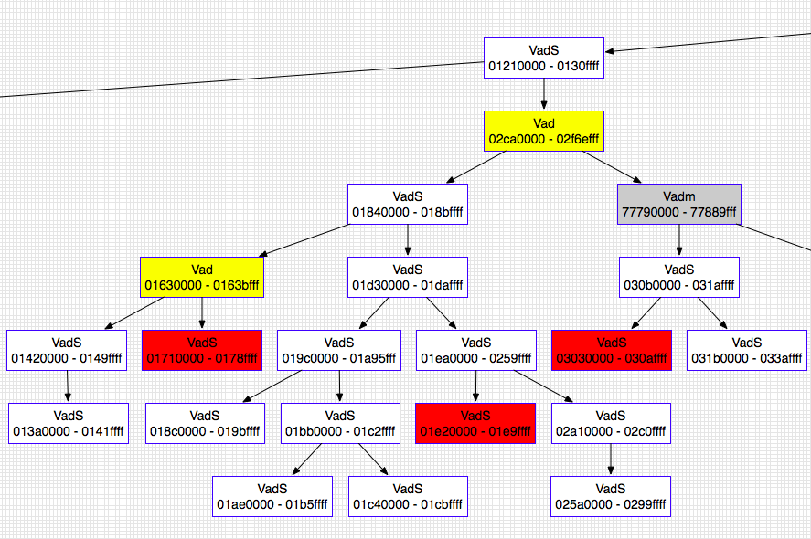

## 功能简介

| vol.py -h                                                | 选项和默认值             |
| -------------------------------------------------------- | ------------------------ |
| vol.py -f imageinfo                                      | 镜像识别                 |
| vol.py -f –profile=Win7SP1x64 pslist                     | 系统进程                 |
| vol.py -f –profile=Win7SP1x64 pstree                     | 以树状形式查看进程列表   |
| vol.py -f – -profile=Win7SP1x64 psscan                   | 不活跃或隐藏进程         |
| vol.py -f –profile=Win7SP1x64 dlllist                    | DLLs                     |
| vol.py -f –profile=Win7SP1x64 cmdscan                    | cmd中的命令              |
| vol.py -f –profile=Win7SP1x64 notepad                    | 记事本                   |
| vol.py -f –profile=Win7SP1x64 iehistory                  | 浏览器历史               |
| vol.py -f –profile=Win7SP1x64 connscan                   | 活动和已终止的连接       |
| vol.py -f –profile=Win7SP1x64 sockets                    | TCP/UDP 连接             |
| vol.py -f –profile=Win7SP1x64 hivescan                   | 注册表文件的物理地址     |
| vol.py -f –profile=Win7SP1x64 hivelist                   | 注册表文件的虚拟地址     |
| vol.py -f –profile=Win7SP1x64 svcscan                    | 运行中的服务             |
| vol.py -f –profile=Win7SP1x64 mimikatz                   | 明文密码                 |
| vol.py -f –profile=Win7SP1x64 malfind                    | 隐藏的、恶意代码分析     |
| vol.py -f –profile=Win7SP1x64 psxview                    | 试图隐藏自己的进程       |
| vol.py -f –profile=Win7SP1x64 connections                | 网络连接                 |
| vol.py -f –profile=Win7SP1x64 filescan                   | 物理内存中的文件         |
| vol.py -f –profile=Win7SP1x64 modules                    | 加载的内核驱动程序       |
| vol.py -f –profile=Win7SP1x64 driverscan                 | 物理内存中的驱动程序     |
| vol.py -f –profile=Win7SP1x64 apihooks                   | 挂钩进程                 |
| vol.py -f –profile=Win7SP1x64 memmap -p <PID>            | 显示哪些页面是内存常驻的 |
| vol.py -f –profile=Win7SP1x64 memdump -p <PID> -D .      | 转储所有内存常驻页面     |
| vol.py -f –profile=Win7SP1x64 procdump -D dump/ -p <PID> | 转储恶意软件             |
| vol.py -f –profile=Win7SP1x64 modscan                    | 隐藏/解除链接的驱动器    |
| vol.py -f –profile=Win7SP1x64 hollowfind                 | 查找进程空心化的证据     |
| vol.py -f –profile=Win7SP1x64 netscan                    | 扫描网络人工制品         |
| vol.py -f –profile=Win7SP1x64 hashdump                   | 提取并解密缓存的域凭据   |
| vol.py -f –profile=Win7SP1x64 hivedump                   | 递归列出文件中的所有子键 |
| vol.py -f –profile=Win7SP1x64 clipboard                  | 剪切板                   |

## 详细使用介绍

### 镜像识别

#### imageinfo

使用`imageinfo`命令，你可以为正在分析的内存样本获得一个高层次的摘要。这个命令主要用于识别操作系统、服务包以及硬件架构（32位或64位），但它也包含了其他有用的信息，比如DTB地址和样本收集的时间。

    $ python vol.py -f ~/Desktop/win7_trial_64bit.raw imageinfo
    Volatility Foundation Volatility Framework 2.4
    Determining profile based on KDBG search...
    
              Suggested Profile(s) : Win7SP0x64, Win7SP1x64, Win2008R2SP0x64, Win2008R2SP1x64
                         AS Layer1 : AMD64PagedMemory (Kernel AS)
                         AS Layer2 : FileAddressSpace (/Users/Michael/Desktop/win7_trial_64bit.raw)
                          PAE type : PAE
                               DTB : 0x187000L
                              KDBG : 0xf80002803070
              Number of Processors : 1
         Image Type (Service Pack) : 0
                    KPCR for CPU 0 : 0xfffff80002804d00L
                 KUSER_SHARED_DATA : 0xfffff78000000000L
               Image date and time : 2012-02-22 11:29:02 UTC+0000
         Image local date and time : 2012-02-22 03:29:02 -0800

`imageinfo`输出会告诉你在使用其他插件时应该传递的配置文件（PROFILE）参数。如果存在多个配置文件建议，这可能是因为这些配置文件非常接近。它还会打印出KDBG（_KDDEBUGGER_DATA64的缩写）结构的地址，这个结构将被像`pslist`和`modules`这样的插件用来找到进程和模块列表头。在某些情况下，尤其是在较大的内存样本中，可能会有多个KDBG结构。同样，如果有多个处理器，你将看到每个处理器的KPCR地址和CPU编号。

插件在需要时会自动扫描KPCR和KDBG值。然而，你可以直接为任何插件指定这些值，通过提供`--kpcr=ADDRESS`或`--kdbg=ADDRESS`。通过为其他Volatility命令提供配置文件和KDBG（或者如果没有KDBG，就提供KPCR），你将获得最准确和最快的结果。

 **注意**：`imageinfo`插件在没有提前给出正确配置文件的情况下，不会在休眠文件上工作。这是因为不同操作系统之间的重要结构定义有所不同。

#### kdbgscan

与`imageinfo`（#imageinfo）插件不同，后者仅提供配置文件建议，`kdbgscan`旨在积极识别正确的配置文件和KDBG地址（如果有多个的话）。该插件扫描与Volatility配置文件相关的KDBGHeader签名，并应用合理性检查以减少误报。输出的详细程度和可以执行的合理性检查数量取决于Volatility是否能找到DTB（调试表），所以如果你已经知道正确的配置文件（或者你已经从`imageinfo`（#imageinfo）获得了配置文件建议），那么请确保使用它。

以下是这个插件可能有用的一个场景示例。你有一份内存样本，你认为它是Windows 2003 SP2 x64，但是`pslist`（#pslist）没有显示任何进程。`pslist`插件依赖于找到由KDBG指向的进程列表头，但是该插件会取内存样本中找到的第一个KDBG，这并不总是“最佳”的。如果你在样本中较早（即在较低的物理偏移量处）找到了一个具有无效PsActiveProcessHead指针的KDBG，你可能会遇到这个问题。

请注意下面`kdbgscan`如何捕获两个KDBG结构：首先发现的无效KDBG（没有进程和模块）位于`0xf80001172cb0`，而有效的KDBG（有37个进程和116个模块）位于`0xf80001175cf0`。为了“修复”这个样本的`pslist`（#pslist），你只需要向`plist`插件提供`--kdbg=0xf80001175cf0`即可。

    $ python vol.py -f Win2K3SP2x64-6f1bedec.vmem --profile=Win2003SP2x64 kdbgscan
    Volatility Foundation Volatility Framework 2.4
    **************************************************
    Instantiating KDBG using: Kernel AS Win2003SP2x64 (5.2.3791 64bit)
    Offset (V)                    : 0xf80001172cb0
    Offset (P)                    : 0x1172cb0
    KDBG owner tag check          : True
    Profile suggestion (KDBGHeader): Win2003SP2x64
    Version64                     : 0xf80001172c70 (Major: 15, Minor: 3790)
    Service Pack (CmNtCSDVersion) : 0
    Build string (NtBuildLab)     : T?
    PsActiveProcessHead           : 0xfffff800011947f0 (0 processes)
    PsLoadedModuleList            : 0xfffff80001197ac0 (0 modules)
    KernelBase                    : 0xfffff80001000000 (Matches MZ: True)
    Major (OptionalHeader)        : 5
    Minor (OptionalHeader)        : 2
    
    **************************************************
    Instantiating KDBG using: Kernel AS Win2003SP2x64 (5.2.3791 64bit)
    Offset (V)                    : 0xf80001175cf0
    Offset (P)                    : 0x1175cf0
    KDBG owner tag check          : True
    Profile suggestion (KDBGHeader): Win2003SP2x64
    Version64                     : 0xf80001175cb0 (Major: 15, Minor: 3790)
    Service Pack (CmNtCSDVersion) : 2
    Build string (NtBuildLab)     : 3790.srv03_sp2_rtm.070216-1710
    PsActiveProcessHead           : 0xfffff800011977f0 (37 processes)
    PsLoadedModuleList            : 0xfffff8000119aae0 (116 modules)
    KernelBase                    : 0xfffff80001000000 (Matches MZ: True)
    Major (OptionalHeader)        : 5
    Minor (OptionalHeader)        : 2
    KPCR                          : 0xfffff80001177000 (CPU 0)

 关于如何识别KDBG结构的更多信息，请阅读以下资源：

1. [在Windows中找到内核全局变量](http://moyix.blogspot.com/2008/04/finding-kernel-global-variables-in.html) - 这篇文章详细介绍了在Windows操作系统中如何定位和识别内核全局变量，包括KDBG结构。

2. [识别内存映像](http://gleeda.blogspot.com/2010/12/identifying-memory-images.html) - 这篇文章探讨了如何分析和识别内存映像，这对于理解内存取证和分析工具（如Volatility）的工作原理至关重要。

#### kpcrscan

 要扫描潜在的KPCR（内核进程控制区域）结构，你可以使用以下命令，该命令通过检查自引用成员来识别KPCR，正如[在Vista中找到对象根](http://blog.schatzforensic.com.au/2010/07/finding-object-roots-in-vista-kpcr/)中所描述的那样。在多核系统中，每个处理器都有自己的KPCR。因此，你将看到每个处理器的详细信息，包括IDT（中断描述符表）和GDT（全局描述符表）地址；当前、空闲和下一个线程；CPU编号、供应商和速度；以及CR3值。

    $ python vol.py -f dang_win7_x64.raw --profile=Win7SP1x64 kpcrscan
    Volatility Foundation Volatility Framework 2.4
    **************************************************
    Offset (V)                    : 0xf800029ead00
    Offset (P)                    : 0x29ead00
    KdVersionBlock                : 0x0
    IDT                           : 0xfffff80000b95080
    GDT                           : 0xfffff80000b95000
    CurrentThread                 : 0xfffffa800cf694d0 TID 2148 (kd.exe:2964)
    IdleThread                    : 0xfffff800029f8c40 TID 0 (Idle:0)
    Details                       : CPU 0 (GenuineIntel @ 2128 MHz)
    CR3/DTB                       : 0x1dcec000
    **************************************************
    Offset (V)                    : 0xf880009e7000
    Offset (P)                    : 0x4d9e000
    KdVersionBlock                : 0x0
    IDT                           : 0xfffff880009f2540
    GDT                           : 0xfffff880009f24c0
    CurrentThread                 : 0xfffffa800cf694d0 TID 2148 (kd.exe:2964)
    IdleThread                    : 0xfffff880009f1f40 TID 0 (Idle:0)
    Details                       : CPU 1 (GenuineIntel @ 2220 MHz)
    CR3/DTB                       : 0x1dcec000

 如果`KdVersionBlock`（内核调试信息块）不为空，那么通过KPCR（内核进程控制区域）可能找到机器的KDBG（内核调试结构）地址。实际上，像`pslist`（#pslist）这样的插件在寻找KDBG时的备用方法就是利用`kpcrscan`，然后调用`KPCR.get_kdbg()` API函数。

### 进程和DLL

#### pslist

 要列出系统中的进程，可以使用`pslist`命令。这个命令会遍历由`PsActiveProcessHead`指向的双向链表，并显示进程的偏移量、进程名称、进程ID、父进程ID、线程数量、句柄数量以及进程启动和退出的日期/时间。从2.1版本开始，它还会显示会话ID以及进程是否为Wow64进程（在64位内核上使用32位地址空间）。

这个插件无法检测隐藏或未链接的进程（但`psscan`（#psscan）可以做到这一点）。

如果你看到进程有0线程、0句柄和/或非空的退出时间，那么这个进程可能实际上已经不再活跃。有关更多信息，请参考[The Missing Active in PsActiveProcessHead](http://mnin.blogspot.com/2011/03/mis-leading-active-in.html)。在下面的例子中，你会注意到`regsvr32.exe`虽然仍在“活动”列表中，但实际上已经终止了。

还要注意的是，`System`和`smss.exe`这两个进程不会有会话ID，因为`System`在会话建立之前就已经启动，而`smss.exe`是会话管理器本身。

    $ python vol.py -f ~/Desktop/win7_trial_64bit.raw --profile=Win7SP0x64 pslist
    Volatility Foundation Volatility Framework 2.4
    Offset(V)          Name                    PID   PPID   Thds     Hnds   Sess  Wow64 Start                Exit                
    ------------------ -------------------- ------ ------ ------ -------- ------ ------ -------------------- --------------------
    0xfffffa80004b09e0 System                    4      0     78      489 ------      0 2012-02-22 19:58:20                      
    0xfffffa8000ce97f0 smss.exe                208      4      2       29 ------      0 2012-02-22 19:58:20                      
    0xfffffa8000c006c0 csrss.exe               296    288      9      385      0      0 2012-02-22 19:58:24                      
    0xfffffa8000c92300 wininit.exe             332    288      3       74      0      0 2012-02-22 19:58:30                      
    0xfffffa8000c06b30 csrss.exe               344    324      7      252      1      0 2012-02-22 19:58:30                      
    0xfffffa8000c80b30 winlogon.exe            372    324      5      136      1      0 2012-02-22 19:58:31                      
    0xfffffa8000c5eb30 services.exe            428    332      6      193      0      0 2012-02-22 19:58:32                      
    0xfffffa80011c5700 lsass.exe               444    332      6      557      0      0 2012-02-22 19:58:32                      
    0xfffffa8000ea31b0 lsm.exe                 452    332     10      133      0      0 2012-02-22 19:58:32                      
    0xfffffa8001296b30 svchost.exe             568    428     10      352      0      0 2012-02-22 19:58:34                      
    0xfffffa80012c3620 svchost.exe             628    428      6      247      0      0 2012-02-22 19:58:34                      
    0xfffffa8001325950 sppsvc.exe              816    428      5      154      0      0 2012-02-22 19:58:41                      
    0xfffffa80007b7960 svchost.exe             856    428     16      404      0      0 2012-02-22 19:58:43                      
    0xfffffa80007bb750 svchost.exe             880    428     34     1118      0      0 2012-02-22 19:58:43                      
    0xfffffa80007d09e0 svchost.exe             916    428     19      443      0      0 2012-02-22 19:58:43                      
    0xfffffa8000c64840 svchost.exe             348    428     14      338      0      0 2012-02-22 20:02:07                      
    0xfffffa8000c09630 svchost.exe             504    428     16      496      0      0 2012-02-22 20:02:07                      
    0xfffffa8000e86690 spoolsv.exe            1076    428     12      271      0      0 2012-02-22 20:02:10                      
    0xfffffa8000518b30 svchost.exe            1104    428     18      307      0      0 2012-02-22 20:02:10                      
    0xfffffa800094d960 wlms.exe               1264    428      4       43      0      0 2012-02-22 20:02:11                      
    0xfffffa8000995b30 svchost.exe            1736    428     12      200      0      0 2012-02-22 20:02:25                      
    0xfffffa8000aa0b30 SearchIndexer.         1800    428     12      757      0      0 2012-02-22 20:02:26                      
    0xfffffa8000aea630 taskhost.exe           1144    428      7      189      1      0 2012-02-22 20:02:41                      
    0xfffffa8000eafb30 dwm.exe                1476    856      3       71      1      0 2012-02-22 20:02:41                      
    0xfffffa80008f3420 explorer.exe           1652    840     21      760      1      0 2012-02-22 20:02:42                      
    0xfffffa8000c9a630 regsvr32.exe           1180   1652      0 --------      1      0 2012-02-22 20:03:05  2012-02-22 20:03:08 
    0xfffffa8000a03b30 rundll32.exe           2016    568      3       67      1      0 2012-02-22 20:03:16                      
    0xfffffa8000a4f630 svchost.exe            1432    428     12      350      0      0 2012-02-22 20:04:14                      
    0xfffffa8000999780 iexplore.exe           1892   1652     19      688      1      1 2012-02-22 11:26:12                      
    0xfffffa80010c9060 iexplore.exe           2820   1892     23      733      1      1 2012-02-22 11:26:15                      
    0xfffffa8001016060 DumpIt.exe             2860   1652      2       42      1      1 2012-02-22 11:28:59                      
    0xfffffa8000acab30 conhost.exe            2236    344      2       51      1      0 2012-02-22 11:28:59 

 默认情况下，`pslist`命令会显示`_EPROCESS`结构的虚拟偏移量。如果你想获取物理偏移量，可以使用`-P`选项。

    $ python vol.py -f ~/Desktop/win7_trial_64bit.raw --profile=Win7SP0x64 pslist -P 
    Volatility Foundation Volatility Framework 2.4
    Offset(P)          Name                    PID   PPID   Thds     Hnds   Sess  Wow64 Start                Exit                
    ------------------ -------------------- ------ ------ ------ -------- ------ ------ -------------------- --------------------
    0x0000000017fef9e0 System                    4      0     78      489 ------      0 2012-02-22 19:58:20                      
    0x00000000176e97f0 smss.exe                208      4      2       29 ------      0 2012-02-22 19:58:20                      
    0x00000000176006c0 csrss.exe               296    288      9      385      0      0 2012-02-22 19:58:24                      
    0x0000000017692300 wininit.exe             332    288      3       74      0      0 2012-02-22 19:58:30                      
    0x0000000017606b30 csrss.exe               344    324      7      252      1      0 2012-02-22 19:58:30
    ... 

#### pstree

要查看进程列表的树状形式，请使用`pstree`命令。这个命令使用与`pslist`相同的技术来枚举进程，所以它也不会显示隐藏或未链接的进程。子进程通过缩进来表示。

    $ python vol.py -f ~/Desktop/win7_trial_64bit.raw --profile=Win7SP0x64 pstree
    Volatility Foundation Volatility Framework 2.4
    Name                                                  Pid   PPid   Thds   Hnds Time                
    -------------------------------------------------- ------ ------ ------ ------ --------------------
     0xfffffa80004b09e0:System                              4      0     78    489 2012-02-22 19:58:20 
    . 0xfffffa8000ce97f0:smss.exe                         208      4      2     29 2012-02-22 19:58:20 
     0xfffffa8000c006c0:csrss.exe                         296    288      9    385 2012-02-22 19:58:24 
     0xfffffa8000c92300:wininit.exe                       332    288      3     74 2012-02-22 19:58:30 
    . 0xfffffa8000c5eb30:services.exe                     428    332      6    193 2012-02-22 19:58:32 
    .. 0xfffffa8000aa0b30:SearchIndexer.                 1800    428     12    757 2012-02-22 20:02:26 
    .. 0xfffffa80007d09e0:svchost.exe                     916    428     19    443 2012-02-22 19:58:43 
    .. 0xfffffa8000a4f630:svchost.exe                    1432    428     12    350 2012-02-22 20:04:14 
    .. 0xfffffa800094d960:wlms.exe                       1264    428      4     43 2012-02-22 20:02:11 
    .. 0xfffffa8001325950:sppsvc.exe                      816    428      5    154 2012-02-22 19:58:41 
    .. 0xfffffa8000e86690:spoolsv.exe                    1076    428     12    271 2012-02-22 20:02:10 
    .. 0xfffffa8001296b30:svchost.exe                     568    428     10    352 2012-02-22 19:58:34 
    ... 0xfffffa8000a03b30:rundll32.exe                  2016    568      3     67 2012-02-22 20:03:16
    ...

#### psscan

要使用池标记扫描（`_POOL_HEADER`）来枚举进程，请使用 `psscan` 命令。这可以找到之前已终止（非活动）的进程以及被rootkit隐藏或解除链接的进程。缺点是，尽管rootkit可以通过覆盖池标记值来隐藏（尽管在实际环境中这种情况不常见）。

    $ python vol.py --profile=Win7SP0x86 -f win7.dmp psscan
    Volatility Foundation Volatility Framework 2.0
     Offset     Name             PID    PPID   PDB        Time created             Time exited             
    ---------- ---------------- ------ ------ ---------- ------------------------ ------------------------ 
    0x3e025ba8 svchost.exe        1116    508 0x3ecf1220 2010-06-16 15:25:25                              
    0x3e04f070 svchost.exe        1152    508 0x3ecf1340 2010-06-16 15:27:40                              
    0x3e144c08 dwm.exe            1540    832 0x3ecf12e0 2010-06-16 15:26:58                              
    0x3e145c18 TPAutoConnSvc.     1900    508 0x3ecf1360 2010-06-16 15:25:41                              
    0x3e3393f8 lsass.exe           516    392 0x3ecf10e0 2010-06-16 15:25:18                              
    0x3e35b8f8 svchost.exe         628    508 0x3ecf1120 2010-06-16 15:25:19                              
    0x3e383770 svchost.exe         832    508 0x3ecf11a0 2010-06-16 15:25:20                              
    0x3e3949d0 svchost.exe         740    508 0x3ecf1160 2010-06-16 15:25:20                              
    0x3e3a5100 svchost.exe         872    508 0x3ecf11c0 2010-06-16 15:25:20                              
    0x3e3f64e8 svchost.exe         992    508 0x3ecf1200 2010-06-16 15:25:24                              
    0x3e45a530 wininit.exe         392    316 0x3ecf10a0 2010-06-16 15:25:15                              
    0x3e45d928 svchost.exe        1304    508 0x3ecf1260 2010-06-16 15:25:28                              
    0x3e45f530 csrss.exe           400    384 0x3ecf1040 2010-06-16 15:25:15                              
    0x3e4d89c8 vmtoolsd.exe       1436    508 0x3ecf1280 2010-06-16 15:25:30                              
    0x3e4db030 spoolsv.exe        1268    508 0x3ecf1240 2010-06-16 15:25:28                              
    0x3e50b318 services.exe        508    392 0x3ecf1080 2010-06-16 15:25:18                              
    0x3e7f3d40 csrss.exe           352    316 0x3ecf1060 2010-06-16 15:25:12                              
    0x3e7f5bc0 winlogon.exe        464    384 0x3ecf10c0 2010-06-16 15:25:18                              
    0x3eac6030 SearchProtocol     2448   1168 0x3ecf15c0 2010-06-16 23:30:52      2010-06-16 23:33:14     
    0x3eb10030 SearchFilterHo     1812   1168 0x3ecf1480 2010-06-16 23:31:02      2010-06-16 23:33:14 
    [snip]

 如果一个进程已经终止，`Time exited` 字段将显示退出时间。如果你想调查一个隐藏的进程（例如显示它的DLLs），那么你将需要`_EPROCESS`对象的物理偏移量，这在最左边的列中显示。几乎所有与进程相关的插件都接受一个`--OFFSET`参数，以便你可以处理隐藏的进程。

#### psdispscan

 这个插件与`psscan`类似，但它通过扫描`DISPATCHER_HEADER`而不是池标记来枚举进程。这为你提供了一种在攻击者试图通过更改池标记来隐藏时雕刻`_EPROCESS`对象的替代方法。这个插件维护得不太好，仅支持XP x86系统。要使用它，你必须在命令行中输入`--plugins=contrib/plugins`。

#### dlllist

 要显示进程加载的DLL列表，使用`dlllist`命令。它会遍历由PEB（进程环境块）的`InLoadOrderModuleList`指向的`_LDR_DATA_TABLE_ENTRY`结构的双向链表。当进程调用`LoadLibrary`（或其衍生版本，如`LdrLoadDll`）时，DLL会自动添加到此列表中，直到`FreeLibrary`被调用且引用计数降至零，它们才会被移除。加载计数列告诉你DLL是静态加载（即作为exe或其他DLL的导入表的一部分）还是动态加载的。.

    $ python vol.py -f ~/Desktop/win7_trial_64bit.raw --profile=Win7SP0x64 dlllist 
    ************************************************************************
    wininit.exe pid:    332
    Command line : wininit.exe
    
    Base                             Size          LoadCount Path
    ------------------ ------------------ ------------------ ----
    0x00000000ff530000            0x23000             0xffff C:\Windows\system32\wininit.exe
    0x0000000076d40000           0x1ab000             0xffff C:\Windows\SYSTEM32\ntdll.dll
    0x0000000076b20000           0x11f000             0xffff C:\Windows\system32\kernel32.dll
    0x000007fefcd50000            0x6b000             0xffff C:\Windows\system32\KERNELBASE.dll
    0x0000000076c40000            0xfa000             0xffff C:\Windows\system32\USER32.dll
    0x000007fefd7c0000            0x67000             0xffff C:\Windows\system32\GDI32.dll
    0x000007fefe190000             0xe000             0xffff C:\Windows\system32\LPK.dll
    0x000007fefef80000            0xca000             0xffff C:\Windows\system32\USP10.dll
    0x000007fefd860000            0x9f000             0xffff C:\Windows\system32\msvcrt.dll
    [snip]

要显示特定进程的DLL而不是所有进程的DLL，可以使用`-p`或`--pid`过滤器，如下所示。此外，在以下输出中，请注意我们正在分析一个Wow64进程。Wow64进程在PEB列表中有有限的DLL列表，但这并不意味着它们是进程地址空间中加载的*唯一* DLL。因此，Volatility会提醒您对于这些进程使用[ldrmodules]插件。

    $ python vol.py -f ~/Desktop/win7_trial_64bit.raw --profile=Win7SP0x64 dlllist -p 1892
    Volatility Foundation Volatility Framework 2.4
    ************************************************************************
    iexplore.exe pid:   1892
    Command line : "C:\Program Files (x86)\Internet Explorer\iexplore.exe" 
    Note: use ldrmodules for listing DLLs in Wow64 processes
    
    Base                             Size          LoadCount Path
    ------------------ ------------------ ------------------ ----
    0x0000000000080000            0xa6000             0xffff C:\Program Files (x86)\Internet Explorer\iexplore.exe
    0x0000000076d40000           0x1ab000             0xffff C:\Windows\SYSTEM32\ntdll.dll
    0x00000000748d0000            0x3f000                0x3 C:\Windows\SYSTEM32\wow64.dll
    0x0000000074870000            0x5c000                0x1 C:\Windows\SYSTEM32\wow64win.dll
    0x0000000074940000             0x8000                0x1 C:\Windows\SYSTEM32\wow64cpu.dll

要显示被rootkit隐藏或解除链接的进程的DLL，首先使用`psscan`获取`_EPROCESS`对象的物理偏移量，并使用`--offset=OFFSET`参数。该插件将“回退”并确定`_EPROCESS`的虚拟地址，然后获取一个地址空间以便访问PEB。

    $ python vol.py -f ~/Desktop/win7_trial_64bit.raw --profile=Win7SP0x64 dlllist --offset=0x04a291a8

#### dlldump

要从进程的内存空间提取DLL并将其转储到磁盘进行分析，使用`dlldump`命令。其语法与我们之前展示的`dlllist`命令几乎相同。你可以：

- 转储所有进程的所有DLL
- 使用`--pid=PID`转储特定进程的所有DLL
- 使用`--offset=OFFSET`转储隐藏/解除链接进程的所有DLL
- 使用`--base=BASEADDR`从进程内存的任何位置转储PE（可执行文件），这个选项对于提取隐藏的DLL非常有用
- 使用`--regex=REGEX`转储与正则表达式匹配的一个或多个DLL，可以区分大小写（`--ignore-case`）或不区分大小写

要指定输出目录，使用`--dump-dir=DIR`或`-d DIR`。

    $ python vol.py -f ~/Desktop/win7_trial_64bit.raw --profile=Win7SP0x64 dlldump -D dlls/
    ...
    Process(V)         Name                 Module Base        Module Name          Result
    ------------------ -------------------- ------------------ -------------------- ------
    0xfffffa8000ce97f0 smss.exe             0x0000000047a90000 smss.exe             OK: module.208.176e97f0.47a90000.dll
    0xfffffa8000ce97f0 smss.exe             0x0000000076d40000                      Error: DllBase is paged
    0xfffffa8000c006c0 csrss.exe            0x0000000049700000 csrss.exe            OK: module.296.176006c0.49700000.dll
    0xfffffa8000c006c0 csrss.exe            0x0000000076d40000 ntdll.dll            Error: DllBase is paged
    0xfffffa8000c006c0 csrss.exe            0x000007fefd860000 msvcrt.dll           Error: DllBase is paged
    0xfffffa80011c5700 lsass.exe            0x000007fefcc40000 WINSTA.dll           Error: DllBase is paged
    0xfffffa80011c5700 lsass.exe            0x000007fefd7c0000 GDI32.dll            OK: module.444.173c5700.7fefd7c0000.dll
    0xfffffa80011c5700 lsass.exe            0x000007fefc270000 DNSAPI.dll           OK: module.444.173c5700.7fefc270000.dll
    0xfffffa80011c5700 lsass.exe            0x000007fefc5d0000 Secur32.dll          OK: module.444.173c5700.7fefc5d0000.dll
    ...

I 如果提取失败，就像上面提到的几个DLL一样，这可能意味着该DLL中的一些内存页不是内存常驻的（由于分页）。特别是，如果包含PE头和PE节映射的第一页不可用，这将是一个问题。在这些情况下，你仍然可以使用[vaddump](#vaddump)命令提取内存段，但你需要手动重建PE头并修复节（如果你计划在IDA Pro中进行分析），如[使用Volatility恢复CoreFlood二进制文件](http://mnin.blogspot.com/2008/11/recovering-coreflood-binaries-with.html)中所述。

要转储一个不在DLL列表中的PE文件（例如，由于代码注入或恶意解除链接），只需指定进程内存中PE的基础地址：:

    $ python vol.py --profile=Win7SP0x86 -f win7.dmp dlldump --pid=492 -D out --base=0x00680000

 如果你想要转储的DLL位于隐藏进程中，你也可以指定`_EPROCESS`的偏移量：

    $ python vol.py --profile=Win7SP0x86 -f win7.dmp dlldump -o 0x3e3f64e8 -D out --base=0x00680000

#### handles

 要显示进程中的打开句柄，使用`handles`命令。这适用于文件、注册表键、互斥锁、命名管道、事件、窗口站、桌面、线程以及所有其他类型的可安全执行对象。从2.1版本开始，输出包括每个对象的句柄值和授予的访问权限。

    $ python vol.py -f ~/Desktop/win7_trial_64bit.raw --profile=Win7SP0x64 handles
    Volatility Foundation Volatility Framework 2.4
    Offset(V)             Pid             Handle             Access Type             Details
    ------------------ ------ ------------------ ------------------ ---------------- -------
    0xfffffa80004b09e0      4                0x4           0x1fffff Process          System(4)
    0xfffff8a0000821a0      4               0x10            0x2001f Key              MACHINE\SYSTEM\CONTROLSET001\CONTROL\PRODUCTOPTIONS
    0xfffff8a00007e040      4               0x14            0xf003f Key              MACHINE\SYSTEM\CONTROLSET001\CONTROL\SESSION MANAGER\MEMORY MANAGEMENT\PREFETCHPARAMETERS
    0xfffff8a000081fa0      4               0x18            0x2001f Key              MACHINE\SYSTEM\SETUP
    0xfffffa8000546990      4               0x1c           0x1f0001 ALPC Port        PowerMonitorPort
    0xfffffa800054d070      4               0x20           0x1f0001 ALPC Port        PowerPort
    0xfffff8a0000676a0      4               0x24            0x20019 Key              MACHINE\HARDWARE\DESCRIPTION\SYSTEM\MULTIFUNCTIONADAPTER
    0xfffffa8000625460      4               0x28           0x1fffff Thread           TID 160 PID 4
    0xfffff8a00007f400      4               0x2c            0xf003f Key              MACHINE\SYSTEM\CONTROLSET001
    0xfffff8a00007f200      4               0x30            0xf003f Key              MACHINE\SYSTEM\CONTROLSET001\ENUM
    0xfffff8a000080d10      4               0x34            0xf003f Key              MACHINE\SYSTEM\CONTROLSET001\CONTROL\CLASS
    0xfffff8a00007f500      4               0x38            0xf003f Key              MACHINE\SYSTEM\CONTROLSET001\SERVICES
    0xfffff8a0001cd990      4               0x3c                0xe Token            
    0xfffff8a00007bfa0      4               0x40            0x20019 Key              MACHINE\SYSTEM\CONTROLSET001\CONTROL\WMI\SECURITY
    0xfffffa8000cd52b0      4               0x44           0x120116 File             \Device\Mup
    0xfffffa8000ce97f0      4               0x48               0x2a Process          smss.exe(208)
    0xfffffa8000df16f0      4               0x4c           0x120089 File             \Device\HarddiskVolume2\Windows\System32\en-US\win32k.sys.mui
    0xfffffa8000de37f0      4               0x50           0x12019f File             \Device\clfsTxfLog
    0xfffff8a000952fa0      4               0x54            0x2001f Key              MACHINE\SYSTEM\CONTROLSET001\CONTROL\VIDEO\{6A8FC9DC-A76B-47FC-A703-17800182E1CE}\0000\VOLATILESETTINGS
    0xfffffa800078da20      4               0x58           0x12019f File             \Device\Tcp
    0xfffff8a002e17610      4               0x5c                0x9 Key              MACHINE\SOFTWARE\MICROSOFT\WINDOWS NT\CURRENTVERSION\IMAGE FILE EXECUTION OPTIONS
    0xfffff8a0008f7b00      4               0x60               0x10 Key              MACHINE\SYSTEM\CONTROLSET001\CONTROL\LSA
    0xfffffa8000da2870      4               0x64           0x100001 File             \Device\KsecDD
    0xfffffa8000da3040      4               0x68                0x0 Thread           TID 228 PID 4
    ...

 你可以通过指定`--pid=PID`或`_EPROCESS`结构的物理偏移量`--physical-offset=OFFSET`来显示特定进程的句柄。你也可以使用`-t`或`--object-type=OBJECTTYPE`按对象类型进行过滤。例如，要仅显示进程ID为600的进程对象的句柄，可以这样做：

    $ python vol.py -f ~/Desktop/win7_trial_64bit.raw --profile=Win7SP0x64 handles -p 296 -t Process
    Volatility Foundation Volatility Framework 2.4
    Offset(V)             Pid             Handle             Access Type             Details
    ------------------ ------ ------------------ ------------------ ---------------- -------
    0xfffffa8000c92300    296               0x54           0x1fffff Process          wininit.exe(332)
    0xfffffa8000c5eb30    296               0xc4           0x1fffff Process          services.exe(428)
    0xfffffa80011c5700    296               0xd4           0x1fffff Process          lsass.exe(444)
    0xfffffa8000ea31b0    296               0xe4           0x1fffff Process          lsm.exe(452)
    0xfffffa8000c64840    296              0x140           0x1fffff Process          svchost.exe(348)
    0xfffffa8001296b30    296              0x150           0x1fffff Process          svchost.exe(568)
    0xfffffa80012c3620    296              0x18c           0x1fffff Process          svchost.exe(628)
    0xfffffa8001325950    296              0x1dc           0x1fffff Process          sppsvc.exe(816)
    ...

对象类型可以是WinDbg命令“object ObjectTypes”打印出的任何名称（详见[枚举对象类型](http://computer.forensikblog.de/en/2009/04/enumerate-object-types.html)了解更多详情）。

在某些情况下，详细信息列可能是空白的（例如，如果对象没有名称）。默认情况下，你会看到命名和未命名的对象。然而，如果你想隐藏不那么有意义的结果，只显示命名对象，可以使用`--silent`参数给这个插件。

#### getsids

要查看与进程关联的SID（安全标识符），请使用`getsids`命令。这可以帮助你识别那些恶意提升权限的进程以及属于特定用户的进程。

有关更多信息，请参考BDG的[将进程链接到用户](http://moyix.blogspot.com/2008/08/linking-processes-to-users.html)。

    $ python vol.py -f ~/Desktop/win7_trial_64bit.raw --profile=Win7SP0x64 getsids
    Volatility Foundation Volatility Framework 2.4
    System (4): S-1-5-18 (Local System)
    System (4): S-1-5-32-544 (Administrators)
    System (4): S-1-1-0 (Everyone)
    System (4): S-1-5-11 (Authenticated Users)
    System (4): S-1-16-16384 (System Mandatory Level)
    smss.exe (208): S-1-5-18 (Local System)
    smss.exe (208): S-1-5-32-544 (Administrators)
    smss.exe (208): S-1-1-0 (Everyone)
    smss.exe (208): S-1-5-11 (Authenticated Users)
    smss.exe (208): S-1-16-16384 (System Mandatory Level)
    [snip]

#### cmdscan

`cmdscan`插件在XP/2003/Vista/2008的`csrss.exe`进程和Windows 7的`conhost.exe`进程的内存中搜索通过控制台shell（cmd.exe）输入的命令。这是你可以使用的最强大的命令之一，用于了解攻击者在受害者系统上的行为，无论他们是通过网络RDP会话打开cmd.exe，还是通过网络后门代理输入/输出到命令shell。

这个插件通过寻找一个已知的常量值（MaxHistory）并应用合理性检查来找到被称为COMMAND_HISTORY的结构。需要注意的是，MaxHistory值可以通过在cmd.exe窗口左上角右键点击并进入属性来更改。对于特定用户打开的所有控制台，也可以通过修改注册表键`HKCU\Console\HistoryBufferSize`来更改这个值。Windows系统的默认值是50，意味着保存最近50条命令。如果需要，你可以使用`--max_history=NUMBER`参数来调整它。

这个插件使用的结构不是公开的（即Microsoft不为它们提供PDBs），因此它们在WinDBG或其他任何取证框架中都不可用。这些结构是由Michael Ligh从conhost.exe和winsrv.dll二进制文件中逆向工程得到的。

除了输入到shell的命令，这个插件还显示：

- 控制台宿主进程的名称（csrss.exe或conhost.exe）
- 使用控制台的应用程序的名称（任何使用cmd.exe的进程）
- 命令历史缓冲区的位置，包括当前缓冲区计数、最后添加的命令和最后显示的命令
- 应用程序进程句柄

由于这个插件使用的扫描技术，它有能力找到活动和已关闭控制台的命令。

    $ python vol.py -f VistaSP2x64.vmem --profile=VistaSP2x64 cmdscan
    Volatility Foundation Volatility Framework 2.4
    
    **************************************************
    CommandProcess: csrss.exe Pid: 528
    CommandHistory: 0x135ec00 Application: cmd.exe Flags: Allocated, Reset
    CommandCount: 18 LastAdded: 17 LastDisplayed: 17
    FirstCommand: 0 CommandCountMax: 50
    ProcessHandle: 0x330
    Cmd #0 @ 0x135ef10: cd \
    Cmd #1 @ 0x135ef50: cd de
    Cmd #2 @ 0x135ef70: cd PerfLogs
    Cmd #3 @ 0x135ef90: cd ..
    Cmd #4 @ 0x5c78b90: cd "Program Files"
    Cmd #5 @ 0x135fae0: cd "Debugging Tools for Windows (x64)"
    Cmd #6 @ 0x135efb0: livekd -w
    Cmd #7 @ 0x135f010: windbg 
    Cmd #8 @ 0x135efd0: cd \
    Cmd #9 @ 0x135fd20: rundll32 c:\apphelp.dll,ExportFunc
    Cmd #10 @ 0x5c8bdb0: rundll32 c:\windows_apphelp.dll,ExportFunc
    Cmd #11 @ 0x5c8be10: rundll32 c:\windows_apphelp.dll
    Cmd #12 @ 0x135ee30: rundll32 c:\windows_apphelp.dll,Test
    Cmd #13 @ 0x135fd70: cd "Program Files"
    Cmd #14 @ 0x5c8b9e0: dir
    Cmd #15 @ 0x5c8be60: cd "Debugging Tools for Windows (x64)"
    Cmd #16 @ 0x5c8ba00: dir
    Cmd #17 @ 0x135eff0: livekd -w
    
    [snip]

 有关背景信息，请参阅Richard Stevens和Eoghan Casey的[从物理内存提取Windows命令行详细信息](http://ww.dfrws.org/2010/proceedings/stevens.pdf)。

#### consoles

 类似于`cmdscan`（#cmdscan），`consoles`插件查找攻击者在cmd.exe中输入或通过后门执行的命令。然而，与扫描COMMAND_HISTORY不同，这个插件扫描CONSOLE_INFORMATION。这个插件的主要优势在于，它不仅打印出攻击者输入的命令，还收集整个屏幕缓冲区（输入和输出）。例如，你不仅会看到“dir”，还会看到攻击者看到的确切内容，包括“dir”命令列出的所有文件和目录。

此外，这个插件还打印以下信息：

- 原始控制台窗口标题和当前控制台窗口标题
- 附加进程的名称和PID（如果超过一个，将遍历LIST_ENTRY来枚举所有进程）
- 与执行的命令相关的任何别名。例如，攻击者可以注册一个别名，使得输入“hello”实际上执行的是“cd system”
- cmd.exe控制台的屏幕坐标

以下是`consoles`命令的一个示例。在下面的例子中，你会注意到一些有趣的事情。取证者似乎失去了理智，找不到用于转储内存的dd.exe工具。在近20次拼写错误之后，他终于找到了这个工具并使用了它。

    $ python vol.py -f xp-laptop-2005-07-04-1430.img consoles
    Volatility Foundation Volatility Framework 2.4
    
    [csrss.exe @ 0x821c11a8 pid 456 console @ 0x4e23b0]
      OriginalTitle: '%SystemRoot%\\system32\\cmd.exe'
      Title: 'C:\\WINDOWS\\system32\\cmd.exe - dd if=\\\\.\\PhysicalMemory of=c:\\xp-2005-07-04-1430.img conv=noerror'
      HistoryBufferCount: 2
      HistoryBufferMax: 4
      CommandHistorySize: 50
    [history @ 0x4e4008]
      CommandCount: 0
      CommandCountMax: 50
      Application: 'dd.exe'
    [history @ 0x4e4d88]
      CommandCount: 20
      CommandCountMax: 50
      Application: 'cmd.exe'
      Cmd #0 @ 0x4e1f90: 'dd'
      Cmd #1 @ 0x4e2cb8: 'cd\\'
      Cmd #2 @ 0x4e2d18: 'dr'
      Cmd #3 @ 0x4e2d28: 'ee:'
      Cmd #4 @ 0x4e2d38: 'e;'
      Cmd #5 @ 0x4e2d48: 'e:'
      Cmd #6 @ 0x4e2d58: 'dr'
      Cmd #7 @ 0x4e2d68: 'd;'
      Cmd #8 @ 0x4e2d78: 'd:'
      Cmd #9 @ 0x4e2d88: 'dr'
      Cmd #10 @ 0x4e2d98: 'ls'
      Cmd #11 @ 0x4e2da8: 'cd Docu'
      Cmd #12 @ 0x4e2dc0: 'cd Documents and'
      Cmd #13 @ 0x4e2e58: 'dr'
      Cmd #14 @ 0x4e2e68: 'd:'
      Cmd #15 @ 0x4e2e78: 'cd dd\\'
      Cmd #16 @ 0x4e2e90: 'cd UnicodeRelease'
      Cmd #17 @ 0x4e2ec0: 'dr'
      Cmd #18 @ 0x4e2ed0: 'dd '
      Cmd #19 @ 0x4e4100: 'dd if=\\\\.\\PhysicalMemory of=c:\\xp-2005-07-04-1430.img conv=noerror'
    [screen @ 0x4e2460 X:80 Y:300]
      Output: Microsoft Windows XP [Version 5.1.2600]                                         
      Output: (C) Copyright 1985-2001 Microsoft Corp.                                         
      Output:                                                                                 
      Output: C:\Documents and Settings\Sarah>dd                                              
      Output: 'dd' is not recognized as an internal or external command,                      
      Output: operable program or batch file.                                                 
      Output:                                                                                 
      Output: C:\Documents and Settings\Sarah>cd\                                             
      Output:                                                                                 
      Output: C:\>dr                                                                          
      Output: 'dr' is not recognized as an internal or external command,                      
      Output: operable program or batch file.                                                 
      Output:                                                                                 
      Output: C:\>ee:                                                                         
      Output: 'ee:' is not recognized as an internal or external command,                     
      Output: operable program or batch file.                                                 
      Output:                                                                                 
      Output: C:\>e;                                                                          
      Output: 'e' is not recognized as an internal or external command,                       
      Output: operable program or batch file.                                                 
      Output:                                                                                 
      Output: C:\>e:                                                                          
      Output: The system cannot find the drive specified.                                     
      Output:                                                                                 
      Output: C:\>dr                                                                          
      Output: 'dr' is not recognized as an internal or external command,                      
      Output: operable program or batch file.                                                 
      Output:                                                                                 
      Output: C:\>d;                                                                          
      Output: 'd' is not recognized as an internal or external command,                       
      Output: operable program or batch file.                                                 
      Output:                                                                                 
      Output: C:\>d:                                                                          
      Output:                                                                                 
      Output: D:\>dr                                                                          
      Output: 'dr' is not recognized as an internal or external command,                      
      Output: operable program or batch file.                                                 
      Output:                                                                                 
      Output: D:\>dr                                                                          
      Output: 'dr' is not recognized as an internal or external command,                      
      Output: operable program or batch file.                                                 
      Output:                                                                                 
      Output: D:\>ls                                                                          
      Output: 'ls' is not recognized as an internal or external command,                      
      Output: operable program or batch file.                                                 
      Output:                                                                                 
      Output: D:\>cd Docu                                                                     
      Output: The system cannot find the path specified.                                      
      Output:                                                                                 
      Output: D:\>cd Documents and                                                            
      Output: The system cannot find the path specified.                                      
      Output:                                                                                 
      Output: D:\>dr                                                                          
      Output: 'dr' is not recognized as an internal or external command,                      
      Output: operable program or batch file.                                                 
      Output:                                                                                 
      Output: D:\>d:                                                                          
      Output:                                                                                 
      Output: D:\>cd dd\                                                                      
      Output:                                                                                 
      Output: D:\dd>                                                                          
      Output: D:\dd>cd UnicodeRelease                                                         
      Output:                                                                                 
      Output: D:\dd\UnicodeRelease>dr                                                         
      Output: 'dr' is not recognized as an internal or external command,                      
      Output: operable program or batch file.                                                 
      Output:                                                                                 
      Output: D:\dd\UnicodeRelease>dd                                                         
      Output:                                                                                 
      Output: 0+0 records in                                                                  
      Output: 0+0 records out                                                                 
      Output: ^C                                                                              
      Output: D:\dd\UnicodeRelease>dd if=\\.\PhysicalMemory of=c:\xp-2005-07-04-1430.img conv=
      Output: noerror                                                                         
      Output: Forensic Acquisition Utilities, 1, 0, 0, 1035                                   
      Output: dd, 3, 16, 2, 1035                                                              
      Output: Copyright (C) 2002-2004 George M. Garner Jr.                                    
      Output:                                                                                 
      Output: Command Line: dd if=\\.\PhysicalMemory of=c:\xp-2005-07-04-1430.img conv=noerror
      Output:                                                                                 
      Output: Based on original version developed by Paul Rubin, David MacKenzie, and Stuart K
      Output: emp                                                                             
      Output: Microsoft Windows: Version 5.1 (Build 2600.Professional Service Pack 2)         
      Output:                                                                                 
      Output: 04/07/2005  18:30:32 (UTC)                                                      
      Output: 04/07/2005  14:30:32 (local time)                                               
      Output:                                                                                 
      Output: Current User: SPLATITUDE\Sarah                                                  
      Output:                                                                                 
      Output: Total physical memory reported: 523676 KB                                       
      Output: Copying physical memory...                                                      
      Output: Physical memory in the range 0x00004000-0x00004000 could not be read.                              

#### privs

 这个插件显示了哪些进程特权存在、已启用以及默认启用。你可以传递`--silent`标志来仅显示进程明确启用的特权（即那些不是默认启用但当前已启用的）。`--regex=REGEX`参数可以用来过滤特定的特权名称。

    $ python vol.py -f win7_trial_64bit.raw privs --profile=Win7SP0x64
    Volatility Foundation Volatility Framework 2.3_alpha
    Pid      Process          Value  Privilege                            Attributes               Description
    -------- ---------------- ------ ------------------------------------ ------------------------ -----------
           4 System                2 SeCreateTokenPrivilege               Present                  Create a token object
           4 System                3 SeAssignPrimaryTokenPrivilege        Present                  Replace a process-level token
           4 System                4 SeLockMemoryPrivilege                Present,Enabled,Default  Lock pages in memory
           4 System                5 SeIncreaseQuotaPrivilege             Present                  Increase quotas
           4 System                6 SeMachineAccountPrivilege                                     Add workstations to the domain
           4 System                7 SeTcbPrivilege                       Present,Enabled,Default  Act as part of the operating system
           4 System                8 SeSecurityPrivilege                  Present                  Manage auditing and security log
           4 System                9 SeTakeOwnershipPrivilege             Present                  Take ownership of files/objects
           4 System               10 SeLoadDriverPrivilege                Present                  Load and unload device drivers
           4 System               11 SeSystemProfilePrivilege             Present,Enabled,Default  Profile system performance
           4 System               12 SeSystemtimePrivilege                Present                  Change the system time
           4 System               13 SeProfileSingleProcessPrivilege      Present,Enabled,Default  Profile a single process
           4 System               14 SeIncreaseBasePriorityPrivilege      Present,Enabled,Default  Increase scheduling priority
           4 System               15 SeCreatePagefilePrivilege            Present,Enabled,Default  Create a pagefile
           4 System               16 SeCreatePermanentPrivilege           Present,Enabled,Default  Create permanent shared objects
    .....

#### envars

要显示进程的环境变量，请使用`envars`插件。通常，它会显示已安装的CPU数量和硬件架构（尽管[KDBG扫描](#kdbgscan)的输出是一个更可靠的信息源），进程的当前目录、临时目录、会话名称、计算机名称、用户名以及其他各种有趣的信息。

    $ python vol.py -f ~/Desktop/win7_trial_64bit.raw --profile=Win7SP0x64 envars
    Volatility Foundation Volatility Framework 2.4
    Pid      Process              Block              Variable                       Value
    -------- -------------------- ------------------ ------------------------------ -----
         296 csrss.exe            0x00000000003d1320 ComSpec                        C:\Windows\system32\cmd.exe
         296 csrss.exe            0x00000000003d1320 FP_NO_HOST_CHECK               NO
         296 csrss.exe            0x00000000003d1320 NUMBER_OF_PROCESSORS           1
         296 csrss.exe            0x00000000003d1320 OS                             Windows_NT
         296 csrss.exe            0x00000000003d1320 Path                           C:\Windows\system32;C:\Windows;C:\Windows\System32\Wbem;C:\Windows\System32\WindowsPowerShell\v1.0\
         296 csrss.exe            0x00000000003d1320 PATHEXT                        .COM;.EXE;.BAT;.CMD;.VBS;.VBE;.JS;.JSE;.WSF;.WSH;.MSC
         296 csrss.exe            0x00000000003d1320 PROCESSOR_ARCHITECTURE         AMD64
         296 csrss.exe            0x00000000003d1320 PROCESSOR_IDENTIFIER           Intel64 Family 6 Model 2 Stepping 3, GenuineIntel
         296 csrss.exe            0x00000000003d1320 PROCESSOR_LEVEL                6
         296 csrss.exe            0x00000000003d1320 PROCESSOR_REVISION             0203
         296 csrss.exe            0x00000000003d1320 PSModulePath                   C:\Windows\system32\WindowsPowerShell\v1.0\Modules\
         296 csrss.exe            0x00000000003d1320 SystemDrive                    C:
         296 csrss.exe            0x00000000003d1320 SystemRoot                     C:\Windows
         296 csrss.exe            0x00000000003d1320 TEMP                           C:\Windows\TEMP
         296 csrss.exe            0x00000000003d1320 TMP                            C:\Windows\TEMP
         296 csrss.exe            0x00000000003d1320 USERNAME                       SYSTEM
         296 csrss.exe            0x00000000003d1320 windir                         C:\Windows

#### verinfo

 要显示嵌入在PE文件中的版本信息，请使用`verinfo`命令。并非所有PE文件都有版本信息，而且许多恶意软件作者会伪造版本信息以包含虚假数据，尽管如此，这个命令在识别二进制文件和与其他文件建立关联方面仍然非常有用。

这个插件目前只支持从进程可执行文件和DLL中打印版本信息，但将来会扩展以包括内核模块。如果你想按模块名称进行过滤，可以使用`--regex=REGEX`和/或`--ignore-case`选项。

    $ python vol.py -f ~/Desktop/win7_trial_64bit.raw --profile=Win7SP0x64 verinfo
    Volatility Foundation Volatility Framework 2.4
    \SystemRoot\System32\smss.exe
    C:\Windows\SYSTEM32\ntdll.dll
    
    C:\Windows\system32\csrss.exe
      File version    : 6.1.7600.16385
      Product version : 6.1.7600.16385
      Flags           : 
      OS              : Windows NT
      File Type       : Application
      File Date       : 
      CompanyName : Microsoft Corporation
      FileDescription : Client Server Runtime Process
      FileVersion : 6.1.7600.16385 (win7_rtm.090713-1255)
      InternalName : CSRSS.Exe
      LegalCopyright : \xa9 Microsoft Corporation. All rights reserved.
      OriginalFilename : CSRSS.Exe
      ProductName : Microsoft\xae Windows\xae Operating System
      ProductVersion : 6.1.7600.16385
    
    [snip]

#### enumfunc

这个插件枚举进程、DLL和内核驱动程序中的导入和导出函数。具体来说，它处理按名称或序号导入的函数、按名称或序号导出的函数以及转发导出。在大多数情况下，输出会非常详细（仅ntdll、msvcrt和kernel32导出的函数就可能达到1000+）。因此，你可以通过命令行选项（如下所示）过滤标准来减少输出的详细程度，或者你可以查看`enumfunc.py`中的代码，将其作为如何在你自己的插件中使用IAT（导入地址表）和EAT（导出地址表）解析API函数的示例。例如，[apihooks]插件利用导入和导出API来在检查钩子时在内存中查找函数。

还要注意，这个插件位于contrib目录中，所以你可以通过`--plugins`参数传递它，如下所示：

    $ python vol.py --plugins=contrib/plugins/ -f ~/Desktop/win7_trial_64bit.raw --profile=Win7SP0x64 enumfunc -h
    ....
      -s, --scan            Scan for objects
      -P, --process-only    Process only
      -K, --kernel-only     Kernel only
      -I, --import-only     Imports only
      -E, --export-only     Exports only

要使用池扫描器来查找进程和内核驱动程序，而不是遍历链接列表，可以使用`-s`选项。这在你尝试枚举隐藏进程或驱动程序中的函数时非常有用。以下是剩余命令行选项的一个示例。

要显示进程内存中的导出函数，请使用`-P`和`-E`选项，如下所示：

    $ python vol.py --plugins=contrib/plugins/ -f ~/Desktop/win7_trial_64bit.raw --profile=Win7SP0x64 enumfunc -P -E
    Process              Type       Module               Ordinal    Address              Name
    lsass.exe            Export     ADVAPI32.dll         1133       0x000007fefd11dd34 CreateWellKnownSid
    lsass.exe            Export     ADVAPI32.dll         1134       0x000007fefd17a460 CredBackupCredentials
    lsass.exe            Export     ADVAPI32.dll         1135       0x000007fefd170590 CredDeleteA
    lsass.exe            Export     ADVAPI32.dll         1136       0x000007fefd1704d0 CredDeleteW
    lsass.exe            Export     ADVAPI32.dll         1137       0x000007fefd17a310 CredEncryptAndMarshalBinaryBlob
    lsass.exe            Export     ADVAPI32.dll         1138       0x000007fefd17d080 CredEnumerateA
    lsass.exe            Export     ADVAPI32.dll         1139       0x000007fefd17cf50 CredEnumerateW
    lsass.exe            Export     ADVAPI32.dll         1140       0x000007fefd17ca00 CredFindBestCredentialA
    lsass.exe            Export     ADVAPI32.dll         1141       0x000007fefd17c8f0 CredFindBestCredentialW
    lsass.exe            Export     ADVAPI32.dll         1142       0x000007fefd130c10 CredFree
    lsass.exe            Export     ADVAPI32.dll         1143       0x000007fefd1630f0 CredGetSessionTypes
    lsass.exe            Export     ADVAPI32.dll         1144       0x000007fefd1703d0 CredGetTargetInfoA
    [snip]

 要显示内核内存中的导入函数，请使用`-K`和`-I`选项，如下所示：

    $ python vol.py --plugins=contrib/plugins/ -f ~/Desktop/win7_trial_64bit.raw --profile=Win7SP0x64 enumfunc -K -I
    Volatility Foundation Volatility Framework 2.4
    Process              Type       Module               Ordinal    Address              Name
    <KERNEL>             Import     VIDEOPRT.SYS         583        0xfffff80002acc320 ntoskrnl.exeIoRegisterPlugPlayNotification
    <KERNEL>             Import     VIDEOPRT.SYS         1325       0xfffff800029f9f30 ntoskrnl.exeRtlAppendStringToString
    <KERNEL>             Import     VIDEOPRT.SYS         509        0xfffff800026d06e0 ntoskrnl.exeIoGetAttachedDevice
    <KERNEL>             Import     VIDEOPRT.SYS         443        0xfffff800028f7ec0 ntoskrnl.exeIoBuildSynchronousFsdRequest
    <KERNEL>             Import     VIDEOPRT.SYS         1466       0xfffff80002699300 ntoskrnl.exeRtlInitUnicodeString
    <KERNEL>             Import     VIDEOPRT.SYS         759        0xfffff80002697be0 ntoskrnl.exeKeInitializeEvent
    <KERNEL>             Import     VIDEOPRT.SYS         1461       0xfffff8000265e8a0 ntoskrnl.exeRtlInitAnsiString
    <KERNEL>             Import     VIDEOPRT.SYS         1966       0xfffff80002685060 ntoskrnl.exeZwSetValueKey
    <KERNEL>             Import     VIDEOPRT.SYS         840        0xfffff80002699440 ntoskrnl.exeKeReleaseSpinLock
    <KERNEL>             Import     VIDEOPRT.SYS         1190       0xfffff800027a98b0 ntoskrnl.exePoRequestPowerIrp
    <KERNEL>             Import     VIDEOPRT.SYS         158        0xfffff800026840f0 ntoskrnl.exeExInterlockedInsertTailList
    <KERNEL>             Import     VIDEOPRT.SYS         1810       0xfffff80002684640 ntoskrnl.exeZwClose
    [snip]

### 进程内存

#### memmap

 `memmap`命令向你展示了特定进程DTB（或者如果你在空闲或系统进程上使用这个插件，则是内核DTB）中哪些页面是内存常驻的。它会显示页面的虚拟地址、相应的物理偏移量以及页面的大小。这个插件生成的映射信息来自于底层地址空间的`get_available_addresses`方法。

从2.1版本开始，新的列`DumpFileOffset`帮助你将`memmap`的输出与`[memdump](#memdump)`插件产生的转储文件进行关联。例如，根据下面的输出，系统进程内存中虚拟地址0x0000000000058000的页面可以在win7_trial_64bit.raw文件的偏移量0x00000000162ed000处找到。在使用`[memdump](#memdump)`将系统进程的可寻址内存提取到一个单独的文件后，你可以在偏移量0x8000处找到这个页面。

    $ python vol.py -f ~/Desktop/win7_trial_64bit.raw --profile=Win7SP0x64 memmap -p 4 
    Volatility Foundation Volatility Framework 2.4
    System pid:      4
    Virtual            Physical                         Size     DumpFileOffset
    ------------------ ------------------ ------------------ ------------------
    0x0000000000050000 0x0000000000cbc000             0x1000                0x0
    0x0000000000051000 0x0000000015ec6000             0x1000             0x1000
    0x0000000000052000 0x000000000f5e7000             0x1000             0x2000
    0x0000000000053000 0x0000000005e28000             0x1000             0x3000
    0x0000000000054000 0x0000000008b29000             0x1000             0x4000
    0x0000000000055000 0x00000000155b8000             0x1000             0x5000
    0x0000000000056000 0x000000000926e000             0x1000             0x6000
    0x0000000000057000 0x0000000002dac000             0x1000             0x7000
    0x0000000000058000 0x00000000162ed000             0x1000             0x8000
    [snip]

#### memdump

要将进程中的所有内存常驻页面提取到一个单独的文件中（详见[memmap](#memmap)），使用`memdump`命令。通过`-D`或`--dump-dir=DIR`提供输出目录。

    $ python vol.py -f ~/Desktop/win7_trial_64bit.raw --profile=Win7SP0x64 memdump -p 4 -D dump/
    Volatility Foundation Volatility Framework 2.4
    ************************************************************************
    Writing System [     4] to 4.dmp
    
    $ ls -alh dump/4.dmp 
    -rw-r--r--  1 Michael  staff   111M Jun 24 15:47 dump/4.dmp

为了结束我们在[memmap](#memmap)讨论中开始的演示，我们现在应该能够对映射和提取页面之间的关系做出断言：

    $ python vol.py -f ~/Desktop/win7_trial_64bit.raw --profile=Win7SP0x64 volshell
    Volatility Foundation Volatility Framework 2.4
    Current context: process System, pid=4, ppid=0 DTB=0x187000
    Welcome to volshell Current memory image is:
    file:///Users/Michael/Desktop/win7_trial_64bit.raw
    To get help, type 'hh()'
    
    >>> PAGE_SIZE = 0x1000
    
    >>> assert addrspace().read(0x0000000000058000, PAGE_SIZE) == \
    ...        addrspace().base.read(0x00000000162ed000, PAGE_SIZE) == \
    ...        open("dump/4.dmp", "rb").read()[0x8000:0x8000 + PAGE_SIZE]
    >>> 

#### procdump

要转储进程的可执行文件，使用`procdump`命令。可以选择传递`--unsafe`或`-u`标志来绕过解析PE头时使用的某些合理性检查。一些恶意软件会故意伪造PE头中的尺寸字段，使得内存转储工具失败。

使用`--memory`选项来包含未对齐到页面的PE节之间的空闲空间。如果不使用`--memory`，你将得到一个更接近磁盘上文件的文件，即在节扩展之前的状态。

更多信息，请参阅Andreas Schuster的四部分系列文章[重建二进制文件](https://computer.forensikblog.de/en/2006/04/reconstructing-a-binary-1.html#more)。另外，也可以查看[impscan](http://code.google.com/p/volatility/wiki/#impscan)来帮助重建二进制文件的导入地址表。

    $ python vol.py -f win7_trial_64bit.raw --profile=Win7SP0x64 procdump -D dump/ -p 296
    Volatility Foundation Volatility Framework 2.4
    ************************************************************************
    Dumping csrss.exe, pid:    296 output: executable.296.exe
    
    $ file dump/executable.296.exe 
    dump/executable.296.exe: PE32+ executable for MS Windows (native) Mono/.Net assembly

#### vadinfo

`vadinfo`命令显示了关于进程的VAD（虚拟地址描述符）节点的扩展信息。具体来说，它会显示：

- 内核内存中MMVAD（内存管理虚拟地址描述符）结构的地址
- MMVAD结构相关的进程内存中的起始和结束虚拟地址
- VAD标签
- VAD标志、控制标志等
- 映射的内存文件的名称（如果存在）
- 内存保护常量（权限）。请注意，原始保护和当前保护之间存在差异。原始保护是从VirtualAlloc的flProtect参数派生的。例如，你可以使用保护PAGE_NOACCESS（原始保护）来保留内存（MEM_RESERVE）。稍后，你可以再次调用VirtualAlloc来提交（MEM_COMMIT）并指定PAGE_READWRITE（成为当前保护）。`vadinfo`命令仅显示原始保护。因此，即使你在这里看到PAGE_NOACCESS，并不意味着该区域的代码不能被读取、写入或执行。

```
    $ python vol.py -f ~/Desktop/win7_trial_64bit.raw --profile=Win7SP0x64 vadinfo -p 296
    Volatility Foundation Volatility Framework 2.4
    ************************************************************************
    Pid:    296
    VAD node @ 0xfffffa8000c00620 Start 0x000000007f0e0000 End 0x000000007ffdffff Tag VadS
    Flags: PrivateMemory: 1, Protection: 1
    Protection: PAGE_READONLY
    Vad Type: VadNone
    
    [snip]
    
    VAD node @ 0xfffffa8000c04ce0 Start 0x000007fefcd00000 End 0x000007fefcd10fff Tag Vad 
    Flags: CommitCharge: 2, Protection: 7, VadType: 2
    Protection: PAGE_EXECUTE_WRITECOPY
    Vad Type: VadImageMap
    ControlArea @fffffa8000c04d70 Segment fffff8a000c45c10
    Dereference list: Flink 00000000, Blink 00000000
    NumberOfSectionReferences:          0 NumberOfPfnReferences:          13
    NumberOfMappedViews:                2 NumberOfUserReferences:          2
    WaitingForDeletion Event:  00000000
    Control Flags: Accessed: 1, File: 1, Image: 1
    FileObject @fffffa8000c074d0, Name: \Windows\System32\basesrv.dll
    First prototype PTE: fffff8a000c45c58 Last contiguous PTE: fffffffffffffffc
    Flags2: Inherit: 1
```

关于VAD的更多信息，请参阅BDG的[The VAD Tree: A Process-Eye View of Physical Memory](http://www.dfrws.org/2007/proceedings/p62-dolan-gavitt.pdf)。

#### vadwalk

要查看进程的VAD节点的表格形式，使用`vadwalk`命令。

    $ python vol.py -f ~/Desktop/win7_trial_64bit.raw --profile=Win7SP0x64 vadwalk -p 296
    Volatility Foundation Volatility Framework 2.4
    ************************************************************************
    Pid:    296
    Address            Parent             Left               Right              Start              End                Tag 
    ------------------ ------------------ ------------------ ------------------ ------------------ ------------------ ----
    0xfffffa8000c00620 0x0000000000000000 0xfffffa8000deaa40 0xfffffa8000c043d0 0x000000007f0e0000 0x000000007ffdffff VadS
    0xfffffa8000deaa40 0xfffffa8000c00620 0xfffffa8000bc4660 0xfffffa80011b8d80 0x0000000000ae0000 0x0000000000b1ffff VadS
    0xfffffa8000bc4660 0xfffffa8000deaa40 0xfffffa8000c04260 0xfffffa8000c91010 0x00000000004d0000 0x0000000000650fff Vadm
    0xfffffa8000c04260 0xfffffa8000bc4660 0xfffffa8000c82010 0xfffffa80012acce0 0x00000000002a0000 0x000000000039ffff VadS
    0xfffffa8000c82010 0xfffffa8000c04260 0xfffffa8000cbce80 0xfffffa8000c00330 0x00000000001f0000 0x00000000001f0fff Vadm
    0xfffffa8000cbce80 0xfffffa8000c82010 0xfffffa8000bc4790 0xfffffa8000d9bb80 0x0000000000180000 0x0000000000181fff Vad 
    0xfffffa8000bc4790 0xfffffa8000cbce80 0xfffffa8000c00380 0xfffffa8000e673a0 0x0000000000100000 0x0000000000166fff Vad 
    0xfffffa8000c00380 0xfffffa8000bc4790 0x0000000000000000 0x0000000000000000 0x0000000000000000 0x00000000000fffff VadS
    [snip]

#### vadtree

要以可视化树状形式显示VAD节点，请使用`vadtree`命令。

    $ python vol.py -f ~/Desktop/win7_trial_64bit.raw --profile=Win7SP0x64 vadtree -p 296
    Volatility Foundation Volatility Framework 2.4
    ************************************************************************
    Pid:    296
     0x000000007f0e0000 - 0x000000007ffdffff
      0x0000000000ae0000 - 0x0000000000b1ffff
       0x00000000004d0000 - 0x0000000000650fff
        0x00000000002a0000 - 0x000000000039ffff
         0x00000000001f0000 - 0x00000000001f0fff
          0x0000000000180000 - 0x0000000000181fff
           0x0000000000100000 - 0x0000000000166fff
            0x0000000000000000 - 0x00000000000fffff
            0x0000000000170000 - 0x0000000000170fff
           0x00000000001a0000 - 0x00000000001a1fff
            0x0000000000190000 - 0x0000000000190fff
            0x00000000001b0000 - 0x00000000001effff
          0x0000000000240000 - 0x000000000024ffff
           0x0000000000210000 - 0x0000000000216fff
            0x0000000000200000 - 0x000000000020ffff
    [snip]

如果你想以Graphviz格式查看平衡二叉树，只需在你的命令中添加`--output=dot --output-file=graph.dot`。然后你可以在任何Graphviz兼容的查看器中打开`graph.dot`。这个插件还支持根据包含堆栈、堆、映射文件、DLL等的区域对输出进行颜色编码。下面是一个使用OmniGraffle的部分示例：



填充颜色图例：

* 红色：堆（Heaps）
* 灰色：动态链接库（DLLs）
* 绿色：堆栈（Stacks）
* 黄色：映射文件（Mapped Files）

#### vaddump

要提取VAD节点描述的页面范围，请使用`vaddump`命令。这与[memdump](#memdump)类似，只是每个VAD节点所属的页面被放置在单独的文件中（根据起始和结束地址命名），而不是一个大的聚合文件。如果范围内的任何页面不是内存常驻的，它们将使用地址空间的`zread()`方法填充0。

    $ python vol.py -f ~/Desktop/win7_trial_64bit.raw --profile=Win7SP0x64 vaddump -D vads
    Volatility Foundation Volatility Framework 2.4
    Pid        Process              Start              End                Result
    ---------- -------------------- ------------------ ------------------ ------
             4 System               0x0000000076d40000 0x0000000076eeafff vads/System.17fef9e0.0x0000000076d40000-0x0000000076eeafff.dmp
             4 System               0x0000000000040000 0x0000000000040fff vads/System.17fef9e0.0x0000000000040000-0x0000000000040fff.dmp
             4 System               0x0000000000010000 0x0000000000032fff vads/System.17fef9e0.0x0000000000010000-0x0000000000032fff.dmp
             4 System               0x000000007ffe0000 0x000000007ffeffff vads/System.17fef9e0.0x000000007ffe0000-0x000000007ffeffff.dmp
             4 System               0x0000000076f20000 0x000000007709ffff vads/System.17fef9e0.0x0000000076f20000-0x000000007709ffff.dmp
           208 smss.exe             0x000000007efe0000 0x000000007ffdffff vads/smss.exe.176e97f0.0x000000007efe0000-0x000000007ffdffff.dmp
           208 smss.exe             0x00000000003d0000 0x00000000004cffff vads/smss.exe.176e97f0.0x00000000003d0000-0x00000000004cffff.dmp
           208 smss.exe             0x0000000000100000 0x0000000000100fff vads/smss.exe.176e97f0.0x0000000000100000-0x0000000000100fff.dmp
           208 smss.exe             0x0000000000000000 0x00000000000fffff vads/smss.exe.176e97f0.0x0000000000000000-0x00000000000fffff.dmp
           208 smss.exe             0x0000000000190000 0x000000000020ffff vads/smss.exe.176e97f0.0x0000000000190000-0x000000000020ffff.dmp
           208 smss.exe             0x0000000047a90000 0x0000000047aaffff vads/smss.exe.176e97f0.0x0000000047a90000-0x0000000047aaffff.dmp
           208 smss.exe             0x00000000005e0000 0x000000000065ffff vads/smss.exe.176e97f0.0x00000000005e0000-0x000000000065ffff.dmp
    [snip]
    
    $ ls -al vads/
    total 123720
    drwxr-xr-x  69 michaelligh  staff      2346 Apr  6 13:12 .
    drwxr-xr-x  37 michaelligh  staff      1258 Apr  6 13:11 ..
    -rw-r--r--   1 michaelligh  staff    143360 Apr  6 13:12 System.17fef9e0.0x0000000000010000-0x0000000000032fff.dmp
    -rw-r--r--   1 michaelligh  staff      4096 Apr  6 13:12 System.17fef9e0.0x0000000000040000-0x0000000000040fff.dmp
    -rw-r--r--   1 michaelligh  staff   1748992 Apr  6 13:12 System.17fef9e0.0x0000000076d40000-0x0000000076eeafff.dmp
    -rw-r--r--   1 michaelligh  staff   1572864 Apr  6 13:12 System.17fef9e0.0x0000000076f20000-0x000000007709ffff.dmp
    -rw-r--r--   1 michaelligh  staff     65536 Apr  6 13:12 System.17fef9e0.0x000000007ffe0000-0x000000007ffeffff.dmp
    -rw-r--r--   1 michaelligh  staff   1048576 Apr  6 13:12 csrss.exe.176006c0.0x0000000000000000-0x00000000000fffff.dmp
    -rw-r--r--   1 michaelligh  staff    421888 Apr  6 13:12 csrss.exe.176006c0.0x0000000000100000-0x0000000000166fff.dmp
    -rw-r--r--   1 michaelligh  staff      4096 Apr  6 13:12 csrss.exe.176006c0.0x0000000000170000-0x0000000000170fff.dmp
    -rw-r--r--   1 michaelligh  staff      8192 Apr  6 13:12 csrss.exe.176006c0.0x0000000000180000-0x0000000000181fff.dmp
    [snip]

文件的命名方式如下：

`ProcessName.PhysicalOffset.StartingVPN.EndingVPN.dmp`

物理偏移字段（PhysicalOffset）存在的原因是为了区分具有相同名称的两个进程。

#### evtlogs

`evtlogs`命令从内存中提取和解析二进制事件日志。二进制事件日志可以在Windows XP和2003机器上找到，因此这个插件仅适用于这些架构。这些文件是从services.exe进程的VAD中提取的，经过解析后被转储到指定的位置。

    $ python vol.py -f WinXPSP1x64.vmem --profile=WinXPSP2x64 evtlogs -D output
    Volatility Foundation Volatility Framework 2.4
    Parsed data sent to appevent.txt
    Parsed data sent to secevent.txt
    Parsed data sent to sysevent.txt

 还有一个选项（`--save-evt`），用于转储原始事件日志以供外部工具解析：

    $ python vol.py -f WinXPSP1x64.vmem --profile=WinXPSP2x64 evtlogs
    --save-evt -D output
    Volatility Foundation Volatility Framework 2.4
    Saved raw .evt file to appevent.evt
    Parsed data sent to appevent.txt
    Saved raw .evt file to secevent.evt
    Parsed data sent to secevent.txt
    Saved raw .evt file to sysevent.evt
    Parsed data sent to sysevent.txt

解析后的输出使用管道分隔符（pipe delimited），以便于导入到Excel文件中，并且“消息”（messages）由分号（semicolons）分隔：

    $ cat output/secevent.txt
    
    2012-01-17 12:01:27|secevent.evt|MACHINENAME|S-1-5-18 (Local System)|Security|612|Success|-;-;+;-;-;-;-;-;-;-;-;-;-;-;-;-;+;-;MACHINENAME$;;(0x0,0x3E7)
    2012-01-17 17:06:18|secevent.evt|MACHINENAME|S-1-5-19 (NT Authority)|Security|528|Success|LOCAL SERVICE;NT AUTHORITY;(0x0,0x3E5);5;Advapi;Negotiate;;-;MACHINENAME$(0x0,0x3E7);252;-;-;-
    2012-01-17 17:06:18|secevent.evt|MACHINENAME|S-1-5-19 (NT Authority)|Security|576|Success|LOCAL SERVICE;NT AUTHORITY;(0x0,0x3E5);SeAuditPrivilege            SeAssignPrimaryTokenPrivilege                   SeImpersonatePrivilege
    2012-01-17 17:06:19|secevent.evt|MACHINENAME|S-1-5-20 (NT Authority)|Security|528|Success|NETWORK SERVICE;NT AUTHORITY;(0x0,0x3E4);5;Advapi;Negotiate;;-;MACHINENAME$(0x0,0x3E7);252;-;-;-
    2012-01-17 17:06:19|secevent.evt|MACHINENAME|S-1-5-20 (NT Authority)|Security|576|Success|NETWORK SERVICE;NTAUTHORITY;(0x0,0x3E4);SeAuditPrivilege                  SeAssignPrimaryTokenPrivilege                   SeImpersonatePrivilege
    
    [snip]

如果使用了`--verbose`标志，SID（安全标识符）也会被评估并放置在解析后的输出中，而不是默认的原始SID。这个操作需要更长的时间来运行，因为插件需要从注册表条目中计算每个服务SID和用户SID。

#### iehistory

这个插件恢复了IE历史记录index.dat缓存文件的片段。它可以找到基本的访问链接（通过FTP或HTTP）、重定向链接（--REDR）和已删除的条目（--LEAK）。它适用于任何加载并使用wininet.dll库的进程，不仅仅是Internet Explorer。通常这包括Windows资源管理器，甚至是恶意软件样本。有关更多信息，请参考[如何扫描互联网缓存/历史记录和URL](http://volatility-labs.blogspot.com/2012/09/howto-scan-for-internet-cachehistory.html)。

    $ python vol.py -f exemplar17_1.vmem iehistory
    Volatility Foundation Volatility Framework 2.4
    **************************************************
    Process: 1928 explorer.exe
    Cache type "URL " at 0xf25100
    Record length: 0x100
    Location: Visited: foo@http://192.168.30.129/malware/40024.exe
    Last modified: 2009-01-08 01:52:09 
    Last accessed: 2009-01-08 01:52:09 
    File Offset: 0x100, Data Offset: 0x0, Data Length: 0xa0
    **************************************************
    Process: 1928 explorer.exe
    Cache type "URL " at 0xf25300
    Record length: 0x180
    Location: Visited: foo@http://www.abcjmp.com/jump1/?affiliate=mu1&subid=88037&terms=eminem&sid=Z605044303%40%40wMfNTNxkTM1EzX5QzNy81My8lM18FN4gTM2gzNzITM&a=zh5&mr=1&rc=0
    Last modified: 2009-01-08 01:52:44 
    Last accessed: 2009-01-08 01:52:44 
    File Offset: 0x180, Data Offset: 0x0, Data Length: 0x108
    **************************************************
    .....

### 内核内存和对象

#### modules

要查看系统上加载的内核驱动程序列表，请使用`modules`命令。这个命令遍历由`PsLoadedModuleList`指向的`LDR_DATA_TABLE_ENTRY`结构的双向链表。类似于`[pslist](#pslist)`命令，它依赖于找到KDBG结构。在极少数情况下，你可能需要使用`[kdbgscan](#kdbgscan)`来找到最合适的KDBG结构地址，然后像这样提供给这个插件：`--kdbg=ADDRESS`。

然而，它无法找到隐藏/未链接的内核驱动程序，但`[modscan](#modscan)`插件可以满足这个需求。此外，由于这个插件使用列表遍历技术，你通常可以假设在输出中显示的模块顺序就是它们在系统上加载的顺序。例如，下面的情况，ntoskrnl.exe首先加载，然后是hal.dll等。

    $ python vol.py -f ~/Desktop/win7_trial_64bit.raw --profile=Win7SP0x64 modules
    Volatility Foundation Volatility Framework 2.4
    Offset(V)          Name                 Base                             Size File
    ------------------ -------------------- ------------------ ------------------ ----
    0xfffffa80004a11a0 ntoskrnl.exe         0xfffff8000261a000           0x5dd000 \SystemRoot\system32\ntoskrnl.exe
    0xfffffa80004a10b0 hal.dll              0xfffff80002bf7000            0x49000 \SystemRoot\system32\hal.dll
    0xfffffa80004a7950 kdcom.dll            0xfffff80000bb4000             0xa000 \SystemRoot\system32\kdcom.dll
    0xfffffa80004a7860 mcupdate.dll         0xfffff88000c3a000            0x44000 \SystemRoot\system32\mcupdate_GenuineIntel.dll
    0xfffffa80004a7780 PSHED.dll            0xfffff88000c7e000            0x14000 \SystemRoot\system32\PSHED.dll
    0xfffffa80004a7690 CLFS.SYS             0xfffff88000c92000            0x5e000 \SystemRoot\system32\CLFS.SYS
    0xfffffa80004a8010 CI.dll               0xfffff88000cf0000            0xc0000 \SystemRoot\system32\CI.dll
    [snip] 

输出显示了`LDR_DATA_TABLE_ENTRY`结构的偏移量，这默认是一个虚拟地址，但可以通过使用`-P`开关指定为物理地址，如下所示。在任何情况下，Base列都是模块在内核内存中的基址虚拟地址（你应该在这里找到PE头）。

    $ python vol.py -f ~/Desktop/win7_trial_64bit.raw --profile=Win7SP0x64 modules -P
    Volatility Foundation Volatility Framework 2.4
    Offset(P)          Name                 Base                             Size File
    ------------------ -------------------- ------------------ ------------------ ----
    0x0000000017fe01a0 ntoskrnl.exe         0xfffff8000261a000           0x5dd000 \SystemRoot\system32\ntoskrnl.exe
    0x0000000017fe00b0 hal.dll              0xfffff80002bf7000            0x49000 \SystemRoot\system32\hal.dll
    0x0000000017fe6950 kdcom.dll            0xfffff80000bb4000             0xa000 \SystemRoot\system32\kdcom.dll
    0x0000000017fe6860 mcupdate.dll         0xfffff88000c3a000            0x44000 \SystemRoot\system32\mcupdate_GenuineIntel.dll
    0x0000000017fe6780 PSHED.dll            0xfffff88000c7e000            0x14000 \SystemRoot\system32\PSHED.dll
    0x0000000017fe6690 CLFS.SYS             0xfffff88000c92000            0x5e000 \SystemRoot\system32\CLFS.SYS
    0x0000000017fe7010 CI.dll               0xfffff88000cf0000            0xc0000 \SystemRoot\system32\CI.dll
    [snip]

#### modscan

`modscan`命令通过扫描物理内存中的池标记来查找`LDR_DATA_TABLE_ENTRY`结构。这可以捕获之前卸载的驱动程序以及被rootkits隐藏/解除链接的驱动程序。与`[modules](#modules)`不同，结果的顺序与驱动程序加载的顺序无关。正如你下面看到的，DumpIt.sys在最低的物理偏移量处被发现，但它可能是最后加载的驱动程序之一（因为它被用来获取内存）。

    $ python vol.py -f ~/Desktop/win7_trial_64bit.raw --profile=Win7SP0x64 modscan
    Volatility Foundation Volatility Framework 2.4
    Offset(P)          Name                 Base                             Size File
    ------------------ -------------------- ------------------ ------------------ ----
    0x00000000173b90b0 DumpIt.sys           0xfffff88003980000            0x11000 \??\C:\Windows\SysWOW64\Drivers\DumpIt.sys
    0x000000001745b180 mouhid.sys           0xfffff880037e9000             0xd000 \SystemRoot\system32\DRIVERS\mouhid.sys
    0x0000000017473010 lltdio.sys           0xfffff88002585000            0x15000 \SystemRoot\system32\DRIVERS\lltdio.sys
    0x000000001747f010 rspndr.sys           0xfffff8800259a000            0x18000 \SystemRoot\system32\DRIVERS\rspndr.sys
    0x00000000174cac40 dxg.sys              0xfffff96000440000            0x1e000 \SystemRoot\System32\drivers\dxg.sys
    0x0000000017600190 monitor.sys          0xfffff8800360c000             0xe000 \SystemRoot\system32\DRIVERS\monitor.sys
    0x0000000017601170 HIDPARSE.SYS         0xfffff880037de000             0x9000 \SystemRoot\system32\DRIVERS\HIDPARSE.SYS
    0x0000000017604180 USBD.SYS             0xfffff880037e7000             0x2000 \SystemRoot\system32\DRIVERS\USBD.SYS
    0x0000000017611d70 cdrom.sys            0xfffff88001944000            0x2a000 \SystemRoot\system32\DRIVERS\cdrom.sys
    [snip]

#### moddump

要将内核驱动程序提取到文件中，请使用`moddump`命令。通过`-D`或`--dump-dir=DIR`提供输出目录。如果没有其他参数，所有由`[modlist](#modlist)`识别的驱动程序都将被转储。如果你想要特定的驱动程序，可以通过`--regex=REGEX`提供驱动程序名称的正则表达式或通过`--base=BASE`提供模块的基址。

有关更多信息，请参考BDG的[插件发布：Moddump](http://moyix.blogspot.com/2008/10/plugin-post-moddump.html)。

    $ python vol.py -f ~/Desktop/win7_trial_64bit.raw --profile=Win7SP0x64 moddump -D drivers/
    Volatility Foundation Volatility Framework 2.4
    Module Base        Module Name          Result
    ------------------ -------------------- ------
    0xfffff8000261a000 ntoskrnl.exe         OK: driver.fffff8000261a000.sys
    0xfffff80002bf7000 hal.dll              OK: driver.fffff80002bf7000.sys
    0xfffff88000e5c000 intelide.sys         OK: driver.fffff88000e5c000.sys
    0xfffff8800349b000 mouclass.sys         OK: driver.fffff8800349b000.sys
    0xfffff88000f7c000 msisadrv.sys         OK: driver.fffff88000f7c000.sys
    0xfffff880035c3000 ndistapi.sys         OK: driver.fffff880035c3000.sys
    0xfffff88002c5d000 pacer.sys            OK: driver.fffff88002c5d000.sys
    [snip]

类似于[dlldump](#dlldump)，如果PE头的关键部分不是内存常驻的，那么重建/提取驱动程序可能会失败。此外，对于映射在不同会话中的驱动程序（如win32k.sys），目前没有办法在获取驱动程序样本时指定使用哪个会话。

#### ssdt

要列出本地（Native）和GUI SSDT（系统服务描述表）中的函数，请使用`ssdt`命令。这将显示SSDT中每个条目的索引、函数名称和拥有驱动程序。请注意以下几点：

- Windows默认有4个SSDT（你可以通过KeAddSystemServiceTable添加更多），但只有两个被使用 - 一个用于NT模块中的本地函数，另一个用于win32k.sys模块中的GUI函数。

- 在内存中定位SSDT有多种方法。大多数工具通过在NT模块中查找导出的KeServiceDescriptorTable符号来实现，但这并不是Volatility的工作方式。

- 对于x86系统，Volatility扫描ETHREAD对象（参见[thrdscan](#thrdscan)命令）并收集所有唯一的ETHREAD.Tcb.ServiceTable指针。这种方法更加健壮和完整，因为它可以检测到rootkits何时复制现有的SSDT并将其分配给特定线程。也请参见[threads]命令。

- 对于x64系统（没有ETHREAD.Tcb.ServiceTable成员），Volatility反汇编ntKeAddSystemServiceTable中的代码并找到其对KeServiceDescriptorTable和KeServiceDescriptorTableShadow符号的引用。

- SSDT中的函数顺序和总数在不同操作系统版本之间有所不同。因此，Volatility将信息存储在一个每个配置文件（OS）的字典中，该字典是自动生成的，并使用相应系统中的ntoskrnl.exe、ntdll.dll、win32k.sys、user32.dll和gdi32.dll模块进行交叉引用。

- 有关更多信息，请参考BDG的[审计系统调用表](http://moyix.blogspot.com/2008/08/auditing-system-call-table.html)。

```
    $ python vol.py -f ~/Desktop/win7_trial_64bit.raw --profile=Win7SP0x64 ssdt
    Volatility Foundation Volatility Framework 2.4
    [x64] Gathering all referenced SSDTs from KeAddSystemServiceTable...
    Finding appropriate address space for tables...
    SSDT[0] at fffff8000268cb00 with 401 entries
      Entry 0x0000: 0xfffff80002a9d190 (NtMapUserPhysicalPagesScatter) owned by ntoskrnl.exe
      Entry 0x0001: 0xfffff80002983a00 (NtWaitForSingleObject) owned by ntoskrnl.exe
      Entry 0x0002: 0xfffff80002683dd0 (NtCallbackReturn) owned by ntoskrnl.exe
      Entry 0x0003: 0xfffff800029a6b10 (NtReadFile) owned by ntoskrnl.exe
      Entry 0x0004: 0xfffff800029a4bb0 (NtDeviceIoControlFile) owned by ntoskrnl.exe
      Entry 0x0005: 0xfffff8000299fee0 (NtWriteFile) owned by ntoskrnl.exe
      Entry 0x0006: 0xfffff80002945dc0 (NtRemoveIoCompletion) owned by ntoskrnl.exe
      Entry 0x0007: 0xfffff80002942f10 (NtReleaseSemaphore) owned by ntoskrnl.exe
      Entry 0x0008: 0xfffff8000299ada0 (NtReplyWaitReceivePort) owned by ntoskrnl.exe
      Entry 0x0009: 0xfffff80002a6ce20 (NtReplyPort) owned by ntoskrnl.exe
    
    [snip]
    
    SSDT[1] at fffff96000101c00 with 827 entries
      Entry 0x1000: 0xfffff960000f5580 (NtUserGetThreadState) owned by win32k.sys
      Entry 0x1001: 0xfffff960000f2630 (NtUserPeekMessage) owned by win32k.sys
      Entry 0x1002: 0xfffff96000103c6c (NtUserCallOneParam) owned by win32k.sys
      Entry 0x1003: 0xfffff96000111dd0 (NtUserGetKeyState) owned by win32k.sys
      Entry 0x1004: 0xfffff9600010b1ac (NtUserInvalidateRect) owned by win32k.sys
      Entry 0x1005: 0xfffff96000103e70 (NtUserCallNoParam) owned by win32k.sys
      Entry 0x1006: 0xfffff960000fb5a0 (NtUserGetMessage) owned by win32k.sys
      Entry 0x1007: 0xfffff960000dfbec (NtUserMessageCall) owned by win32k.sys
      Entry 0x1008: 0xfffff960001056c4 (NtGdiBitBlt) owned by win32k.sys
      Entry 0x1009: 0xfffff960001fd750 (NtGdiGetCharSet) owned by win32k.sys
```

要过滤所有指向ntoskrnl.exe和win32k.sys的函数，你可以在命令行上使用`egrep`。这将只显示被钩子（hooked）的SSDT函数。

    $ python vol.py -f ~/Desktop/win7_trial_64bit.raw --profile=Win7SP0x64 ssdt | egrep -v '(ntos|win32k)'

请注意，你系统上的NT模块可能是ntkrnlpa.exe或ntkrnlmp.exe - 在使用`egrep`之前请确认这一点，否则你可能过滤了错误的模块名称。同时要注意，这不是一种硬核技术来查找钩子，因为恶意软件可以加载一个名为win32ktesting.sys的驱动程序来绕过你的过滤器。

#### driverscan

 要使用池标记扫描在物理内存中查找DRIVER_OBJECTs，请使用`driverscan`命令。这是另一种定位内核模块的方法，尽管并非所有内核模块都有一个关联的DRIVER_OBJECT。DRIVER_OBJECT包含28个IRP（主要功能）表，因此`[driverirp](#driverirp)`命令是基于`driverscan`使用的相同方法论。

有关更多信息，请参考Andreas Schuster的[扫描驱动程序](http://computer.forensikblog.de/en/2009/04/scanning_for_drivers.html)。

    $ python vol.py -f ~/Desktop/win7_trial_64bit.raw --profile=Win7SP0x64 driverscan
    Volatility Foundation Volatility Framework 2.4
    Offset(P)          #Ptr #Hnd Start                            Size Service Key          Name         Driver Name
    ------------------ ---- ---- ------------------ ------------------ -------------------- ------------ -----------
    0x00000000174c6350    3    0 0xfffff880037e9000             0xd000 mouhid               mouhid       \Driver\mouhid
    0x0000000017660cb0    3    0 0xfffff8800259a000            0x18000 rspndr               rspndr       \Driver\rspndr
    0x0000000017663e70    3    0 0xfffff88002585000            0x15000 lltdio               lltdio       \Driver\lltdio
    0x0000000017691d70    3    0 0xfffff88001944000            0x2a000 cdrom                cdrom        \Driver\cdrom
    0x0000000017692a50    3    0 0xfffff8800196e000             0x9000 Null                 Null         \Driver\Null
    0x0000000017695e70    3    0 0xfffff88001977000             0x7000 Beep                 Beep         \Driver\Beep
    0x00000000176965c0    3    0 0xfffff8800197e000             0xe000 VgaSave              VgaSave      \Driver\VgaSave
    0x000000001769fb00    4    0 0xfffff880019c1000             0x9000 RDPCDD               RDPCDD       \Driver\RDPCDD
    0x00000000176a1720    3    0 0xfffff880019ca000             0x9000 RDPENCDD             RDPENCDD     \Driver\RDPENCDD
    0x00000000176a2230    3    0 0xfffff880019d3000             0x9000 RDPREFMP             RDPREFMP     \Driver\RDPREFMP
    [snip]

#### filescan

要使用池标记扫描在物理内存中查找FILE_OBJECTs，请使用`filescan`命令。这将找到打开的文件，即使rootkit在磁盘上隐藏了这些文件，并且如果rootkit钩取了一些API函数来隐藏活动系统上的打开句柄。输出将显示FILE_OBJECT的物理偏移量、文件名、指向对象的指针数量、指向对象的句柄数量以及授予对象的有效权限。

有关更多信息，请参考Andreas Schuster的[扫描文件对象](http://computer.forensikblog.de/en/2009/04/scanning_for_file_objects.html) 和 [将文件对象链接到进程](http://computer.forensikblog.de/en/2009/04/linking_file_objects_to_processes.html)。

    $ python vol.py -f ~/Desktop/win7_trial_64bit.raw --profile=Win7SP0x64 filescan
    Volatility Foundation Volatility Framework 2.4
    Offset(P)            #Ptr   #Hnd Access Name
    ------------------ ------ ------ ------ ----
    0x000000000126f3a0     14      0 R--r-d \Windows\System32\mswsock.dll
    0x000000000126fdc0     11      0 R--r-d \Windows\System32\ssdpsrv.dll
    0x000000000468f7e0      6      0 R--r-d \Windows\System32\cryptsp.dll
    0x000000000468fdc0     16      0 R--r-d \Windows\System32\Apphlpdm.dll
    0x00000000048223a0      1      1 ------ \Endpoint
    0x0000000004822a30     16      0 R--r-d \Windows\System32\kerberos.dll
    0x0000000004906070     13      0 R--r-d \Windows\System32\wbem\repdrvfs.dll
    0x0000000004906580      9      0 R--r-d \Windows\SysWOW64\netprofm.dll
    0x0000000004906bf0      9      0 R--r-d \Windows\System32\wbem\wmiutils.dll
    0x00000000049ce8e0      2      1 R--rwd \$Extend\$ObjId
    0x00000000049cedd0      1      1 R--r-d \Windows\System32\en-US\vsstrace.dll.mui
    0x0000000004a71070     17      1 R--r-d \Windows\System32\en-US\pnidui.dll.mui
    0x0000000004a71440     11      0 R--r-d \Windows\System32\nci.dll
    0x0000000004a719c0      1      1 ------ \srvsvc
    [snip]

#### mutantscan

 要使用池标记扫描在物理内存中扫描KMUTANT对象，请使用`mutantscan`命令。默认情况下，它会显示所有对象，但你可以通过传递`-s`或`--silent`选项来仅显示命名的互斥锁。CID列包含互斥锁所有者的进程ID和线程ID（如果存在）。

有关更多信息，请参考Andreas Schuster的[寻找互斥锁](http://computer.forensikblog.de/en/2009/04/searching_for_mutants.html)。

    $ python -f ~/Desktop/win7_trial_64bit.raw --profile=Win7SP0x64 mutantscan --silent
    Volatility Foundation Volatility Framework 2.4
    Offset(P)          #Ptr #Hnd Signal Thread                   CID Name
    ------------------ ---- ---- ------ ------------------ --------- ----
    0x000000000f702630    2    1      1 0x0000000000000000           {A3BD3259-3E4F-428a-84C8-F0463A9D3EB5}
    0x00000000102fd930    2    1      1 0x0000000000000000           Feed Arbitration Shared Memory Mutex [ User : S-1-5-21-2628989162-3383567662-1028919141-1000 ]
    0x00000000104e5e60    3    2      1 0x0000000000000000           ZoneAttributeCacheCounterMutex
    0x0000000010c29e40    2    1      1 0x0000000000000000           _MSFTHISTORY_LOW_
    0x0000000013035080    2    1      1 0x0000000000000000           c:userstestingappdatalocalmicrosoftfeeds cache
    0x000000001722dfc0    2    1      1 0x0000000000000000           c:userstestingappdataroamingmicrosoftwindowsietldcachelow
    0x00000000172497f0    2    1      1 0x0000000000000000           LRIEElevationPolicyMutex
    0x000000001724bfc0    3    2      1 0x0000000000000000           BrowserEmulationSharedMemoryMutex
    0x000000001724f400    2    1      1 0x0000000000000000           c:userstestingappdatalocalmicrosoftwindowshistorylowhistory.ie5mshist012012022220120223
    0x000000001724f4c0    4    3      1 0x0000000000000000           _SHMSFTHISTORY_
    0x00000000172517c0    2    1      1 0x0000000000000000           __DDrawExclMode__
    0x00000000172783a0    2    1      1 0x0000000000000000           Lowhttp://sourceforge.net/
    0x00000000172db840    4    3      1 0x0000000000000000           ConnHashTable<1892>_HashTable_Mutex
    0x00000000172de1d0    2    1      1 0x0000000000000000           Feeds Store Mutex S-1-5-21-2628989162-3383567662-1028919141-1000
    0x00000000173b8080    2    1      1 0x0000000000000000           DDrawDriverObjectListMutex
    0x00000000173bd340    2    1      0 0xfffffa8000a216d0 1652:2000 ALTTAB_RUNNING_MUTEX
    0x0000000017449c40    2    1      1 0x0000000000000000           DDrawWindowListMutex
    [snip]

#### symlinkscan

 这个插件扫描符号链接对象并输出它们的信息。在过去，这被用来将驱动器字母（例如D:、E:、F:等）链接到真实的加密卷（例如\Device\TrueCryptVolume）。有关更多信息，请参考[符号链接对象](http://computer.forensikblog.de/en/2009/04/symbolic-link-objects.html)和[从易失性内存中的人工制品识别已挂载的TrueCrypt卷](http://www.scribd.com/doc/103174530/Identifying-a-mounted-TrueCrypt-volume-from-artefacts-in-volatile-memory-using-Volatility-2-1)。

    $ python -f ~/Desktop/win7_trial_64bit.raw --profile=Win7SP0x64 symlinkscan
    Volatility Foundation Volatility Framework 2.4
    Offset(P)            #Ptr   #Hnd Creation time            From                 To                                                          
    ------------------ ------ ------ ------------------------ -------------------- ------------------------------------------------------------
    0x0000000000469780      1      0 2012-02-22 20:03:13      UMB#UMB#1...e1ba19f} \Device\00000048                                            
    0x0000000000754560      1      0 2012-02-22 20:03:15      ASYNCMAC             \Device\ASYNCMAC                                            
    0x0000000000ef6cf0      2      1 2012-02-22 19:58:24      0                    \BaseNamedObjects                                           
    0x00000000014b2a10      1      0 2012-02-22 20:02:10      LanmanRedirector     \Device\Mup\;LanmanRedirector                               
    0x00000000053e56f0      1      0 2012-02-22 20:03:15      SW#{eeab7...abac361} \Device\KSENUM#00000001                                     
    0x0000000005cc0770      1      0 2012-02-22 19:58:20      WanArpV6             \Device\WANARPV6                                            
    0x0000000005cc0820      1      0 2012-02-22 19:58:20      WanArp               \Device\WANARP                                              
    0x0000000008ffa680      1      0 2012-02-22 19:58:24      Global               \BaseNamedObjects                                           
    0x0000000009594810      1      0 2012-02-22 19:58:24      KnownDllPath         C:\Windows\syswow64                                         
    0x000000000968f5f0      1      0 2012-02-22 19:58:23      KnownDllPath         C:\Windows\system32                                         
    0x000000000ab24060      1      0 2012-02-22 19:58:20      Volume{3b...f6e6963} \Device\CdRom0                                              
    0x000000000ab24220      1      0 2012-02-22 19:58:21      {EE0434CC...863ACC2} \Device\NDMP2                                               
    0x000000000abd3460      1      0 2012-02-22 19:58:21      ACPI#PNP0...91405dd} \Device\00000041                                            
    0x000000000abd36f0      1      0 2012-02-22 19:58:21      {802389A0...A90C31A} \Device\NDMP3 
    [snip]

#### thrdscan

要使用池标记扫描在物理内存中查找ETHREAD对象，请使用`thrdscan`命令。由于ETHREAD包含识别其父进程的字段，你可以使用这种技术来查找隐藏的进程。其中一个用例在`[psxview](Mal23#psxview)`命令中有记录。此外，为了获取详细的信息，可以尝试使用`[threads](#threads)`插件。

    $ python vol.py -f ~/Desktop/win7_trial_64bit.raw --profile=Win7SP0x64 thrdscan
    Volatility Foundation Volatility Framework 2.4
    Offset(P)             PID    TID      Start Address Create Time               Exit Time                
    ------------------ ------ ------ ------------------ ------------------------- -------------------------
    0x0000000008df68d0    280    392         0x77943260 2012-02-22 19:08:18                                
    0x000000000eac3850   2040    144         0x76d73260 2012-02-22 11:28:59       2012-02-22 11:29:04      
    0x000000000fd82590    880   1944         0x76d73260 2012-02-22 20:02:29       2012-02-22 20:02:29      
    0x00000000103d15f0    880    884         0x76d73260 2012-02-22 19:58:43                                
    0x00000000103e5480   1652   1788 0xfffff8a0010ed490 2012-02-22 20:03:44                                
    0x00000000105a3940    916    324         0x76d73260 2012-02-22 20:02:07       2012-02-22 20:02:09      
    0x00000000105b3560    816    824         0x76d73260 2012-02-22 19:58:42                                
    0x00000000106d1710    916   1228         0x76d73260 2012-02-22 20:02:11                                
    0x0000000010a349a0    816    820         0x76d73260 2012-02-22 19:58:41                                
    0x0000000010bd1060   1892   2280         0x76d73260 2012-02-22 11:26:13                                
    0x0000000010f24230    628    660         0x76d73260 2012-02-22 19:58:34                                
    0x0000000010f27060    568    648 0xfffff8a0017c6650 2012-02-22 19:58:34
    [snip]

#### dumpfiles

 缓存是计算机科学中的一个重要概念，尤其是对于那些在操作系统研究领域花费过时间的人来说，他们对此非常熟悉。文件在被访问和使用时会被缓存在内存中，以提高系统性能。从取证的角度来看，缓存是一个宝贵的资源，因为我们能够正确地检索到正在使用的文件，而不是使用文件雕刻技术，后者并不利用文件在内存中的映射方式。文件可能不会完全映射到内存中（这也是为了性能考虑），所以缺失的部分会被零填充。从内存中转储的文件随后可以使用外部工具进行处理。

有关更多信息，请参见AAron Walter的文章：[MoVP 4.4 Cache Rules Everything Around Me(mory)](http://volatility-labs.blogspot.com/2012/10/movp-44-cache-rules-everything-around.html)。

`dumpfiles`插件中有多个选项，例如：

      -r REGEX, --regex=REGEX
                            Dump files matching REGEX
      -i, --ignore-case     Ignore case in pattern match
      -o OFFSET, --offset=OFFSET
                            Dump files for Process with physical address OFFSET
      -Q PHYSOFFSET, --physoffset=PHYSOFFSET
                            Dump File Object at physical address PHYSOFFSET
      -D DUMP_DIR, --dump-dir=DUMP_DIR
                            Directory in which to dump extracted files
      -S SUMMARY_FILE, --summary-file=SUMMARY_FILE
                            File where to store summary information
      -p PID, --pid=PID     Operate on these Process IDs (comma-separated)
      -n, --name            Include extracted filename in output file path
      -u, --unsafe          Relax safety constraints for more data
      -F FILTER, --filter=FILTER
                            Filters to apply (comma-separated)

 默认情况下，`dumpfiles`会遍历VAD并提取所有作为DataSectionObject、ImageSectionObject或SharedCacheMap映射的文件。然而，作为调查员，你可能想要进行更有针对性的搜索。你可以使用`-r`和`-i`标志来指定一个不区分大小写的正则表达式文件名。在下面的输出中，你可以看到文件是从哪里转储的（DataSectionObject、ImageSectionObject或SharedCacheMap）、`_FILE_OBJECT`的偏移量、包含文件的进程的PID以及磁盘上的文件路径：

    $ python vol.py -f mebromi.raw dumpfiles -D output/ -r evt$ -i -S summary.txt
    Volatility Foundation Volatility Framework 2.4
    DataSectionObject 0x81ed6240   684    \Device\HarddiskVolume1\WINDOWS\system32\config\AppEvent.Evt
    SharedCacheMap 0x81ed6240   684    \Device\HarddiskVolume1\WINDOWS\system32\config\AppEvent.Evt
    DataSectionObject 0x8217beb0   684    \Device\HarddiskVolume1\WINDOWS\system32\config\SecEvent.Evt
    DataSectionObject 0x8217bd78   684    \Device\HarddiskVolume1\WINDOWS\system32\config\SysEvent.Evt
    SharedCacheMap 0x8217bd78   684    \Device\HarddiskVolume1\WINDOWS\system32\config\SysEvent.Evt
    
    $ ls output/
    file.684.0x81fc6ed0.vacb	file.684.0x82256a48.dat		file.684.0x82256e48.dat		file.None.0x82339cd8.vacb
    file.684.0x8217b720.vacb	file.684.0x82256c50.dat		file.None.0x82339c70.dat 

 转储的文件名格式如下：

`file.[PID].[OFFSET].ext`

这里的OFFSET是`SharedCacheMap`或`_CONTROL_AREA`的偏移量，而不是`_FILE_OBJECT`。

扩展名（EXT）可以是：

- img – `ImageSectionObject`
- dat - `DataSectionObject`
- vacb – `SharedCacheMap`

你可以查看`-S/--summary-file`选项，以便将文件映射回其原始文件名：

    {"name": "\\Device\\HarddiskVolume1\\WINDOWS\\system32\\config\\AppEvent.Evt", "ofpath": "dumpfiles/file.684.0x82256e48.dat", "pid": 684,...

你也可以使用[parsesummary.py脚本](https://raw.githubusercontent.com/gleeda/misc-scripts/master/misc_python/parsesummary.py)来解析摘要文件的JSON输出。以下是一个使用这个脚本的例子。除了原始文件名、持有文件打开的进程的PID和大小之外，你还可以在解析后的摘要输出中看到哪些页面存在，以及哪些页面缺失并被零填充：

```
$ python vol.py -f grrcon.img dumpfiles --summary=grrcon_summary.json -D output/ 
Volatility Foundation Volatility Framework 2.4

$ python parsesummary.py grrcon_summary.json |less
[snip]
File: \Device\HarddiskVolume1\Documents and Settings\administrator\NTUSER.DAT -> output/file.4.0x82245008.vacb
        PID: 4
        _FILE_OBJECT offset: 0x821cd9e8
        Type: SharedCacheMap
        Size: 262144
        Present Pages:
                Offset(V): 0xde5c0000, Length: 4096
                Offset(V): 0xde5c1000, Length: 4096
                Offset(V): 0xde5c2000, Length: 4096
                Offset(V): 0xde5c3000, Length: 4096
[snip]
        Padding:
                FileOffset: 0xde62e000 x 0x1000
                FileOffset: 0xde62f000 x 0x1000
                FileOffset: 0xde630000 x 0x1000
                FileOffset: 0xde631000 x 0x1000
                FileOffset: 0xde632000 x 0x1000
[snip]
```

或者你可以使用`-n/--name`选项，以便使用原始文件名转储文件。

并非每个文件都是当前活动的或在VAD中，使用`-r/--regex`选项时，这些文件不会被转储。对于这些文件，你可以首先扫描`_FILE_OBJECT`，然后使用`-Q/--physoffset`标志来提取文件。特殊NTFS文件是需要特别转储的文件的例子：

    $ python vol.py -f mebromi.raw filescan |grep -i mft
    Volatility Foundation Volatility Framework 2.4
    0x02410900      3      0 RWD--- \Device\HarddiskVolume1\$Mft
    0x02539e30      3      0 RWD--- \Device\HarddiskVolume1\$Mft
    0x025ac868      3      0 RWD--- \Device\HarddiskVolume1\$MftMirr
    
    $ python vol.py -f mebromi.raw dumpfiles -D output/ -Q 0x02539e30
    Volatility Foundation Volatility Framework 2.4
    DataSectionObject 0x02539e30   None   \Device\HarddiskVolume1\$Mft
    SharedCacheMap 0x02539e30   None   \Device\HarddiskVolume1\$Mft

`-f/--filter`选项允许你指定你想要转储的文件视图（DataSectionObject、ImageSectionObject或SharedCacheMap）。例如，如果你只想看到可执行文件的状态信息，你可以指定`--filter=ImageSectionObject`。

#### unloadedmodules

Windows为了调试目的存储了最近卸载驱动程序的信息。这为你提供了另一种方法来确定系统上发生的事情，除了众所周知的模块和`modscan`插件。

    $ python vol.py -f win7_trial_64bit.raw unloadedmodules --profile=Win7SP0x64
    Volatility Foundation Volatility Framework 2.4
    Name                 StartAddress       EndAddress         Time
    -------------------- ------------------ ------------------ ----
    dump_dumpfve.sys     0xfffff88001931000 0xfffff88001944000 2012-02-22 19:58:21 
    dump_atapi.sys       0xfffff88001928000 0xfffff88001931000 2012-02-22 19:58:21 
    dump_ataport.sys     0xfffff8800191c000 0xfffff88001928000 2012-02-22 19:58:21 
    crashdmp.sys         0xfffff8800190e000 0xfffff8800191c000 2012-02-22 19:58:21

### 网络

#### connections

要查看在内存获取时处于活动状态的TCP连接，请使用`connections`命令。这个命令遍历由tcpip.sys模块中的一个非导出符号指向的连接结构的单链表。

这个命令仅适用于x86和x64 Windows XP和Windows 2003 Server。

    $ python vol.py -f Win2003SP2x64.vmem --profile=Win2003SP2x64 connections
    Volatile Systems Volatility Framework 2.1_alpha
    Offset(V)          Local Address             Remote Address               Pid
    ------------------ ------------------------- ------------------------- ------
    0xfffffadfe6f2e2f0 172.16.237.150:1408       72.246.25.25:80             2136
    0xfffffadfe72e8080 172.16.237.150:1369       64.4.11.30:80               2136
    0xfffffadfe622d010 172.16.237.150:1403       74.125.229.188:80           2136
    0xfffffadfe62e09e0 172.16.237.150:1352       64.4.11.20:80               2136
    0xfffffadfe6f2e630 172.16.237.150:1389       209.191.122.70:80           2136
    0xfffffadfe5e7a610 172.16.237.150:1419       74.125.229.187:80           2136
    0xfffffadfe7321bc0 172.16.237.150:1418       74.125.229.188:80           2136
    0xfffffadfe5ea3c90 172.16.237.150:1393       216.115.98.241:80           2136
    0xfffffadfe72a3a80 172.16.237.150:1391       209.191.122.70:80           2136
    0xfffffadfe5ed8560 172.16.237.150:1402       74.125.229.188:80           2136

输出默认包括`_TCPT_OBJECT`的虚拟偏移量。可以通过`-P`开关获取物理偏移量。

#### connscan

要使用池标记扫描查找`_TCPT_OBJECT`结构，请使用`connscan`命令。这可以找到之前已终止的连接的残留物，以及当前活动的连接。在下面的输出中，你会注意到一些字段已被部分覆盖，但一些信息仍然是准确的。例如，最后一个条目的Pid字段是0，但所有其他字段仍然完整。因此，虽然它有时可能会发现误报，但你也能从中获得尽可能多的信息。

这个命令仅适用于x86和x64 Windows XP和Windows 2003 Server。

    $ python vol.py -f Win2K3SP0x64.vmem --profile=Win2003SP2x64 connscan
    Volatility Foundation Volatility Framework 2.4
    Offset(P)  Local Address             Remote Address            Pid   
    ---------- ------------------------- ------------------------- ------ 
    0x0ea7a610 172.16.237.150:1419       74.125.229.187:80           2136
    0x0eaa3c90 172.16.237.150:1393       216.115.98.241:80           2136
    0x0eaa4480 172.16.237.150:1398       216.115.98.241:80           2136
    0x0ead8560 172.16.237.150:1402       74.125.229.188:80           2136
    0x0ee2d010 172.16.237.150:1403       74.125.229.188:80           2136
    0x0eee09e0 172.16.237.150:1352       64.4.11.20:80               2136
    0x0f9f83c0 172.16.237.150:1425       98.139.240.23:80            2136
    0x0f9fe010 172.16.237.150:1394       216.115.98.241:80           2136
    0x0fb2e2f0 172.16.237.150:1408       72.246.25.25:80             2136
    0x0fb2e630 172.16.237.150:1389       209.191.122.70:80           2136
    0x0fb72730 172.16.237.150:1424       98.139.240.23:80            2136
    0x0fea3a80 172.16.237.150:1391       209.191.122.70:80           2136
    0x0fee8080 172.16.237.150:1369       64.4.11.30:80               2136
    0x0ff21bc0 172.16.237.150:1418       74.125.229.188:80           2136
    0x1019ec90 172.16.237.150:1397       216.115.98.241:80           2136
    0x179099e0 172.16.237.150:1115       66.150.117.33:80            2856
    0x2cdb1bf0 172.16.237.150:139        172.16.237.1:63369             4
    0x339c2c00 172.16.237.150:1138       23.45.66.43:80              1332
    0x39b10010 172.16.237.150:1148       172.16.237.138:139             0

#### sockets

要检测任何协议（TCP、UDP、RAW等）的监听套接字，请使用`sockets`命令。这个命令遍历由tcpip.sys模块中的一个非导出符号指向的套接字结构的单链表。

这个命令仅适用于x86和x64 Windows XP和Windows 2003 Server。

    $ python vol.py -f Win2K3SP0x64.vmem --profile=Win2003SP2x64 sockets
    Volatility Foundation Volatility Framework 2.4
    Offset(V)             PID   Port  Proto Protocol        Address         Create Time
    ------------------ ------ ------ ------ --------------- --------------- -----------
    0xfffffadfe71bbda0    432   1025      6 TCP             0.0.0.0         2012-01-23 18:20:01 
    0xfffffadfe7350490    776   1028     17 UDP             0.0.0.0         2012-01-23 18:21:44 
    0xfffffadfe6281120    804    123     17 UDP             127.0.0.1       2012-06-25 12:40:55 
    0xfffffadfe7549010    432    500     17 UDP             0.0.0.0         2012-01-23 18:20:09 
    0xfffffadfe5ee8400      4      0     47 GRE             0.0.0.0         2012-02-24 18:09:07 
    0xfffffadfe606dc90      4    445      6 TCP             0.0.0.0         2012-01-23 18:19:38 
    0xfffffadfe6eef770      4    445     17 UDP             0.0.0.0         2012-01-23 18:19:38 
    0xfffffadfe7055210   2136   1321     17 UDP             127.0.0.1       2012-05-09 02:09:59 
    0xfffffadfe750c010      4    139      6 TCP             172.16.237.150  2012-06-25 12:40:55 
    0xfffffadfe745f610      4    138     17 UDP             172.16.237.150  2012-06-25 12:40:55 
    0xfffffadfe6096560      4    137     17 UDP             172.16.237.150  2012-06-25 12:40:55 
    0xfffffadfe7236da0    720    135      6 TCP             0.0.0.0         2012-01-23 18:19:51 
    0xfffffadfe755c5b0   2136   1419      6 TCP             0.0.0.0         2012-06-25 12:42:37 
    0xfffffadfe6f36510   2136   1418      6 TCP             0.0.0.0         2012-06-25 12:42:37       
    [snip]

输出默认包括`_ADDRESS_OBJECT`的虚拟偏移量。可以通过`-P`开关获取物理偏移量。

#### sockscan

要使用池标记扫描查找`_ADDRESS_OBJECT`结构，请使用`sockscan`命令。与`connscan`类似，这可以捕获之前套接字的残留数据和人工制品。

这个命令仅适用于x86和x64 Windows XP和Windows 2003 Server。

    $ python vol.py -f Win2K3SP0x64.vmem --profile=Win2003SP2x64 sockscan
    Volatility Foundation Volatility Framework 2.4
    Offset(P)             PID   Port  Proto Protocol        Address         Create Time
    ------------------ ------ ------ ------ --------------- --------------- -----------
    0x0000000000608010    804    123     17 UDP             172.16.237.150  2012-05-08 22:17:44 
    0x000000000eae8400      4      0     47 GRE             0.0.0.0         2012-02-24 18:09:07 
    0x000000000eaf1240   2136   1403      6 TCP             0.0.0.0         2012-06-25 12:42:37 
    0x000000000ec6dc90      4    445      6 TCP             0.0.0.0         2012-01-23 18:19:38 
    0x000000000ec96560      4    137     17 UDP             172.16.237.150  2012-06-25 12:40:55 
    0x000000000ecf7d20   2136   1408      6 TCP             0.0.0.0         2012-06-25 12:42:37 
    0x000000000ed5a010   2136   1352      6 TCP             0.0.0.0         2012-06-25 12:42:18 
    0x000000000ed84ca0    804    123     17 UDP             172.16.237.150  2012-06-25 12:40:55 
    0x000000000ee2d380   2136   1393      6 TCP             0.0.0.0         2012-06-25 12:42:37 
    0x000000000ee81120    804    123     17 UDP             127.0.0.1       2012-06-25 12:40:55 
    0x000000000eeda8c0    776   1363     17 UDP             0.0.0.0         2012-06-25 12:42:20 
    0x000000000f0be1a0   2136   1402      6 TCP             0.0.0.0         2012-06-25 12:42:37 
    0x000000000f0d0890      4   1133      6 TCP             0.0.0.0         2012-02-24 18:09:07
    [snip]

#### netscan

 要在32位和64位Windows Vista、Windows 2008 Server和Windows 7内存转储中扫描网络人工制品，请使用`netscan`命令。这个命令会找到TCP端点、TCP监听器、UDP端点和UDP监听器。它会区分IPv4和IPv6，打印出本地和远程IP（如果适用）、本地和远程端口（如果适用）、套接字绑定的时间或连接建立的时间，以及当前状态（仅适用于TCP连接）。有关更多信息，请参见[Volatility的New Netscan Module](http://mnin.blogspot.com/2011/03/volatilitys-new-netscan-module.html)。

请注意以下几点：

- `netscan`命令使用池标记扫描。
- 在Vista+操作系统上枚举连接和套接字至少有两种替代方法。其中一种是使用分区和动态哈希表，这是Windows系统上netstat.exe实用程序的工作方式。另一种涉及位图和端口池。

```
$ python vol.py -f ~/Desktop/win7_trial_64bit.raw --profile=Win7SP0x64 netscan
Volatility Foundation Volatility Framework 2.4
Offset(P)  Proto    Local Address                  Foreign Address      State            Pid      Owner          Created
0xf882a30  TCPv4    0.0.0.0:135                    0.0.0.0:0            LISTENING        628      svchost.exe    
0xfc13770  TCPv4    0.0.0.0:49154                  0.0.0.0:0            LISTENING        916      svchost.exe    
0xfdda1e0  TCPv4    0.0.0.0:49154                  0.0.0.0:0            LISTENING        916      svchost.exe    
0xfdda1e0  TCPv6    :::49154                       :::0                 LISTENING        916      svchost.exe    
0x1121b7b0 TCPv4    0.0.0.0:135                    0.0.0.0:0            LISTENING        628      svchost.exe    
0x1121b7b0 TCPv6    :::135                         :::0                 LISTENING        628      svchost.exe    
0x11431360 TCPv4    0.0.0.0:49152                  0.0.0.0:0            LISTENING        332      wininit.exe    
0x11431360 TCPv6    :::49152                       :::0                 LISTENING        332      wininit.exe    
[snip]
0x17de8980 TCPv6    :::49153                       :::0                 LISTENING        444      lsass.exe      
0x17f35240 TCPv4    0.0.0.0:49155                  0.0.0.0:0            LISTENING        880      svchost.exe    
0x17f362b0 TCPv4    0.0.0.0:49155                  0.0.0.0:0            LISTENING        880      svchost.exe    
0x17f362b0 TCPv6    :::49155                       :::0                 LISTENING        880      svchost.exe    
0xfd96570  TCPv4    -:0                            232.9.125.0:0        CLOSED           1        ?C?            
0x17236010 TCPv4    -:49227                        184.26.31.55:80      CLOSED           2820     iexplore.exe   
0x1725d010 TCPv4    -:49359                        93.184.220.20:80     CLOSED           2820     iexplore.exe   
0x17270530 TCPv4    10.0.2.15:49363                173.194.35.38:80     ESTABLISHED      2820     iexplore.exe   
0x17285010 TCPv4    -:49341                        82.165.218.111:80    CLOSED           2820     iexplore.exe   
0x17288a90 TCPv4    10.0.2.15:49254                74.125.31.157:80     CLOSE_WAIT       2820     iexplore.exe   
0x1728f6b0 TCPv4    10.0.2.15:49171                204.245.34.130:80    ESTABLISHED      2820     iexplore.exe   
0x17291ba0 TCPv4    10.0.2.15:49347                173.194.35.36:80     CLOSE_WAIT       2820     iexplore.exe   
[snip]
0x17854010 TCPv4    -:49168                        157.55.15.32:80      CLOSED           2820     iexplore.exe   
0x178a2a20 TCPv4    -:0                            88.183.123.0:0       CLOSED           504      svchost.exe    
0x178f5b00 TCPv4    10.0.2.15:49362                173.194.35.38:80     CLOSE_WAIT       2820     iexplore.exe   
0x17922910 TCPv4    -:49262                        184.26.31.55:80      CLOSED           2820     iexplore.exe   
0x17a9d860 TCPv4    10.0.2.15:49221                204.245.34.130:80    ESTABLISHED      2820     iexplore.exe   
0x17ac84d0 TCPv4    10.0.2.15:49241                74.125.31.157:80     CLOSE_WAIT       2820     iexplore.exe   
0x17b9acf0 TCPv4    10.0.2.15:49319                74.125.127.148:80    CLOSE_WAIT       2820     iexplore.exe   
0x10f38d70 UDPv4    10.0.2.15:1900                 *:*                                   1736     svchost.exe    2012-02-22 20:04:12 
0x173b3dc0 UDPv4    0.0.0.0:59362                  *:*                                   1736     svchost.exe    2012-02-22 20:02:27 
0x173b3dc0 UDPv6    :::59362                       *:*                                   1736     svchost.exe    2012-02-22 20:02:27 
0x173b4cf0 UDPv4    0.0.0.0:3702                   *:*                                   1736     svchost.exe    2012-02-22 20:02:27 
0x173b4cf0 UDPv6    :::3702                        *:*                                   1736     svchost.exe    2012-02-22 20:02:27
[snip]
```

### 注册表

 Volatility是唯一具有从内存中提取注册表数据能力的内存取证框架。有关更多信息，请参考BDG的[内存注册表工具](http://moyix.blogspot.com/2009/01/memory-registry-tools.html)和[注册表代码更新](http://moyix.blogspot.com/2009/01/registry-code-updates.html)。

#### hivescan

要查找内存中CMHIVEs（注册表文件）的物理地址，请使用`hivescan`命令。有关更多信息，请参考BDG的[枚举注册表文件](http://moyix.blogspot.com/2008/02/enumerating-registry-hives.html)。

这个插件本身通常没有太大用处。它旨在被其他插件（如下面的[hivelist](#hivelist)）继承，这些插件会在CMHIVEs中构建和解释找到的信息。

    $python vol.py -f ~/Desktop/win7_trial_64bit.raw --profile=Win7SP0x64 hivescan
    Volatility Foundation Volatility Framework 2.4
    Offset(P)         
    ------------------
    0x0000000008c95010
    0x000000000aa1a010
    0x000000000acf9010
    0x000000000b1a9010
    0x000000000c2b4010
    0x000000000cd20010
    0x000000000da51010
    [snip]

#### hivelist

要定位内存中注册表文件的虚拟地址以及相应文件在磁盘上的完整路径，请使用`hivelist`命令。如果你想打印某个文件的值，首先运行这个命令，以便你可以看到文件的地址。

    $ python vol.py -f ~/Desktop/win7_trial_64bit.raw --profile=Win7SP0x64 hivelist
    Volatility Foundation Volatility Framework 2.4
    Virtual            Physical           Name
    ------------------ ------------------ ----
    0xfffff8a001053010 0x000000000b1a9010 \??\C:\System Volume Information\Syscache.hve
    0xfffff8a0016a7420 0x0000000012329420 \REGISTRY\MACHINE\SAM
    0xfffff8a0017462a0 0x00000000101822a0 \??\C:\Windows\ServiceProfiles\NetworkService\NTUSER.DAT
    0xfffff8a001abe420 0x000000000eae0420 \??\C:\Windows\ServiceProfiles\LocalService\NTUSER.DAT
    0xfffff8a002ccf010 0x0000000014659010 \??\C:\Users\testing\AppData\Local\Microsoft\Windows\UsrClass.dat
    0xfffff80002b53b10 0x000000000a441b10 [no name]
    0xfffff8a00000d010 0x000000000ddc6010 [no name]
    0xfffff8a000022010 0x000000000da51010 \REGISTRY\MACHINE\SYSTEM
    0xfffff8a00005c010 0x000000000dacd010 \REGISTRY\MACHINE\HARDWARE
    0xfffff8a00021d010 0x000000000cd20010 \SystemRoot\System32\Config\SECURITY
    0xfffff8a0009f1010 0x000000000aa1a010 \Device\HarddiskVolume1\Boot\BCD
    0xfffff8a000a15010 0x000000000acf9010 \SystemRoot\System32\Config\SOFTWARE
    0xfffff8a000ce5010 0x0000000008c95010 \SystemRoot\System32\Config\DEFAULT
    0xfffff8a000f95010 0x000000000c2b4010 \??\C:\Users\testing\ntuser.dat

#### printkey

要显示指定注册表键中的子键、值、数据和数据类型，请使用`printkey`命令。默认情况下，`printkey`会搜索所有文件并打印请求键的信息（如果找到）。因此，如果键位于多个文件中，那么每个包含它的文件中的键信息都会被打印出来。

假设你想遍历到HKEY_LOCAL_MACHINE\Microsoft\Security Center\Svc键。你可以按照以下方式操作。注意：如果你在Windows上运行Volatility，请将键用双引号括起来（参见[问题166](https://github.com/gleeda/Volatility/issues#issue/166)）。

    $ python vol.py -f ~/Desktop/win7_trial_64bit.raw --profile=Win7SP0x64 printkey -K "Microsoft\Security Center\Svc"
    Volatility Foundation Volatility Framework 2.4
    Legend: (S) = Stable   (V) = Volatile
    
    ----------------------------
    Registry: \SystemRoot\System32\Config\SOFTWARE
    Key name: Svc (S)
    Last updated: 2012-02-22 20:04:44 
    
    Subkeys:
      (V) Vol
    
    Values:
    REG_QWORD     VistaSp1        : (S) 128920218544262440
    REG_DWORD     AntiSpywareOverride : (S) 0
    REG_DWORD     ConfigMask      : (S) 4361

在这里，你可以看到当多个文件（DEFAULT和ntuser.dat）包含相同的键“Software\Microsoft\Windows NT\CurrentVersion”时，输出是如何显示的。

    $ python vol.py -f ~/Desktop/win7_trial_64bit.raw --profile=Win7SP0x64 printkey -K "Software\Microsoft\Windows NT\CurrentVersion"
    Volatility Foundation Volatility Framework 2.4
    Legend: (S) = Stable   (V) = Volatile
    
    ----------------------------
    Registry: \SystemRoot\System32\Config\DEFAULT
    Key name: CurrentVersion (S)
    Last updated: 2009-07-14 04:53:31 
    
    Subkeys:
      (S) Devices
      (S) PrinterPorts
    
    Values:
    ----------------------------
    Registry: \??\C:\Users\testing\ntuser.dat
    Key name: CurrentVersion (S)
    Last updated: 2012-02-22 11:26:13 
    
    Subkeys:
      (S) Devices
      (S) EFS
      (S) MsiCorruptedFileRecovery
      (S) Network
      (S) PeerNet
      (S) PrinterPorts
      (S) Windows
      (S) Winlogon
    
    [snip]

如果你想限制搜索到特定的文件，`printkey`也接受文件的虚拟地址。例如，要查看HKEY_LOCAL_MACHINE的内容，请使用以下命令。注意：偏移量是从之前的`[hivelist](#hivelist)`输出中获取的。

    $ python vol.py -f ~/Desktop/win7_trial_64bit.raw --profile=Win7SP0x64 printkey -o 0xfffff8a000a15010
    Volatility Foundation Volatility Framework 2.4
    Legend: (S) = Stable   (V) = Volatile
    
    ----------------------------
    Registry: User Specified
    Key name: CMI-CreateHive{199DAFC2-6F16-4946-BF90-5A3FC3A60902} (S)
    Last updated: 2009-07-14 07:13:38 
    
    Subkeys:
      (S) ATI Technologies
      (S) Classes
      (S) Clients
      (S) Intel
      (S) Microsoft
      (S) ODBC
      (S) Policies
      (S) RegisteredApplications
      (S) Sonic
      (S) Wow6432Node

#### hivedump

要递归列出文件中的所有子键，请使用`hivedump`命令并传递所需的文件的虚拟地址。

    $ python vol.py -f ~/Desktop/win7_trial_64bit.raw --profile=Win7SP0x64 hivedump -o 0xfffff8a000a15010
    Volatility Foundation Volatility Framework 2.4
    Last Written         Key
    2009-07-14 07:13:38  \CMI-CreateHive{199DAFC2-6F16-4946-BF90-5A3FC3A60902}
    2009-07-14 04:48:57  \CMI-CreateHive{199DAFC2-6F16-4946-BF90-5A3FC3A60902}\ATI Technologies
    2009-07-14 04:48:57  \CMI-CreateHive{199DAFC2-6F16-4946-BF90-5A3FC3A60902}\ATI Technologies\Install
    2009-07-14 04:48:57  \CMI-CreateHive{199DAFC2-6F16-4946-BF90-5A3FC3A60902}\ATI Technologies\Install\South Bridge
    2009-07-14 04:48:57  \CMI-CreateHive{199DAFC2-6F16-4946-BF90-5A3FC3A60902}\ATI Technologies\Install\South Bridge\ATI_AHCI_RAID
    2009-07-14 07:13:39  \CMI-CreateHive{199DAFC2-6F16-4946-BF90-5A3FC3A60902}\Classes
    2009-07-14 04:53:38  \CMI-CreateHive{199DAFC2-6F16-4946-BF90-5A3FC3A60902}\Classes\*
    2009-07-14 04:53:38  \CMI-CreateHive{199DAFC2-6F16-4946-BF90-5A3FC3A60902}\Classes\*\OpenWithList
    2009-07-14 04:53:38  \CMI-CreateHive{199DAFC2-6F16-4946-BF90-5A3FC3A60902}\Classes\*\OpenWithList\Excel.exe
    2009-07-14 04:53:38  \CMI-CreateHive{199DAFC2-6F16-4946-BF90-5A3FC3A60902}\Classes\*\OpenWithList\IExplore.exe
    [snip]

#### hashdump

要从注册表中提取和解密缓存的域凭据，请使用`hashdump`命令。有关更多信息，请参考BDG的[缓存的域凭据](http://moyix.blogspot.com/2008/02/cached-domain-credentials.html)和[SANS Forensics 2009 - 内存取证和注册表分析](http://www.slideshare.net/mooyix/sans-forensics-2009-memory-forensics-and-registry-analysis)。

要使用`hashdump`，请传递SYSTEM文件的虚拟地址作为`-y`参数，SAM文件的虚拟地址作为`-s`参数，如下所示：

    $ python vol.py hashdump -f image.dd -y 0xe1035b60 -s 0xe165cb60 
    Administrator:500:08f3a52bdd35f179c81667e9d738c5d9:ed88cccbc08d1c18bcded317112555f4::: 
    Guest:501:aad3b435b51404eeaad3b435b51404ee:31d6cfe0d16ae931b73c59d7e0c089c0::: 
    HelpAssistant:1000:ddd4c9c883a8ecb2078f88d729ba2e67:e78d693bc40f92a534197dc1d3a6d34f::: 
    SUPPORT_388945a0:1002:aad3b435b51404eeaad3b435b51404ee:8bfd47482583168a0ae5ab020e1186a9::: 
    phoenix:1003:07b8418e83fad948aad3b435b51404ee:53905140b80b6d8cbe1ab5953f7c1c51::: 
    ASPNET:1004:2b5f618079400df84f9346ce3e830467:aef73a8bb65a0f01d9470fadc55a411c::: 
    S----:1006:aad3b435b51404eeaad3b435b51404ee:31d6cfe0d16ae931b73c59d7e0c089c0::: 

现在可以使用John the Ripper、彩虹表等工具破解哈希。例如：https://crackstation.net/

有可能注册表键在内存中不可用。当这种情况发生时，你可能会看到以下错误：

"ERROR   : volatility.plugins.registry.lsadump: Unable to read hashes from registry"

你可以尝试查看正确的键是否可用：从SYSTEM文件中的"CurrentControlSet\Control\lsa"和SAM文件中的"SAM\Domains\Account"。首先，你需要获取"CurrentControlSet"，为此我们可以使用volshell（将下面的`[REGISTRY ADDRESS](SYSTEM)`替换为你从`hivelist`得到的偏移量），例如：

    $ python vol.py -f XPSP3.vmem --profile=WinXPSP3x86 volshell
    Volatility Foundation Volatility Framework 2.4
    Current context: process System, pid=4, ppid=0 DTB=0x319000
    Welcome to volshell Current memory image is: 
    file:///XPSP3.vmem
    To get help, type 'hh()'
    >>> import volatility.win32.hashdump as h
    >>> import volatility.win32.hive as hive
    >>> addr_space = utils.load_as(self._config)
    >>> sysaddr = hive.HiveAddressSpace(addr_space, self._config, [SYSTEM REGISTRY ADDRESS])
    >>> print h.find_control_set(sysaddr)
    1
    >>> ^D

然后你可以使用`printkey`插件来确保键及其数据存在。由于在我们的示例中"CurrentControlSet"是1，我们在第一个命令中使用"ControlSet001"：

    $ python vol.py -f XPSP3.vmem --profile=WinXPSP3x86 printkey -K "ControlSet001\Control\lsa" 
    
    $ python vol.py -f XPSP3.vmem --profile=WinXPSP3x86 printkey -K "SAM\Domains\Account"

如果键缺失，你应该会看到一个错误消息：

"The requested key could not be found in the hive(s) searched"

#### lsadump

要从注册表中转储LSA（本地安全机构）秘密，请使用`lsadump`命令。这会暴露出诸如默认密码（对于启用了自动登录的系统）、RDP（远程桌面协议）公钥以及DPAPI（数据保护API）使用的凭据等信息。

有关更多信息，请参考BDG的[解密LSA秘密](http://moyix.blogspot.com/2008/02/decrypting-lsa-secrets.html)。

    $ python vol.py -f laqma.vmem lsadump
    Volatility Foundation Volatility Framework 2.4
    L$RTMTIMEBOMB_1320153D-8DA3-4e8e-B27B-0D888223A588
    
    0000   00 92 8D 60 01 FF C8 01                            ...`....
    
    _SC_Dnscache
    
    L$HYDRAENCKEY_28ada6da-d622-11d1-9cb9-00c04fb16e75
    
    0000   52 53 41 32 48 00 00 00 00 02 00 00 3F 00 00 00    RSA2H.......?...
    0010   01 00 01 00 37 CE 0C C0 EF EC 13 C8 A4 C5 BC B8    ....7...........
    0020   AA F5 1A 7C 50 95 A4 E9 3B BA 41 C8 53 D7 CE C6    ...|P...;.A.S...
    0030   CB A0 6A 46 7C 70 F3 21 17 1C FB 79 5C C1 83 68    ..jF|p....y...h
    0040   91 E5 62 5E 2C AC 21 1E 79 07 A9 21 BB F0 74 E8    ..b^,..y....t.
    0050   85 66 F4 C4 00 00 00 00 00 00 00 00 F9 D7 AD 5C    .f..............
    0060   B4 7C FB F6 88 89 9D 2E 91 F2 60 07 10 42 CA 5A    .|........`..B.Z
    0070   FC F0 D1 00 0F 86 29 B5 2E 1E 8C E0 00 00 00 00    ......).........
    0080   AF 43 30 5F 0D 0E 55 04 57 F9 0D 70 4A C8 36 01    .C0_..U.W..pJ.6.
    0090   C2 63 45 59 27 62 B5 77 59 84 B7 65 8E DB 8A E0    .cEY'b.wY..e....
    00A0   00 00 00 00 89 19 5E D8 CB 0E 03 39 E2 52 04 37    ......^....9.R.7
    00B0   20 DC 03 C8 47 B5 2A B3 9C 01 65 15 FF 0F FF 8F     ...G.*...e.....
    00C0   17 9F C1 47 00 00 00 00 1B AC BF 62 4E 81 D6 2A    ...G.......bN..*
    00D0   32 98 36 3A 11 88 2D 99 3A EA 59 DE 4D 45 2B 9E    2.6:..-.:.Y.ME+.
    00E0   74 15 14 E1 F2 B5 B2 80 00 00 00 00 75 BD A0 36    t...........u..6
    00F0   20 AD 29 0E 88 E0 FD 5B AD 67 CA 88 FC 85 B9 82     .)....[.g......
    0100   94 15 33 1A F1 65 45 D1 CA F9 D8 4C 00 00 00 00    ..3..eE....L....
    0110   71 F0 0B 11 F2 F1 AA C5 0C 22 44 06 E1 38 6C ED    q........"D..8l.
    0120   6E 38 51 18 E8 44 5F AD C2 CE 0A 0A 1E 8C 68 4F    n8Q..D_.......hO
    0130   4D 91 69 07 DE AA 1A EC E6 36 2A 9C 9C B6 49 1F    M.i......6*...I.
    0140   B3 DD 89 18 52 7C F8 96 4F AF 05 29 DF 17 D8 48    ....R|..O..)...H
    0150   00 00 00 00 00 00 00 00 00 00 00 00 00 00 00 00    ................
    0160   00 00 00 00 00 00 00 00 00 00 00 00 00 00 00 00    ................
    0170   00 00 00 00 00 00 00 00 00 00 00 00                ............
    
    DPAPI_SYSTEM
    
    0000   01 00 00 00 24 04 D6 B0 DA D1 3C 40 BB EE EC 89    ....$.....<@....
    0010   B4 BB 90 5B 9A BF 60 7D 3E 96 72 CD 9A F6 F8 BE    ...[..`}>.r.....
    0020   D3 91 5C FA A5 8B E6 B4 81 0D B6 D4                ............

可能的项目包括：

* $MACHINE.ACC：域身份验证[Microsoft](http://support.microsoft.com/kb/175468)。
* DefaultPassword：当启用自动登录时用于登录Windows的密码。
* NL$KM：用于加密缓存的域密码的秘密密钥[解密LSA秘密](http://moyix.blogspot.com/2008/02/decrypting-lsa-secrets.html)。
* L$RTMTIMEBOMB_*：提供未激活的Windows副本停止工作的日期的时间戳。
* L$HYDRAENCKEY_*：用于远程桌面协议（RDP）的私钥。如果你也有通过RDP攻击系统的包捕获，你可以从包捕获中提取客户端的公钥，从内存中提取服务器的私钥；然后解密流量。


#### userassist

要从样本中获取UserAssist键，你可以使用`userassist`插件。有关更多信息，请参见Gleeda的[Volatility UserAssist插件](http://gleeda.blogspot.com/2011/04/volatility-14-userassist-plugin.html)文章。

    $ python vol.py -f win7.vmem --profile=Win7SP0x86 userassist 
    Volatility Foundation Volatility Framework 2.4
    ----------------------------
    Registry: \??\C:\Users\admin\ntuser.dat
    Key name: Count
    Last updated: 2010-07-06 22:40:25 
    
    Subkeys:
    
    Values:
    REG_BINARY    Microsoft.Windows.GettingStarted : 
    Count:          14
    Focus Count:    21
    Time Focused:   0:07:00.500000
    Last updated:   2010-03-09 19:49:20 
    
    0000   00 00 00 00 0E 00 00 00 15 00 00 00 A0 68 06 00    .............h..
    0010   00 00 80 BF 00 00 80 BF 00 00 80 BF 00 00 80 BF    ................
    0020   00 00 80 BF 00 00 80 BF 00 00 80 BF 00 00 80 BF    ................
    0030   00 00 80 BF 00 00 80 BF FF FF FF FF EC FE 7B 9C    ..............{.
    0040   C1 BF CA 01 00 00 00 00                            ........
    
    REG_BINARY    UEME_CTLSESSION : 
    Count:          187
    Focus Count:    1205
    Time Focused:   6:25:06.216000
    Last updated:   1970-01-01 00:00:00 
    
    [snip]
    
    REG_BINARY    %windir%\system32\calc.exe : 
    Count:          12
    Focus Count:    17
    Time Focused:   0:05:40.500000
    Last updated:   2010-03-09 19:49:20 
    
    0000   00 00 00 00 0C 00 00 00 11 00 00 00 20 30 05 00    ............ 0..
    0010   00 00 80 BF 00 00 80 BF 00 00 80 BF 00 00 80 BF    ................
    0020   00 00 80 BF 00 00 80 BF 00 00 80 BF 00 00 80 BF    ................
    0030   00 00 80 BF 00 00 80 BF FF FF FF FF EC FE 7B 9C    ..............{.
    0040   C1 BF CA 01 00 00 00 00                            ........
                              ........
    
    REG_BINARY    Z:\vmware-share\apps\odbg110\OLLYDBG.EXE : 
    Count:          11
    Focus Count:    266
    Time Focused:   1:19:58.045000
    Last updated:   2010-03-18 01:56:31 
    
    0000   00 00 00 00 0B 00 00 00 0A 01 00 00 69 34 49 00    ............i4I.
    0010   00 00 80 BF 00 00 80 BF 00 00 80 BF 00 00 80 BF    ................
    0020   00 00 80 BF 00 00 80 BF 00 00 80 BF 00 00 80 BF    ................
    0030   00 00 80 BF 00 00 80 BF FF FF FF FF 70 3B CB 3A    ............p;.:
    0040   3E C6 CA 01 00 00 00 00                            >.......
    [snip]

#### shellbags

这个插件解析并打印从注册表中获取的[Shellbag (pdf)](http://www.dfrws.org/2009/proceedings/p69-zhu.pdf)信息。有关更多信息，请参见[Shellbags in Memory, SetRegTime, and TrueCrypt Volumes](http://volatility-labs.blogspot.com/2012/09/movp-32-shellbags-in-memory-setregtime.html)。输出有两种选项：详细（默认）和bodyfile格式。

    $ python vol.py -f win7.vmem --profile=Win7SP1x86 shellbags
    Volatility Foundation Volatility Framework 2.4
    Scanning for registries....
    Gathering shellbag items and building path tree...
    ***************************************************************************
    Registry: \??\C:\Users\user\ntuser.dat 
    Key: Software\Microsoft\Windows\Shell\Bags\1\Desktop
    Last updated: 2011-10-20 15:24:46 
    Value                     File Name      Modified Date        Create Date          Access Date          File Attr                 Unicode Name
    ------------------------- -------------- -------------------- -------------------- -------------------- ------------------------- ------------
    ItemPos1176x882x96(1)     ADOBER~1.LNK   2011-10-20 15:20:04  2011-10-20 15:20:04  2011-10-20 15:20:04  ARC                       Adobe Reader X.lnk 
    ItemPos1176x882x96(1)     ENCASE~1.LNK   2011-05-15 23:02:26  2011-05-15 23:02:26  2011-05-15 23:02:26  ARC                       EnCase v6.18.lnk 
    ItemPos1176x882x96(1)     VMWARE~1.LNK   2011-10-20 15:13:06  2011-05-15 23:09:08  2011-10-20 15:13:06  ARC                       VMware Shared Folders.lnk 
    ItemPos1176x882x96(1)     EF_SET~1.EXE   2010-12-28 15:47:32  2011-05-15 23:01:10  2011-05-15 23:01:10  ARC, NI                   ef_setup_618_english.exe 
    ItemPos1366x768x96(1)     ADOBER~1.LNK   2011-10-20 15:20:04  2011-10-20 15:20:04  2011-10-20 15:20:04  ARC                       Adobe Reader X.lnk 
    ItemPos1366x768x96(1)     ENCASE~1.LNK   2011-05-15 23:02:26  2011-05-15 23:02:26  2011-05-15 23:02:26  ARC                       EnCase v6.18.lnk  
    ItemPos1366x768x96(1)     EF_SET~1.EXE   2010-12-28 15:47:32  2011-05-15 23:01:10  2011-05-15 23:01:10  ARC, NI                   ef_setup_618_english.exe 
    ItemPos1366x768x96(1)     VMWARE~1.LNK   2011-10-20 15:24:22  2011-05-15 23:09:08  2011-10-20 15:24:22  ARC                       VMware Shared Folders.lnk 
    ItemPos1640x834x96(1)     EF_SET~1.EXE   2010-12-28 15:47:32  2011-05-15 23:01:10  2011-05-15 23:01:10  ARC, NI                   ef_setup_618_english.exe 
    ItemPos1640x834x96(1)     ENCASE~1.LNK   2011-05-15 23:02:26  2011-05-15 23:02:26  2011-05-15 23:02:26  ARC                       EnCase v6.18.lnk 
    ItemPos1640x834x96(1)     VMWARE~1.LNK   2011-05-15 23:09:08  2011-05-15 23:09:08  2011-05-15 23:09:08  ARC                       VMware Shared Folders.lnk 
    ***************************************************************************
    
    ***************************************************************************
    Registry: \??\C:\Users\user\AppData\Local\Microsoft\Windows\UsrClass.dat 
    Key: Local Settings\Software\Microsoft\Windows\Shell\BagMRU
    Last updated: 2011-10-20 15:14:21 
    Value   Mru   Entry Type     GUID                                     GUID Description     Folder IDs
    ------- ----- -------------- ---------------------------------------- -------------------- ----------
    1       2     Folder Entry   031e4825-7b94-4dc3-b131-e946b44c8dd5     Libraries            EXPLORER, LIBRARIES 
    0       1     Folder Entry   20d04fe0-3aea-1069-a2d8-08002b30309d     My Computer          EXPLORER, MY_COMPUTER 
    2       0     Folder Entry   59031a47-3f72-44a7-89c5-5595fe6b30ee     Users                EXPLORER, USERS 
    ***************************************************************************
    
    ***************************************************************************
    Registry: \??\C:\Users\user\AppData\Local\Microsoft\Windows\UsrClass.dat 
    Key: Local Settings\Software\Microsoft\Windows\Shell\BagMRU\0
    Last updated: 2011-05-15 23:10:01 
    Value   Mru   Entry Type     Path
    ------- ----- -------------- ----
    1       0     Volume Name    Z:\ 
    0       1     Volume Name    C:\ 
    ***************************************************************************
    [snip]
    
    ***************************************************************************
    Registry: \??\C:\Users\user\AppData\Local\Microsoft\Windows\UsrClass.dat 
    Key: Local Settings\Software\Microsoft\Windows\Shell\BagMRU\0\0\0\0
    Last updated: 2011-05-15 23:03:22 
    Value   Mru   File Name      Modified Date        Create Date          Access Date          File Attr                 Path
    ------- ----- -------------- -------------------- -------------------- -------------------- ------------------------- ----
    0       0     AppData        2011-05-15 22:57:52  2011-05-15 22:57:52  2011-05-15 22:57:52  HID, NI, DIR              C:\Users\user\AppData
    ***************************************************************************
    [snip]

另一个选项是使用`--output=body`选项，用于[TSK 3.x bodyfile格式](http://wiki.sleuthkit.org/index.php?title=Body_file)。当你想要结合`timeliner`、[mftparser](#mftparser)和[timeliner](#timeliner)的输出时，你可以使用这个输出选项。你也可以使用`--machine`标志在bodyfile头部包含机器标识符（这在结合多台机器的时间线时非常有用）。只有ITEMPOS和FILE_ENTRY项目会以bodyfile格式输出：

    $ python vol.py -f win7.vmem --profile=Win7SP1x86 shellbags --output=body
    Volatility Foundation Volatility Framework 2.4
    Scanning for registries....
    Gathering shellbag items and building path tree...
    0|[SHELLBAGS ITEMPOS] Name: Adobe Reader X.lnk/Attrs: ARC/FullPath: Adobe Reader X.lnk/Registry: \??\C:\Users\user\ntuser.dat /Key: Software\Microsoft\Windows\Shell\Bags\1\Desktop/LW: 2011-10-20 15:24:46 UTC+0000|0|---------------|0|0|0|1319124004|1319124004|1319124004|1319124004
    0|[SHELLBAGS ITEMPOS] Name: EnCase v6.18.lnk/Attrs: ARC/FullPath: EnCase v6.18.lnk/Registry: \??\C:\Users\user\ntuser.dat /Key: Software\Microsoft\Windows\Shell\Bags\1\Desktop/LW: 2011-10-20 15:24:46 UTC+0000|0|---------------|0|0|0|1305500546|1305500546|1305500546|1305500546
    0|[SHELLBAGS ITEMPOS] Name: VMware Shared Folders.lnk/Attrs: ARC/FullPath: VMware Shared Folders.lnk/Registry: \??\C:\Users\user\ntuser.dat /Key: Software\Microsoft\Windows\Shell\Bags\1\Desktop/LW: 2011-10-20 15:24:46 UTC+0000|0|---------------|0|0|0|1319123586|1319123586|1305500948|1305500948
    [snip]
    0|[SHELLBAGS FILE_ENTRY] Name: Program Files/Attrs: RO, DIR/FullPath: C:\Program Files/Registry: \??\C:\Users\user\AppData\Local\Microsoft\Windows\UsrClass.dat /Key: Local Settings\Software\Microsoft\Windows\Shell\BagMRU\0\0/LW: 2011-05-15 23:03:35 UTC+0000|0|---------------|0|0|0|1305500504|1305500504|1247539026|1247539026
    0|[SHELLBAGS FILE_ENTRY] Name: Users/Attrs: RO, DIR/FullPath: C:\Users/Registry: \??\C:\Users\user\AppData\Local\Microsoft\Windows\UsrClass.dat /Key: Local Settings\Software\Microsoft\Windows\Shell\BagMRU\0\0/LW: 2011-05-15 23:03:35 UTC+0000|0|---------------|0|0|0|1305500270|1305500270|1247539026|1247539026
    [snip]

#### shimcache

这个插件解析应用程序兼容性缓存注册表键。

    $ python vol.py -f win7.vmem --profile=Win7SP1x86 shimcache
    Volatility Foundation Volatility Framework 2.4
    Last Modified                  Path
    ------------------------------ ----
    2009-07-14 01:14:22 UTC+0000   \??\C:\Windows\system32\LogonUI.exe
    2009-07-14 01:14:18 UTC+0000   \??\C:\Windows\system32\DllHost.exe
    2009-07-14 01:16:03 UTC+0000   \??\C:\Windows\System32\networkexplorer.dll
    2009-07-14 01:14:31 UTC+0000   \??\C:\WINDOWS\SYSTEM32\RUNDLL32.EXE
    2011-03-22 18:18:16 UTC+0000   \??\C:\Program Files\VMware\VMware Tools\TPAutoConnect.exe
    2009-07-14 01:14:25 UTC+0000   \??\C:\Windows\System32\msdtc.exe
    2009-07-14 01:15:22 UTC+0000   \??\C:\Windows\System32\gameux.dll
    2011-08-12 00:00:18 UTC+0000   \??\C:\Program Files\Common Files\VMware\Drivers\vss\comreg.exe
    2010-08-02 20:42:26 UTC+0000   \??\C:\Program Files\VMware\VMware Tools\TPAutoConnSvc.exe
    2009-07-14 01:14:27 UTC+0000   \??\C:\Windows\system32\net1.exe
    2009-07-14 01:14:27 UTC+0000   \??\C:\Windows\System32\net.exe
    2011-08-12 00:06:50 UTC+0000   \??\C:\Program Files\VMware\VMware Tools\vmtoolsd.exe
    2009-07-14 01:14:45 UTC+0000   \??\C:\Windows\system32\WFS.exe
    [snip]

#### getservicesids

`getservicesids`命令计算机器上服务的SIDs，并将它们以Python字典格式输出以供将来使用。服务名称是从注册表（"SYSTEM\CurrentControlSet\Services"）中获取的。有关如何计算这些SIDs的更多信息，请参见[Timeliner发布文档(pdf)](http://jls-scripts.googlecode.com/files/Timeliner%20Release%20Documentation.pdf)。下面可以看到示例输出：

    $ python vol.py -f WinXPSP1x64.vmem --profile=WinXPSP2x64 getservicesids
    Volatility Foundation Volatility Framework 2.4
    servicesids = {
        'S-1-5-80-2675092186-3691566608-1139246469-1504068187-1286574349':
    'Abiosdsk',
        'S-1-5-80-850610371-2162948594-2204246734-1395993891-583065928': 'ACPIEC',
        'S-1-5-80-2838020983-819055183-730598559-323496739-448665943': 'adpu160m',
        'S-1-5-80-3218321610-3296847771-3570773115-868698368-3117473630': 'aec',
        'S-1-5-80-1344778701-2960353790-662938617-678076498-4183748354': 'aic78u2',
        'S-1-5-80-1076555770-1261388817-3553637611-899283093-3303637635': 'Alerter',
        'S-1-5-80-1587539839-2488332913-1287008632-3751426284-4220573165': 'AliIde',
        'S-1-5-80-4100430975-1934021090-490597466-3817433801-2954987127': 'AmdIde',
        'S-1-5-80-258649362-1997344556-1754272750-1450123204-3407402222': 'Atdisk',
    
    [snip]

为了将输出保存到文件中，请使用`--output-file`选项。

#### dumpregistry

`dumpregistry`插件允许你将注册表文件转储到磁盘。它适用于所有支持的Windows版本（Windows XP-8.1）。默认情况下，该插件会将所有找到的注册表文件（包括虚拟注册表如`HARDWARE`）转储到磁盘，但你可以指定特定文件的虚拟偏移量，以便一次只转储一个注册表。使用此插件（或[dumpfiles](#dumpfiles)插件）的一个注意事项是，转储的注册表文件可能存在空洞，因此如果离线注册表工具没有被设计为能够处理“损坏”的文件，它们可能会崩溃。这些空洞在文本输出中用类似于`Physical layer returned None for index 2000, filling with NULL`的行表示。下面展示了示例输出：

```
$ python vol.py -f voltest.dmp --profile=Win7SP1x86 dumpregistry -D output
**************************************************
Writing out registry: registry.0x888101e0.no_name.reg

**************************************************
**************************************************
Writing out registry: registry.0x8cec09d0.ntuserdat.reg

Physical layer returned None for index 9000, filling with NULL
Physical layer returned None for index a000, filling with NULL
Physical layer returned None for index b000, filling with NULL
[snip]
**************************************************
Writing out registry: registry.0x8883c7d0.HARDWARE.reg

Physical layer returned None for index 2000, filling with NULL
Physical layer returned None for index 3000, filling with NULL
Physical layer returned None for index 4000, filling with NULL
[snip]
**************************************************
Writing out registry: registry.0x88c9c008.SAM.reg

**************************************************
**************************************************
Writing out registry: registry.0x8a5449d0.NTUSERDAT.reg

**************************************************
[snip]
$ file output/*
output/registry.0x888101e0.no_name.reg:     MS Windows registry file, NT/2000 or above
output/registry.0x8881c008.SYSTEM.reg:      MS Windows registry file, NT/2000 or above
output/registry.0x8883c7d0.HARDWARE.reg:    data
output/registry.0x888c14e8.DEFAULT.reg:     MS Windows registry file, NT/2000 or above
output/registry.0x88c3b898.SECURITY.reg:    MS Windows registry file, NT/2000 or above
output/registry.0x88c9c008.SAM.reg:         MS Windows registry file, NT/2000 or above
output/registry.0x8a4c2008.NTUSERDAT.reg:   MS Windows registry file, NT/2000 or above
output/registry.0x8a5449d0.NTUSERDAT.reg:   MS Windows registry file, NT/2000 or above
output/registry.0x8c7e7008.BCD.reg:         MS Windows registry file, NT/2000 or above
output/registry.0x8cec09d0.ntuserdat.reg:   MS Windows registry file, NT/2000 or above
output/registry.0x8d432008.SOFTWARE.reg:    MS Windows registry file, NT/2000 or above
output/registry.0x945229d0.UsrClassdat.reg: MS Windows registry file, NT/2000 or above
output/registry.0xa019c9d0.Syscachehve.reg: MS Windows registry file, NT/2000 or above
```

注意到`HARDWARE`注册表的类型是"Data"。这是因为注册表的前几个单元被清零了。如果你使用十六进制编辑器检查注册表，你会看到有效的键和值：

```
$ xxd output/registry.0x8883c7d0.HARDWARE.reg |grep -v "0000 0000 0000 0000 0000 0000 0000 0000" |less
0001000: 6862 696e 0000 0000 0010 0000 0000 0000  hbin............
0001020: a8ff ffff 6e6b 2c00 c1be 7203 3eba cf01  ....nk,...r.>...
0001030: 0000 0000 d002 0000 0300 0000 0100 0000  ................
0001040: 9018 0000 2801 0080 0000 0000 ffff ffff  ....(...........
0001050: 7800 0000 ffff ffff 1600 0000 0000 0000  x...............
0001060: 0000 0000 0000 0000 0000 0000 0800 0000  ................
0001070: 4841 5244 5741 5245 58ff ffff 736b 0000  HARDWAREX...sk..
0001080: 7800 0000 7800 0000 2800 0000 8c00 0000  x...x...(.......
0001090: 0100 0480 7000 0000 8000 0000 0000 0000  ....p...........
00010a0: 1400 0000 0200 5c00 0400 0000 0002 1400  ......\.........
00010b0: 3f00 0f00 0101 0000 0000 0005 1200 0000  ?...............
00010c0: 0002 1800 3f00 0f00 0102 0000 0000 0005  ....?...........
00010d0: 2000 0000 2002 0000 0002 1400 1900 0200   ... ...........
00010e0: 0101 0000 0000 0001 0000 0000 0002 1400  ................
00010f0: 1900 0200 0101 0000 0000 0005 0c00 0000  ................
0001100: 0102 0000 0000 0005 2000 0000 2002 0000  ........ ... ...
0001110: 0101 0000 0000 0005 1200 0000 0000 0000  ................
0001120: a0ff ffff 6e6b 2000 3eb5 f30a 3eba cf01  ....nk .>...>...
0001130: 0000 0000 2000 0000 0500 0000 0100 0000  .... ...........
0001140: 6828 0200 701f 0080 0000 0000 ffff ffff  h(..p...........
0001150: 7800 0000 ffff ffff 1c00 0000 0000 0000  x...............
0001160: 0000 0000 0000 0000 0000 0000 0900 0000  ................
0001170: 4445 5649 4345 4d41 5000 0000 0000 0000  DEVICEMAP.......
0001180: f0ff ffff 6c66 0100 0802 0000 5379 7374  ....lf......Syst
0001190: a0ff ffff 6e6b 2000 00fc 6d03 3eba cf01  ....nk ...m.>...
00011a0: 0000 0000 2000 0000 0100 0000 0000 0000  .... ...........
00011b0: 8001 0000 ffff ffff 0000 0000 ffff ffff  ................
00011c0: 7800 0000 ffff ffff 0c00 0000 0000 0000  x...............
00011d0: 0000 0000 0000 0000 0000 0000 0b00 0000  ................
00011e0: 4445 5343 5249 5054 494f 4e00 0000 0000  DESCRIPTION.....
00011f0: f0ff ffff 6c66 0100 901b 0000 494e 5445  ....lf......INTE
0001200: f8ff ffff 181a 0000 a8ff ffff 6e6b 2000  ............nk .
0001210: b68f c70b 3eba cf01 0000 0000 9001 0000  ....>...........
0001220: 0300 0000 0200 0000 f012 0000 a05a 0080  .............Z..
0001230: 0800 0000 8017 0000 7800 0000 ffff ffff  ........x.......
0001240: 2c00 0000 0000 0000 2a00 0000 6600 0000  ,.......*...f...
0001250: 0000 0000 0600 0000 5379 7374 656d 0000  ........System..
0001260: d0ff ffff 766b 1500 1000 0000 9002 0000  ....vk..........
0001270: 0300 0000 0100 0000 436f 6d70 6f6e 656e  ........Componen
0001280: 7420 496e 666f 726d 6174 696f 6e00 0000  t Information...
[snip]
```

你也可以通过使用文件的虚拟偏移量来一次转储一个注册表：

```
$ python vol.py -f voltest.dmp --profile=Win7SP1x86 hivelist
Volatility Foundation Volatility Framework 2.4
Virtual    Physical   Name
---------- ---------- ----
[snip]
0x8cec09d0 0x0d1f19d0 \??\C:\Users\test\ntuser.dat
[snip]

$ python vol.py -f voltest.dmp --profile=Win7SP1x86 dumpregistry -o 0x8cec09d0 -D output/
Volatility Foundation Volatility Framework 2.4
**************************************************
Writing out registry: registry.0x8cec09d0.ntuserdat.reg

Physical layer returned None for index 9000, filling with NULL
Physical layer returned None for index a000, filling with NULL
Physical layer returned None for index b000, filling with NULL
Physical layer returned None for index c000, filling with NULL
Physical layer returned None for index d000, filling with NULL
Physical layer returned None for index e000, filling with NULL
Physical layer returned None for index f000, filling with NULL
Physical layer returned None for index 10000, filling with NULL
Physical layer returned None for index 11000, filling with NULL
Physical layer returned None for index 20000, filling with NULL
Physical layer returned None for index 21000, filling with NULL

$ file output/*
output/registry.0x8cec09d0.ntuserdat.reg: MS Windows registry file, NT/2000 or above
```

### 崩溃转储、休眠和转换

Volatility支持多种不同的内存转储格式，以确保与不同的获取工具具有最高的兼容性。你可以以与任何原始内存转储相同的方式分析休眠文件、崩溃转储、VirtualBox核心转储等，Volatility将检测底层文件格式并应用适当的地址空间。你也可以在文件格式之间进行转换。

#### crashinfo

可以使用`crashinfo`命令打印崩溃转储头的信息。你将看到类似于Microsoft [dumpcheck](http://support.microsoft.com/kb/119490)实用程序的信息。

    $ python vol.py -f win7_x64.dmp --profile=Win7SP0x64 crashinfo
    Volatility Foundation Volatility Framework 2.4
    _DMP_HEADER64:
     Majorversion:         0x0000000f (15)
     Minorversion:         0x00001db0 (7600)
     KdSecondaryVersion    0x00000000
     DirectoryTableBase    0x32a44000
     PfnDataBase           0xfffff80002aa8220
     PsLoadedModuleList    0xfffff80002a3de50
     PsActiveProcessHead   0xfffff80002a1fb30
     MachineImageType      0x00008664
     NumberProcessors      0x00000002
     BugCheckCode          0x00000000
     KdDebuggerDataBlock   0xfffff800029e9070
     ProductType           0x00000001
     SuiteMask             0x00000110
     WriterStatus          0x00000000
     Comment               PAGEPAGEPAGEPAGEPAGEPAGE[snip]
    
    Physical Memory Description:
    Number of runs: 3
    FileOffset    Start Address    Length
    00002000      00001000         0009e000
    000a0000      00100000         3fde0000
    3fe80000      3ff00000         00100000
    3ff7f000      3ffff000

#### hibinfo

`hibinfo`命令揭示了休眠文件中存储的额外信息，包括控制寄存器的状态，如CR0等。它还识别了创建休眠文件的时间、休眠文件的状态以及正在休眠的Windows版本。函数的示例输出如下所示。

    $ python vol.py -f hiberfil.sys --profile=Win7SP1x64 hibinfo
    IMAGE_HIBER_HEADER:
    Signature: HIBR
    SystemTime: 2011-12-23 16:34:27 
    
    Control registers flags
    CR0: 80050031
    CR0[PAGING]: 1
    CR3: 00187000
    CR4: 000006f8
    CR4[PSE]: 1
    CR4[PAE]: 1
    
    Windows Version is 6.1 (7601)

#### imagecopy

`imagecopy`命令允许你将任何现有类型的地址空间（例如崩溃转储、休眠文件、VirtualBox核心转储、VMware快照或实时Firewire会话）转换为原始内存映像。如果你的其他取证工具仅支持读取原始内存转储，这种转换可能是必要的。

这个命令需要指定配置文件，所以如果你还不知道，首先使用`[kdbgscan](#kdbgscan)`或`[imageinfo](#imageinfo)`命令。输出文件使用`-O`标志指定。在文件转换过程中，进度会更新：

    $ python vol.py -f win7_x64.dmp --profile=Win7SP0x64 imagecopy -O copy.raw
    Volatility Foundation Volatility Framework 2.4
    Writing data (5.00 MB chunks): |.......................................|

#### raw2dmp

要将原始内存转储（例如来自win32dd获取或VMware .vmem文件）转换为Microsoft崩溃转储，请使用`raw2dmp`命令。如果你想要在WinDbg内核调试器中加载内存进行分析，这会很有用。

    $ python vol.py -f ~/Desktop/win7_trial_64bit.raw --profile=Win7SP0x64 raw2dmp -O copy.dmp
    Volatility Foundation Volatility Framework 2.4
    Writing data (5.00 MB chunks): |..............................................................................|

#### vboxinfo

要从VirtualBox核心转储中提取详细信息，请使用`vboxinfo`命令。

    $ python vol.py -f ~/Desktop/win7sp1x64_vbox.elf --profile=Win7SP1x64 vboxinfo 
    Volatility Foundation Volatility Framework 2.4
    
    Magic: 0xc01ac0de
    Format: 0x10000
    VirtualBox 4.1.23 (revision 80870)
    CPUs: 1
    
    File Offset        PhysMem Offset     Size              
    ------------------ ------------------ ------------------
    0x0000000000000758 0x0000000000000000 0x00000000e0000000
    0x00000000e0000758 0x00000000e0000000 0x0000000003000000
    0x00000000e3000758 0x00000000f0400000 0x0000000000400000
    0x00000000e3400758 0x00000000f0800000 0x0000000000004000
    0x00000000e3404758 0x00000000ffff0000 0x0000000000010000
    0x00000000e3414758 0x0000000100000000 0x000000006a600000

#### vmwareinfo

使用这个插件来分析VMware保存状态（vmss）或VMware快照（vmsn）文件的头部信息。元数据包含CPU寄存器、整个VMX配置文件、内存运行信息以及客户机VM的PNG截图。

    $ python vol.py -f ~/Desktop/Win7SP1x64-d8737a34.vmss vmwareinfo --verbose | less
    
    Magic: 0xbad1bad1 (Version 1)
    Group count: 0x5c
    
    File Offset PhysMem Offset Size      
    ----------- -------------- ----------
    0x000010000 0x000000000000 0xc0000000
    0x0c0010000 0x000100000000 0xc0000000
    
    DataOffset   DataSize Name                                               Value
    ---------- ---------- -------------------------------------------------- -----
    0x00001cd9        0x4 Checkpoint/fileversion                             0xa
    0x00001cfc      0x100 Checkpoint/ProductName                             
    0x00001cfc  56 4d 77 61 72 65 20 45 53 58 00 00 00 00 00 00   VMware.ESX......
    0x00001d0c  00 00 00 00 00 00 00 00 00 00 00 00 00 00 00 00   ................
    [snip]
    0x00001e1d      0x100 Checkpoint/VersionNumber                           
    0x00001e1d  34 2e 31 2e 30 00 00 00 00 00 00 00 00 00 00 00   4.1.0...........
    0x00001e2d  00 00 00 00 00 00 00 00 00 00 00 00 00 00 00 00   ................
    [snip]
    0x00002046        0x4 Checkpoint/Platform                                0x1
    0x00002055        0x4 Checkpoint/usageMode                               0x1
    0x00002062        0x4 Checkpoint/memSize                                 0x1800
    ......

#### hpakinfo

这个插件显示由FDPro.exe创建的hpak格式内存转储的信息。

    $ python vol.py -f memdump.hpak hpakinfo
    Header:     HPAKSECTHPAK_SECTION_PHYSDUMP
    Length:     0x20000000
    Offset:     0x4f8
    NextOffset: 0x200004f8
    Name:       memdump.bin
    Compressed: 0
    
    Header:     HPAKSECTHPAK_SECTION_PAGEDUMP
    Length:     0x30000000
    Offset:     0x200009d0
    NextOffset: 0x500009d0
    Name:       dumpfile.sys
    Compressed: 0

#### hpakextract

如果你有一个内容被压缩的hpak文件，你可以使用这个插件来提取和解压缩物理内存映像。

### 文件系统

#### mbrparser

 扫描并解析潜在的主引导记录（MBRs）。有不同的选项用于查找MBR并过滤输出。有关更多信息，请参见[从内存中恢复主引导记录](http://volatility-labs.blogspot.com/2012/10/movp-43-recovering-master-boot-records.html)。虽然这个插件是为Windows引导套件编写的，但它也可以与其他系统的内存样本一起使用。

在没有任何额外选项的情况下运行`mbrparser`，它会扫描并返回内存中所有由签名（'\x55\xaa'）定义的潜在MBRs的信息。信息包括：引导代码的反汇编（必须安装[distorm3](https://github.com/gdabah/distorm)）和分区信息。这很可能会有误报。

如果未安装distorm3，可以使用`-H/--hex`选项以十六进制形式获取整个引导代码部分，而不是反汇编：

    $ python vol.py -f [sample] mbrparser -H

如果已知MBR的物理偏移量，可以使用`-o/--offset=`选项指定，例如：

    $ python vol.py -f [sample] -o 0x600 mbrparser

如果已知所需引导代码的md5哈希值，可以使用`-M/--hash`（到RET指令的引导代码哈希）或`-F/--fullhash`（完整引导代码的哈希）选项指定。

    $ python vol.py mbrparser -f AnalysisXPSP3.vmem -M 6010862faee6d5e314aba791380d4f41

或者

    $ python vol.py mbrparser -f AnalysisXPSP3.vmem -F 6010862faee6d5e314aba791380d4f41

为了减少误报，有一个`-C/--check`选项，它会检查分区表，寻找一个可引导的分区，该分区具有已知的非空类型（如NTFS、FAT`*`等）。

    $ python vol.py -f [sample] -C mbrparser

还有一个选项可以改变反汇编的起始偏移量。这对于调查（如Windows XP）只复制尚未执行的MBR引导代码部分的机器非常有用。例如，在更改偏移量之前：

    $ python vol.py mbrparser -f AnalysisXPSP3.vmem -o 0x600 
    Volatility Foundation Volatility Framework 2.4
    Potential MBR at physical offset: 0x600
    Disk Signature: d8-8f-d8-8f
    Bootcode md5: c1ca166a3417427890520bbb18911b1f
    Bootcode (FULL) md5: c0bf3a94515bbd70e5a0af82f1804d89
    Disassembly of Bootable Code:
    0x00000600: 0000                             ADD [BX+SI], AL
    0x00000602: 0000                             ADD [BX+SI], AL
    0x00000604: 0000                             ADD [BX+SI], AL
    0x00000606: 0000                             ADD [BX+SI], AL
    0x00000608: 0000                             ADD [BX+SI], AL
    0x0000060a: 0000                             ADD [BX+SI], AL
    0x0000060c: 0000                             ADD [BX+SI], AL
    0x0000060e: 0000                             ADD [BX+SI], AL
    0x00000610: 0000                             ADD [BX+SI], AL
    0x00000612: 0000                             ADD [BX+SI], AL
    0x00000614: 0000                             ADD [BX+SI], AL
    0x00000616: 0000                             ADD [BX+SI], AL
    0x00000618: 0000                             ADD [BX+SI], AL
    0x0000061a: 00bdbe07                         ADD [DI+0x7be], BH
    0x0000061e: b104                             MOV CL, 0x4
    0x00000620: 386e00                           CMP [BP+0x0], CH
    [snip]

在更改起始偏移量之后：

    $ python vol.py mbrparser -f AnalysisXPSP3.vmem -o 0x600 -D 0x1b
    Volatility Foundation Volatility Framework 2.4
    Potential MBR at physical offset: 0x600
    Disk Signature: d8-8f-d8-8f
    Bootcode md5: 961f3ad835d6fa9396e60ea9f825c393
    Bootcode (FULL) md5: f54546c199c72389f20d537997d50c66
    Disassembly of Bootable Code:
    0x0000061b: bdbe07                           MOV BP, 0x7be
    0x0000061e: b104                             MOV CL, 0x4
    0x00000620: 386e00                           CMP [BP+0x0], CH
    0x00000623: 7c09                             JL 0x13
    0x00000625: 7513                             JNZ 0x1f
    0x00000627: 83c510                           ADD BP, 0x10
    0x0000062a: e2f4                             LOOP 0x5
    [snip]


#### mftparser

这个插件在内存中扫描潜在的主文件表（MFT）条目（使用"FILE"和"BAAD"签名），并打印出某些属性的信息，目前包括：`$FILE_NAME`（`$FN`）、`$STANDARD_INFORMATION`（`$SI`）、来自`$ATTRIBUTE_LIST`的`$FN`和`$SI`属性、默认输出的`$OBJECT_ID`以及驻留的`$DATA`。这个插件还有扩展的空间，但已经包含了其他属性的VTypes。有关更多信息，请参见[从内存中重建MBR和MFT（OMFW 2012幻灯片）](http://volatility-labs.blogspot.com/2012/10/omfw-2012-reconstructing-mbr-and-mft.html)。感兴趣的选项包括：

- `--machine` - 添加到时间线标题的机器名称（在组合多台机器的时间线时有用）
- `-D/--dump-dir` - 输出目录，用于转储驻留数据文件
- `--output=body` - 以[Sleuthkit 3.X body格式](http://wiki.sleuthkit.org/index.php?title=Body_file)打印输出
- `--no-check` - 打印所有条目，包括那些时间戳为null的条目
- `-E/--entry-size` - 更改默认的1024字节MFT条目大小。
- `-o/--offset` - 打印给定偏移量的MFT条目（用逗号分隔）

这个插件可能需要一段时间才能运行并看到输出，因为它首先扫描，然后构建完整的文件路径目录树。

示例（默认输出）：

    $ python vol.py -f Bob.vmem mftparser
    Volatility Foundation Volatility Framework 2.4
    Scanning for MFT entries and building directory, this can take a while
    [snip]
    ***************************************************************************
    MFT entry found at offset 0x1e69c00
    Type: File
    Record Number: 12091
    Link count: 2


​    

    $STANDARD_INFORMATION
    Creation             Modified             MFT Altered          Access Date          Type
    -------------------- -------------------- -------------------- -------------------- ----
    2010-02-27 20:12:32  2010-02-27 20:12:32  2010-02-27 20:12:32  2010-02-27 20:12:32  Archive
    
    $FILE_NAME
    Creation             Modified             MFT Altered          Access Date          Name/Path
    -------------------- -------------------- -------------------- -------------------- ---------
    2010-02-27 20:12:32  2010-02-27 20:12:32  2010-02-27 20:12:32  2010-02-27 20:12:32  Documents and Settings\Administrator\Cookies\ADMINI~1.TXT
    
    $FILE_NAME
    Creation             Modified             MFT Altered          Access Date          Name/Path
    -------------------- -------------------- -------------------- -------------------- ---------
    2010-02-27 20:12:32  2010-02-27 20:12:32  2010-02-27 20:12:32  2010-02-27 20:12:32  Documents and Settings\Administrator\Cookies\administrator@search-network-plus[1].txt
    
    $DATA
    0000000000: 65 78 70 0a 31 39 0a 73 65 61 72 63 68 2d 6e 65   exp.19.search-ne
    0000000010: 74 77 6f 72 6b 2d 70 6c 75 73 2e 63 6f 6d 2f 0a   twork-plus.com/.
    0000000020: 31 35 33 36 0a 33 03 00 32 34 33 33 39 32 30 0a   1536.3..2433920.
    0000000030: 33 30 30 36 32 36 30 35 0a 38 33 37 34 31 36 35   30062605.8374165
    0000000040: 37 36 0a 33 30 30 36 32 35 36 39 0a 2a 0a         76.30062569.*.
    
    ***************************************************************************
    [snip]
    ***************************************************************************
    MFT entry found at offset 0x1cdbac00
    Type: In Use & File 
    Record Number: 12079
    Link count: 1


​    

    $STANDARD_INFORMATION
    Creation             Modified             MFT Altered          Access Date          Type   
    -------------------- -------------------- -------------------- -------------------- ----
    2010-02-27 20:12:28  2010-02-27 20:12:28  2010-02-27 20:12:28  2010-02-27 20:12:28  Archive
    
    $FILE_NAME
    Creation             Modified             MFT Altered          Access Date          Name/Path
    -------------------- -------------------- -------------------- -------------------- ---------
    2010-02-27 20:12:28  2010-02-27 20:12:28  2010-02-27 20:12:28  2010-02-27 20:12:28  Documents and Settings\Administrator\Local Settings\Temp\plugtmp\PDF.php
    
    $DATA
    Non-Resident
    
    ***************************************************************************
    [snip]

bodyfile输出也是一个选项。建议使用`--output-file`选项将输出存储在文件中，因为它相当长。以下展示了在使用`mftparser`时创建bodyfile并转储驻留文件。你还可以看到系统上创建的一个感兴趣的文件（`f.txt`），它恰好在`output`目录中被恢复：

```
$ python vol.py -f grrcon.img mftparser --output=body -D output --output-file=grrcon_mft.body
Volatility Foundation Volatility Framework 2.4
Scanning for MFT entries and building directory, this can take a while

$ cat grrcon_mft.body
[snip]
0|[MFT STD_INFO] WINDOWS\system32\systems (Offset: 0x15938400)|12029|---------------|0|0|0|1335579320|1335579320|1335579320|1335578463
0|[MFT FILE_NAME] WINDOWS\system32\systems\f.txt (Offset: 0x15938800)|12030|---a-----------|0|0|0|1335578503|1335578503|1335578503|1335578503
0|[MFT STD_INFO] WINDOWS\system32\systems\f.txt (Offset: 0x15938800)|12030|---a-----------|0|0|0|1335578503|1335578503|1335578503|1335578503
0|[MFT FILE_NAME] WINDOWS\system32\systems\g.exe (Offset: 0x15938c00)|12031|---a-----------|0|0|0|1335578514|1335578514|1335578514|1335578514
0|[MFT STD_INFO] WINDOWS\system32\systems\g.exe (Offset: 0x15938c00)|12031|---a-----------|0|0|0|1335579014|1335578514|1335578514|1335578514
0|[MFT FILE_NAME] WINDOWS\inf\divasrv.inf (Offset: 0x15c83000)|2192|---a-----------|0|0|22554|1332601266|1332601266|1332601266|1332601235
[snip]

$ ls output/*15938800*
output/file.0x15938800.data0.dmp

$ cat output/*15938800*
open 66.32.119.38
jack
2awes0me
lcd c:\WINDOWS\System32\systems
cd  /home/jack
binary
mput "*.txt"
disconnect
bye
```

然后可以使用Sleuthkit的`mactime`实用程序以可读的方式输出bodyfile：

```
$ mactime -b grrcon_mft.body -d -z UTC |less
[snip]
Sat Apr 28 2012 02:01:43,0,macb,---a-----------,0,0,12030,"[MFT FILE_NAME] WINDOWS\system32\systems\f.txt (Offset: 0x15938800)"
Sat Apr 28 2012 02:01:43,0,macb,---a-----------,0,0,12030,"[MFT STD_INFO] WINDOWS\system32\systems\f.txt (Offset: 0x15938800)"
Sat Apr 28 2012 02:01:54,0,macb,---a-----------,0,0,12031,"[MFT FILE_NAME] WINDOWS\system32\systems\g.exe (Offset: 0x15938c00)"
Sat Apr 28 2012 02:01:54,0,m.cb,---a-----------,0,0,12031,"[MFT STD_INFO] WINDOWS\system32\systems\g.exe (Offset: 0x15938c00)"
Sat Apr 28 2012 02:02:05,0,macb,---a-----------,0,0,12032,"[MFT FILE_NAME] WINDOWS\system32\systems\p.exe (Offset: 0x18229000)"
Sat Apr 28 2012 02:02:05,0,...b,---a-----------,0,0,12032,"[MFT STD_INFO] WINDOWS\system32\systems\p.exe (Offset: 0x18229000)"
Sat Apr 28 2012 02:02:06,0,m...,---a-----------,0,0,12032,"[MFT STD_INFO] WINDOWS\system32\systems\p.exe (Offset: 0x18229000)"
Sat Apr 28 2012 02:02:17,0,macb,---a-----------,0,0,12033,"[MFT FILE_NAME] WINDOWS\system32\systems\r.exe (Offset: 0x18229400)"
Sat Apr 28 2012 02:02:17,0,m.cb,---a-----------,0,0,12033,"[MFT STD_INFO] WINDOWS\system32\systems\r.exe (Offset: 0x18229400)"
Sat Apr 28 2012 02:02:26,0,macb,---a-----------,0,0,12034,"[MFT FILE_NAME] WINDOWS\system32\systems\sysmon.exe (Offset: 0x18229800)"
Sat Apr 28 2012 02:02:26,0,...b,---a-----------,0,0,12034,"[MFT STD_INFO] WINDOWS\system32\systems\sysmon.exe (Offset: 0x18229800)"
Sat Apr 28 2012 02:02:27,0,m.c.,---a-----------,0,0,12034,"[MFT STD_INFO] WINDOWS\system32\systems\sysmon.exe (Offset: 0x18229800)"
[snip]
```

### 杂项

#### strings

 对于给定的镜像和一个包含形式为`<decimal_offset>:<string>`或`<decimal_offset> <string>`的文件，输出可以找到该字符串的相应进程和虚拟地址。这个工具的预期输入是[Microsoft Sysinternals的Strings实用程序](http://technet.microsoft.com/en-us/sysinternals/bb897439)的输出，或者其他提供类似格式的偏移量：字符串映射的实用程序。请注意，输入的偏移量是从文件/映像开始的物理偏移量。

Sysinternals Strings可以在Linux/Mac上使用[Wine](http://www.winehq.org/)。输出应该重定向到一个文件，以便提供给Volatility strings插件。如果你使用的是GNU strings命令，请使用`-td`标志以十进制格式产生偏移量（插件不接受十六进制偏移量）。以下是一些示例用法：

**Windows**

    C:\> strings.exe –q –o -accepteula win7.dd > win7_strings.txt

Sysinternals strings程序可能需要一段时间才能完成。`–q`和`–o`开关是必需的，因为它们确保不输出标题（`-q`），并且每行都有一个偏移量（`-o`）。

**Linux/Mac**

你可以使用Wine来运行Sysinternals strings程序：

    $ wine strings.exe –q –o -accepteula win7.dd > win7_strings.txt

你也可以使用Linux和Mac自带的GNU `strings`实用程序（**注意：**Mac上的默认`strings`实用程序不支持Unicode。你可以安装GNU `binutils`包以获取支持Unicode的`strings`实用程序）。你应该使用`-td`标志来获取十进制偏移量，并且需要使用`-el`标志进行第二次遍历以获取（小端）Unicode字符串。请注意，第二次遍历会将结果追加（`>>`）到现有文件：

    $ strings -a -td win7.dd > win7_strings.txt
    $ strings -a -td -el win7.dd >> win7_strings.txt

结果应该是一个文本文件，其中包含镜像的偏移量和字符串，例如：

    16392:@@@
    17409:
    17441:
    17473:""" 
    17505:####
    17537:$$$
    17569:%%%
    17601:&&&
    17633:'''
    17665:(((
    17697:)))
    17729:***

**EnCase Keyword Export**

你也可以通过一些调整使用EnCase导出关键词和偏移量。需要注意的一点是，EnCase以UTF-16格式导出文本，并带有BOM（U+FEFF），这可能会引起`strings`插件的问题。以下是导出的关键词文件的一个示例：

    File Offset Hit Text
    114923  DHCP
    114967  DHCP
    115892  DHCP
    115922  DHCP
    115952  DHCP
    116319  DHCP
    
    [snip]

现在通过删除头部和制表符，我们得到：

    114923:DHCP
    114967:DHCP
    115892:DHCP
    115922:DHCP
    115952:DHCP
    116319:DHCP
    
    [snip]

 我们可以通过使用十六进制编辑器看到它是UTF-16格式，并且有一个BOM（U+FEFF）。

    $ file export.txt 
    export.txt: Little-endian UTF-16 Unicode text, with CRLF, CR line terminators
    
    $ xxd export.txt |less
    
    0000000: fffe 3100 3100 3400 3900 3200 3300 3a00  ..1.1.4.9.2.3.:.
    
    [snip]

我们必须将其转换为ANSI或UTF-8。在Windows中，你可以打开文本文件并使用“另存为”对话框将文件保存为ANSI（在“编码”下拉菜单中）。在Linux中，你可以使用`iconv`：

    $ iconv -f UTF-16 -t UTF-8 export.txt > export1.txt

**注意：**你必须确保你的最终“strings”文件中没有空白行。

现在我们可以看到这两个文件的处理方式有所不同：

    $ python vol.py -f Bob.vmem --profile=WinXPSP2x86 strings -s export.txt 
    Volatility Foundation Volatility Framework 2.4
    ERROR   : volatility.plugins.strings: String file format invalid.
    
    $ python vol.py -f Bob.vmem --profile=WinXPSP2x86 strings -s export1.txt 
    Volatility Foundation Volatility Framework 2.4
    0001c0eb [kernel:2147598571] DHCP
    0001c117 [kernel:2147598615] DHCP
    0001c4b4 [kernel:2147599540] DHCP
    0001c4d2 [kernel:2147599570] DHCP
    0001c4f0 [kernel:2147599600] DHCP
    0001c65f [kernel:2147599967] DHCP
    0001c686 [kernel:2147600006] DHCP
    
    [snip]

**注意：**Volatility strings输出非常详细，最好重定向或保存到文件。以下命令使用`--output-file`选项和文件名"win7_vol_strings.txt"保存输出：

    $ python vol.py --profile=Win7SP0x86 strings –f win7.dd –s win7_strings.txt --output-file=win7_vol_strings.txt

默认情况下，`strings`只会为通过`PsActiveProcessHead`（参见[pslist](#pslist)）指向的双向链表找到的进程以及内核地址提供输出。`strings`也可以通过使用大写的-S开关为隐藏进程（参见[psscan](#psscan)）提供输出：

    $ python vol.py --profile=Win7SP0x86 strings –f win7.dd –s win7_strings.txt --output-file=win7_vol_strings.txt -S 

还可以提供EPROCESS偏移量：

    $ python vol.py --profile=Win7SP0x86 strings –f win7.dd –s win7_strings.txt --output-file=win7_vol_strings.txt -o 0x04a291a8

strings插件需要一段时间才能完成。完成时，你应该有一个输出文件，每行的格式如下：

    physical_address [kernel_or_pid:virtual_address] string

在示例输出中，你可以看到PIDs/内核引用：

    $ less win7_vol_strings.txt
    
    000003c1 [kernel:4184445889] '<'@
    00000636 [kernel:4184446518] 8,t
    000006c1 [kernel:4184446657] w#r
    000006d8 [kernel:4184446680] sQOtN2
    000006fc [kernel:4184446716] t+a`j
    00000719 [kernel:4184446745] aas
    0000072c [kernel:4184446764] Invalid partition ta
    00000748 [kernel:4184446792] r loading operating system
    00000763 [kernel:4184446819] Missing operating system
    000007b5 [kernel:4184446901] ,Dc
    0000400b [kernel:2147500043 kernel:4184461323] 3TYk
    00004056 [kernel:2147500118 kernel:4184461398] #:s
    000040b0 [kernel:2147500208 kernel:4184461488] CO0
    000040e9 [kernel:2147500265 kernel:4184461545] BrvWo
    000040f0 [kernel:2147500272 kernel:4184461552] %Sz
    000040fc [kernel:2147500284 kernel:4184461564] A0?0=
    00004106 [kernel:2147500294 kernel:4184461574] 7http://crl.microsoft.com/pki/crl/products/WinIntPCA.crl0U
    
    [snip]
    
    00369f14 [1648:1975394068] Ph$
    00369f2e [1648:1975394094] 9}$
    00376044 [1372:20422724] Ju0w
    0037616d [1372:20423021] msxml6.dll
    003761e8 [1372:20423144] U'H
    003762e3 [1372:20423395] }e_
    0037632e [1372:20423470] xnA
    
    [snip]
    
    03678031 [360:2089816113 596:2089816113 620:2089816113 672:2089816113 684:2089816113 844:2089816113 932:2089816113 1064:2089816113 1164:2089816113 1264:2089816113 1516:2089816113 1648
    :2089816113 1896:2089816113 1904:2089816113 1756:2089816113 512:2089816113 1372:2089816113 560:2089816113] A$9B

一旦你有了strings输出，你就可以看到哪个（些）进程在内存中有可疑的字符串，然后可以缩小你的关注范围。你可以根据给定的上下文搜索字符串或模式。例如，如果你正在寻找特定的命令：

    $ grep [command or pattern] win7_vol_strings.txt > strings_of_interest.txt

 对于所有IP地址：

    $ cat win7_vol_strings.txt | \
    perl -e 'while(<>){if(/(?:(?:25[0-5]|2[0-4][0-9]|[01]?[0-9][0-9]?)\.){3}(?:25[0-5]|2[0-4][0-9]|[01]?[0-9][0-9]?)/){print $_;}}' > IPs.txt

 对于所有URL：

    $ cat win7_vol_strings.txt | \
    perl -e 'while(<>){ if(/(http|https|ftp|mail)\:[\/\w.]+/){print $_;}}' > URLs.txt

根据上下文，你的搜索会有所不同。

#### volshell

如果你想交互式地探索内存映像，请使用`volshell`命令。这将给你一个类似于WinDbg的内存转储接口。例如，你可以：

- 列出进程
- 切换到进程的上下文
- 显示结构/对象的类型
- 在给定地址上叠加类型
- 遍历链接列表
- 在给定地址上反汇编代码

注意：如果你安装了[IPython](http://ipython.org/)，volshell可以利用它。这将添加标签补全和保存命令历史。

要进入volshell：

    $ python vol.py --profile=Win7SP0x86 -f win7.dmp volshell
    Volatility Foundation Volatility Framework 2.0
    Current context: process System, pid=4, ppid=0 DTB=0x185000
    Welcome to volshell Current memory image is:
    file:///Users/M/Desktop/win7.dmp
    To get help, type 'hh()'
    >>> hh()
    ps()                                     : Print a process listing.
    cc(offset=None, pid=None, name=None)     : Change current shell context.
    dd(address, length=128, space=None)      : Print dwords at address.
    db(address, length=128, width=16, space=None) : Print bytes as canonical hexdump.
    hh(cmd=None)                             : Get help on a command.
    dt(objct, address=None, address_space=None)  : Describe an object or show type info.
    list_entry(head, objname, offset=-1, fieldname=None, forward=True) : Traverse a _LIST_ENTRY.
    dis(address, length=128, space=None)     : Disassemble code at a given address.
    
    For help on a specific command, type 'hh(<command>)'
    >>> 

假设你想查看explorer.exe内存中的0x779f0000位置的内容。首先显示进程，以便你可以获取Explorer的EPROCESS的PID或偏移量。（注意：如果你想查看内核内存中的数据，你不需要先切换上下文。）

    >>> ps()
    Name             PID    PPID   Offset  
    System           4      0      0x83dad960
    smss.exe         252    4      0x84e47840
    csrss.exe        348    340    0x8d5ffd40
    wininit.exe      384    340    0x84e6e3d8
    csrss.exe        396    376    0x8d580530
    winlogon.exe     424    376    0x8d598530
    services.exe     492    384    0x8d4cc030
    lsass.exe        500    384    0x8d6064a0
    lsm.exe          508    384    0x8d6075d8
    svchost.exe      616    492    0x8d653030
    svchost.exe      680    492    0x8d673b88
    svchost.exe      728    492    0x8d64fb38
    taskhost.exe     1156   492    0x8d7ee030
    dwm.exe          956    848    0x8d52bd40
    explorer.exe     1880   1720   0x8d66c1a8
    wuauclt.exe      1896   876    0x83ec3238
    VMwareTray.exe   2144   1880   0x83f028d8
    VMwareUser.exe   2156   1880   0x8d7893b0
    [snip]

 现在切换到Explorer的上下文，并使用db（以标准十六进制转储显示）或dd（以双字显示）打印数据：

    >>> dd(0x779f0000)
    779f0000  00905a4d 00000003 00000004 0000ffff
    779f0010  000000b8 00000000 00000040 00000000
    779f0020  00000000 00000000 00000000 00000000
    779f0030  00000000 00000000 00000000 000000e0
    779f0040  0eba1f0e cd09b400 4c01b821 685421cd
    779f0050  70207369 72676f72 63206d61 6f6e6e61
    779f0060  65622074 6e757220 206e6920 20534f44
    779f0070  65646f6d 0a0d0d2e 00000024 00000000
    >>> db(0x779f0000)
    779f0000   4d 5a 90 00 03 00 00 00 04 00 00 00 ff ff 00 00    MZ..............
    779f0010   b8 00 00 00 00 00 00 00 40 00 00 00 00 00 00 00    ........@.......
    779f0020   00 00 00 00 00 00 00 00 00 00 00 00 00 00 00 00    ................
    779f0030   00 00 00 00 00 00 00 00 00 00 00 00 e0 00 00 00    ................
    779f0040   0e 1f ba 0e 00 b4 09 cd 21 b8 01 4c cd 21 54 68    ..........L.Th
    779f0050   69 73 20 70 72 6f 67 72 61 6d 20 63 61 6e 6e 6f    is program canno
    779f0060   74 20 62 65 20 72 75 6e 20 69 6e 20 44 4f 53 20    t be run in DOS 
    779f0070   6d 6f 64 65 2e 0d 0d 0a 24 00 00 00 00 00 00 00    mode....$.......

所以在explorer.exe的0x779f0000位置有一个PE。如果你想在PE的RVA 0x2506处反汇编指令，这样做：

    >>> dis(0x779f0000 + 0x2506)
    0x779f2506 8d0c48                           LEA ECX, [EAX+ECX*2]
    0x779f2509 8b4508                           MOV EAX, [EBP+0x8]
    0x779f250c 8b4c4802                         MOV ECX, [EAX+ECX*2+0x2]
    0x779f2510 8d0448                           LEA EAX, [EAX+ECX*2]
    0x779f2513 e9c07f0300                       JMP 0x77a2a4d8
    0x779f2518 85f6                             TEST ESI, ESI
    0x779f251a 0f85c12c0700                     JNZ 0x77a651e1
    0x779f2520 8b4310                           MOV EAX, [EBX+0x10]
    0x779f2523 8b407c                           MOV EAX, [EAX+0x7c]
    0x779f2526 8b4b18                           MOV ECX, [EBX+0x18]
    0x779f2529 0fb7444102                       MOVZX EAX, [ECX+EAX*2+0x2]
    0x779f252e 894520                           MOV [EBP+0x20], EAX
    [snip]

如果你想提醒自己给定操作系统中EPROCESS对象的成员，这样做：

    >>> dt("_EPROCESS")
    '_EPROCESS' (704 bytes)
    0x0   : Pcb                            ['_KPROCESS']
    0x98  : ProcessLock                    ['_EX_PUSH_LOCK']
    0xa0  : CreateTime                     ['_LARGE_INTEGER']
    0xa8  : ExitTime                       ['_LARGE_INTEGER']
    0xb0  : RundownProtect                 ['_EX_RUNDOWN_REF']
    0xb4  : UniqueProcessId                ['pointer', ['void']]
    0xb8  : ActiveProcessLinks             ['_LIST_ENTRY']
    0xc0  : ProcessQuotaUsage              ['array', 2, ['unsigned long']]
    0xc8  : ProcessQuotaPeak               ['array', 2, ['unsigned long']]
    0xd0  : CommitCharge                   ['unsigned long']
    0xd4  : QuotaBlock                     ['pointer', ['_EPROCESS_QUOTA_BLOCK']]
    [snip]

要为explorer.exe的偏移量叠加EPROCESS类型，这样做：

    >>> dt("_EPROCESS", 0x8d66c1a8)
    [_EPROCESS _EPROCESS] @ 0x8D66C1A8
    0x0   : Pcb                            2372321704
    0x98  : ProcessLock                    2372321856
    0xa0  : CreateTime                     2010-07-06 22:38:07 
    0xa8  : ExitTime                       1970-01-01 00:00:00 
    0xb0  : RundownProtect                 2372321880
    0xb4  : UniqueProcessId                1880
    0xb8  : ActiveProcessLinks             2372321888
    0xc0  : ProcessQuotaUsage              -
    0xc8  : ProcessQuotaPeak               -
    0xd0  : CommitCharge                   4489
    0xd4  : QuotaBlock                     2372351104
    [snip]

db、dd、dt和dis命令都接受一个可选的“space”参数，允许你指定一个地址空间。你将看到的数据取决于你使用的地址空间。Volshell有一些默认值和规则需要注意：

- 如果你没有提供地址空间并且**没有**使用cc切换到进程上下文，那么你将使用默认的内核空间（System进程）。

- 如果你没有提供地址空间并且**已经**使用cc切换到进程上下文，那么你将使用活动/当前进程的空间。

- 如果你明确提供了一个地址空间，那么将使用你提供的地址空间。

想象一下你正在使用其中一个扫描命令（psscan、connscan等），你认为它可能捕获了一个误报。扫描命令输出一个物理偏移量（内存转储文件中的偏移量）。你想探索潜在误报周围的数据，以确定任何结构成员是否看起来正常。你可以做的方法是在十六进制查看器中打开内存转储并转到物理偏移量以查看原始字节。然而，更好的方法是使用volshell并将结构问题叠加到所谓的物理偏移量上。这允许你看到字段被解释为它们的预期类型（DWORD、字符串、短整型等）。

这里有一个例子。首先实例化一个物理地址空间：

    >>> physical_space = utils.load_as(self._config, astype = 'physical')

假设EPROCESS的潜在误报位于0x433308，那么你将这样做：

    >>> dt("_EPROCESS", 0x433308, physical_space)
    [_EPROCESS _EPROCESS] @ 0x00433308
    0x0   : Pcb                            4403976
    0x6c  : ProcessLock                    4404084
    0x70  : CreateTime                     1970-01-01 00:00:00 
    0x78  : ExitTime                       1970-01-01 00:00:00
    ...

另一个巧妙的技巧是使用非交互式的volshell。例如，假设你想将内核内存中的地址转换为其对应的物理偏移量。

    $ echo "hex(addrspace().vtop(0x823c8830))" | python vol.py -f stuxnet.vmem volshell
    Volatility Foundation Volatility Framework 2.4
    Current context: process System, pid=4, ppid=0 DTB=0x319000
    Welcome to volshell Current memory image is:
    file:///mem/stuxnet.vmem
    To get help, type 'hh()'
    >>> '0x25c8830'

因此，内核地址0x823c8830转换为内存转储文件中的物理偏移量0x25c8830。

你可以像这样顺序执行多个命令：

    $ echo "cc(pid=4); dd(0x10000)" | [...]

有关更多信息，请参见BDG的[介绍Volshell](http://moyix.blogspot.com/2008/08/indroducing-volshell.html)。

#### bioskbd

要从内存的BIOS区域读取按键，使用`bioskbd`命令。这可以揭示在HP、Intel和Lenovo BIOS以及SafeBoot、TrueCrypt和BitLocker软件中输入的密码。根据获取内存的工具，并非所有内存样本都会包含必要的BIOS区域。有关更多信息，请参见Andreas Schuster的[从键盘缓冲区读取密码](http://computer.forensikblog.de/en/2009/04/read_password_from_keyboard_buffer.html#more)，David Sharpe的[在实时Windows系统上复制Volatility Bioskbd命令功能](http://blog.sharpesecurity.com/2011/05/09/duplicating-volatility-bioskbd-command-function-on-live-windows-systems/)，以及Jonathan Brossard的[通过仪器化BIOS键盘缓冲区绕过预启动认证密码](http://www.ivizsecurity.com/research/preboot/preboot_whitepaper.pdf)。

#### patcher

`patcher`插件接受一个单一的参数`-x`，后面跟着一个XML文件。然后，XML文件指定所需的补丁，如下例所示：

    <patchfile>
      <patchinfo method="pagescan" name="Some Descriptive Name">
        <constraints>
          <match offset="0x123">554433221100</match>
        </constraints>
        <patches>
          <setbytes offset="0x234">001122334455</setbytes>
        </patches>
      </patchinfo>
      <patchinfo>
        ...
      </patchinfo>
    </patchfile>

XML根元素始终是`patchfile`，并包含任意数量的`patchinfo`元素。当运行patchfile时，它会对每个`patchinfo`进行一次内存扫描，尝试使用`method`属性中指定的方法进行扫描。目前唯一支持的方法是`pagescan`，这必须在每个`patchinfo`元素中明确声明。

每个`pagescan`类型的`patchinfo`元素包含一个`constraints`元素和一个`patches`元素。然后扫描会在内存的每个页面上进行，验证所有约束是否满足，如果满足，就会执行`patches`元素中指定的指令。

`constraints`元素包含任意数量的`match`元素，它们接受一个特定的偏移量属性（指定在页面内匹配应该发生的位置），然后包含一个十六进制字符串，表示应该匹配的字节。

`patches`元素包含任意数量的`setbytes`元素，它们接受一个特定的偏移量属性（指定在页面内应该修改数据的位置），然后包含一个十六进制字符串，表示应该写入页面的字节。

注意：在运行patcher插件时，除非在命令行上指定了**write**选项（-w），否则不会对内存进行任何修改。

#### pagecheck

`pagecheck`插件使用内核DTB（来自System/Idle进程）并确定哪些页面应该是内存常驻的（使用AddressSpace.get_available_pages方法）。对于每个页面，它会尝试访问页面数据并报告详细信息，例如，如果尝试失败，会报告PDE和PTE地址。这是一个诊断插件，通常在解决地址空间中的“空洞”问题时很有帮助。

这个插件支持不佳。它位于contrib目录中，目前仅适用于非PAE x86地址空间。

    $ python vol.py --plugins=contrib/plugins/ -f pat-2009-11-16.mddramimage pagecheck
    Volatility Foundation Volatility Framework 2.4
    (V): 0x06a5a000 [PDE] 0x038c3067 [PTE] 0x1fe5e047 (P): 0x1fe5e000 Size: 0x00001000
    (V): 0x06c5f000 [PDE] 0x14d62067 [PTE] 0x1fe52047 (P): 0x1fe52000 Size: 0x00001000
    (V): 0x06cd5000 [PDE] 0x14d62067 [PTE] 0x1fe6f047 (P): 0x1fe6f000 Size: 0x00001000
    (V): 0x06d57000 [PDE] 0x14d62067 [PTE] 0x1fe5c047 (P): 0x1fe5c000 Size: 0x00001000
    (V): 0x06e10000 [PDE] 0x14d62067 [PTE] 0x1fe62047 (P): 0x1fe62000 Size: 0x00001000
    (V): 0x070e4000 [PDE] 0x1cac7067 [PTE] 0x1fe1e047 (P): 0x1fe1e000 Size: 0x00001000
    (V): 0x077a8000 [PDE] 0x1350a067 [PTE] 0x1fe06047 (P): 0x1fe06000 Size: 0x00001000
    (V): 0x07a41000 [PDE] 0x05103067 [PTE] 0x1fe05047 (P): 0x1fe05000 Size: 0x00001000
    (V): 0x07c05000 [PDE] 0x103f7067 [PTE] 0x1fe30047 (P): 0x1fe30000 Size: 0x00001000
    ...

#### timeliner

`timeliner`插件从以下来源的内存中创建时间线（括号中的项目是过滤器，可以使用`--type`标志仅获取该人工制品的项目）：

* 系统时间（ImageDate）
* 进程（Process）
  * 创建和退出时间
  * LastTrimTime（仅XP和2003）
* DLLs（Process，LoadTime）
  * LoadTime（仅Windows 7和8）
* PE时间戳（TimeDateStamp）
  * 模块/进程/DLLs
  * _IMAGE_FILE_HEADER
  * _IMAGE_DEBUG_DIRECTORY
* 线程（Thread）
  * 创建和退出时间
* 套接字（Socket）
  * 创建时间
* 事件日志（仅XP和2003）（EvtLog）
* IE历史记录（IEHistory）
* 注册表文件（_CMHIVE和_HBASE_BLOCK）
* 注册表键
  * _CMHIVE中注册表键的LastWriteTime（Registry）
  * 句柄表中引用的注册表键对象的LastWriteTime（_CM_KEY_BODY）
* 嵌入注册表（过滤器如下）
  * Userassist
  * Shimcache
* 定时器（Timer）
* 符号链接（Symlink）

你可以使用`--type`标志过滤上述任何选项，以便获得更专注的输出：

```
$ python vol.py -f Win2k12x64-Snapshot3.vmsn --profile=Win2012R2x64 --kdbg=0xf800f17dd9b0 timeliner --type=_CMHIVE
Volatility Foundation Volatility Framework 2.4
1970-01-01 00:00:00 UTC+0000|[_CMHIVE LastWriteTime]| [no name]| 
1970-01-01 00:00:00 UTC+0000|[_CMHIVE LastWriteTime]| \REGISTRY\MACHINE\SYSTEM| 
2014-06-20 06:31:29 UTC+0000|[_CMHIVE LastWriteTime]| \SystemRoot\System32\Config\SOFTWARE| 
2014-06-20 06:31:29 UTC+0000|[_CMHIVE LastWriteTime]| \SystemRoot\System32\Config\DEFAULT| 
2014-06-20 06:31:29 UTC+0000|[_CMHIVE LastWriteTime]| \REGISTRY\MACHINE\SAM| 
2014-06-20 06:31:05 UTC+0000|[_CMHIVE LastWriteTime]| \??\C:\Users\Administrator\AppData\Local\Microsoft\Windows\UsrClass.dat| 
2013-09-15 03:33:22 UTC+0000|[_CMHIVE LastWriteTime]| \SystemRoot\System32\Config\BBI| 
2014-06-20 06:31:29 UTC+0000|[_CMHIVE LastWriteTime]| \??\C:\Windows\ServiceProfiles\NetworkService\NTUSER.DAT| 
2014-06-20 06:31:29 UTC+0000|[_CMHIVE LastWriteTime]| \REGISTRY\MACHINE\SECURITY| 
2014-06-20 06:31:05 UTC+0000|[_CMHIVE LastWriteTime]| \??\C:\Users\Administrator\ntuser.dat| 
2014-06-20 06:31:29 UTC+0000|[_CMHIVE LastWriteTime]| \??\C:\Windows\ServiceProfiles\LocalService\NTUSER.DAT| 
2014-06-20 06:31:29 UTC+0000|[_CMHIVE LastWriteTime]| \Device\HarddiskVolume1\Boot\BCD| 
1970-01-01 00:00:00 UTC+0000|[_CMHIVE LastWriteTime]| \REGISTRY\MACHINE\HARDWARE| 
```

输出有三种选项：默认文本输出、bodyfile格式和Excel 2007文件。有关更多详细信息，请参见[Timeliner发布文档(pdf)](http://jls-scripts.googlecode.com/files/Timeliner%20Release%20Documentation.pdf)和OMFW 2011演示[Time is on My Side](https://docs.google.com/leaf?id=0B7mg0ZBnpGuOZjVlYjJmMWMtYTgyYy00OGVlLTkxNmYtZWM2YmJjNzc1Zjc0&hl=en_US)。你也可以使用`--machine`标志在头部包含机器标识符（这在组合多台机器的时间线时非常有用）。以下是默认文本输出的示例：

```
$ python vol.py -f XPSP3x86.vmem timeliner
Volatility Foundation Volatility Framework 2.4
2011-10-13 04:29:21 UTC+0000|[LIVE RESPONSE]| (System time)
2010-08-22 17:38:12 UTC+0000|[IEHISTORY]| explorer.exe->Visited: Administrator@about:Home| PID: 1196/Cache type "URL " at 0x17f5100 End: 2010-08-22 17:38:12 UTC+0000
2010-10-31 13:48:47 UTC+0000|[IEHISTORY]| explorer.exe->Visited: Administrator@file:///C:/Documents%20and%20Settings/Administrator/Desktop/Sparkling_Swiss-4288x2848.jpg| PID: 1196/Cache type "URL " at 0x17f5300 End: 2010-10-31 13:48:47 UTC+0000
2010-10-31 13:49:00 UTC+0000|[IEHISTORY]| explorer.exe->Visited: Administrator@file:///C:/Documents%20and%20Settings/Administrator/My%20Documents/My%20Pictures/Sparkling_Swiss-4288x2848.jpg| PID: 1196/Cache type "URL " at 0x17f6000 End: 2010-10-31 13:49:00 UTC+0000
2011-10-13 04:20:23 UTC+0000|[PROCESS]| wuauclt.exe| PID: 332/PPID: 1032/POffset: 0x0226d580
2011-10-13 04:20:23 UTC+0000|[PROCESS LastTrimTime]| wuauclt.exe| PID: 332/PPID: 1032/POffset: 0x0226d580
2010-10-29 17:08:54 UTC+0000|[Handle (Key)]| MACHINE| wuauclt.exe PID: 332/PPID: 1032/POffset: 0x0226d580
2010-08-22 17:35:38 UTC+0000|[Handle (Key)]| MACHINE\SOFTWARE\MICROSOFT\WINDOWS NT\CURRENTVERSION\DRIVERS32| wuauclt.exe PID: 332/PPID: 1032/POffset: 0x0226d580
2010-08-22 17:35:38 UTC+0000|[Handle (Key)]| MACHINE\SOFTWARE\MICROSOFT\WINDOWS NT\CURRENTVERSION\DRIVERS32| wuauclt.exe PID: 332/PPID: 1032/POffset: 0x0226d580
2010-10-29 16:50:27 UTC+0000|[Handle (Key)]| MACHINE\SOFTWARE\CLASSES| wuauclt.exe PID: 332/PPID: 1032/POffset: 0x0226d580
[snip]
```

如果你不想进行额外的导入步骤，你可以使用`--output=xlsx`选项与`--output-file=[FILE](OUTPUT)`直接保存为Excel 2007文件。**注意：**你必须安装了[OpenPyxl](https://bitbucket.org/ericgazoni/openpyxl/wiki/Home)才能这样做。

    $ python vol.py -f XPSP3x86.vmem timeliner --output=xlsx --output-file=output.xlsx

另一个选项是使用`--output=body`选项，用于[TSK 3.x bodyfile格式](http://wiki.sleuthkit.org/index.php?title=Body_file)。当你想要结合`timeliner`、[mftparser](#mftparser)和[shellbags](#shellbags)的输出时，你可以使用这个输出选项。

默认情况下，`timeliner`的输出除了注册表的LastWrite时间戳之外都包含在内，这是因为获取注册表时间戳相当费力。为了将它们添加到输出中，只需在运行Volatility时添加`--type=Registry`选项。你也可以通过列出特定的注册表名称（如`--hive=SYSTEM`）、用户（如`--user=Jim`）或两者（如`--hive=UsrClass.dat   --user=jim`）来限制你对注册表时间戳的关注。这些选项不区分大小写。

    $ python vol.py -f win7SP1x86.vmem --profile=Win7SP1x86 timeliner --output=body --output-file=output.body --type=Registry --user=Jim --hive=UsrClass.dat