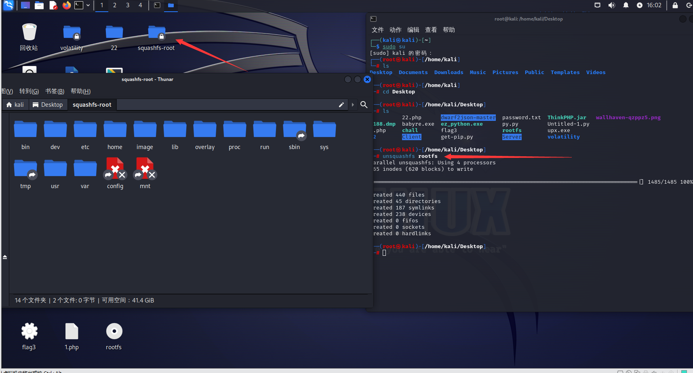

## 按文件头分类

### 68 73 71 73

#### 例子

hackthebox：https://app.hackthebox.com/challenges/Photon%2520Lockdown

#### 打开方式

rootfs 是一个压缩文件

Squashfs 是 Linux 的压缩只读文件系统。Squashfs 压缩文件、索引节点和目录。所以我们可以使用squashfs实用程序来指定unsquashfs，它将提取rootfs文件的所有内容。

之后将生成 squashfs-root 文件夹，在此文件夹中可浏览文件。