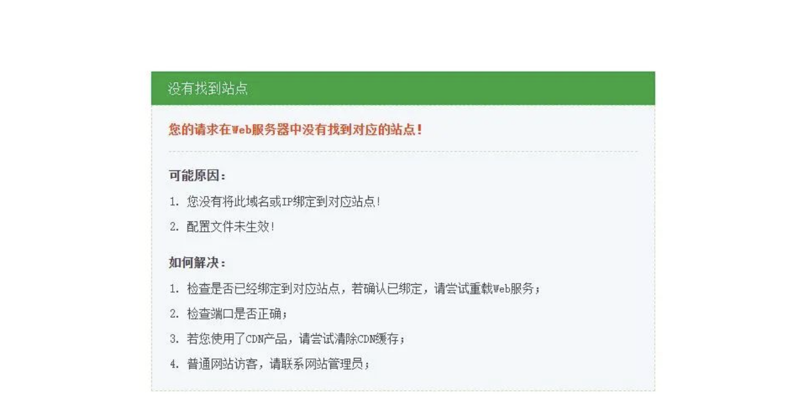
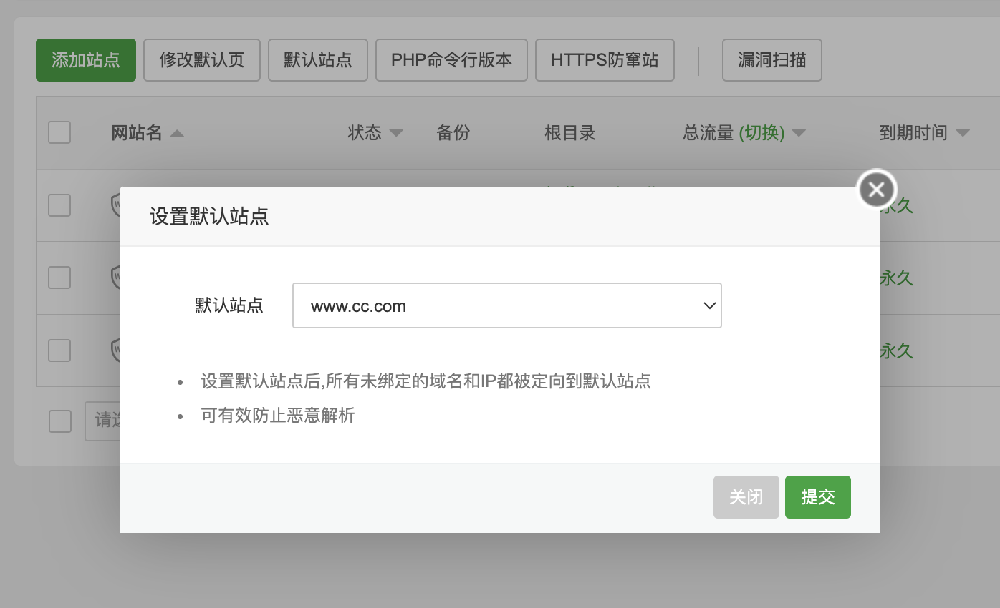
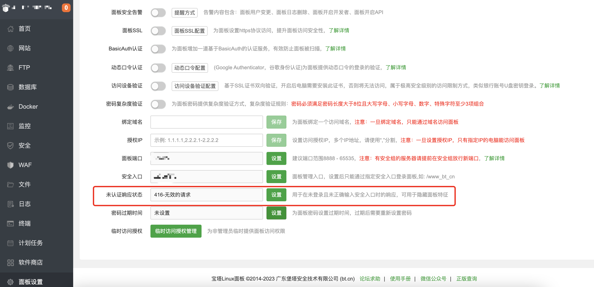
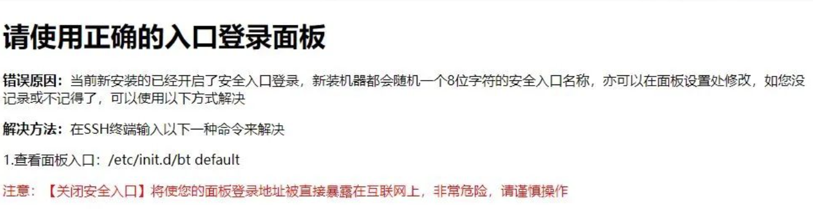
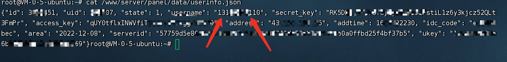
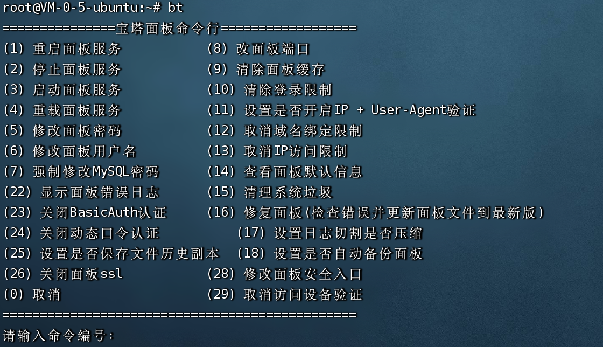
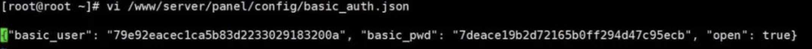

## 宝塔介绍

宝塔面板是一款服务器管理软件，支持windows和linux系统，可以通过Web端轻松管理服务器，提升运维效率。例如：创建管理网站、FTP、数据库，拥有可视化文件管理器，可视化软件管理器，可视化CPU、内存、流量监控图表，计划任务等功能。

## 宝塔使用手册

https://www.kancloud.cn/chudong/bt2017/424204

## 查看服务器是否使用了宝塔面板

1. 直接输入 服务器ip 看是否跳转到了宝塔错误页面（如果开启了默认网站或开启了未认证响应状态，则无效）
    
    
    
2. 给 服务器ip后加上宝塔面板默认端口8888 例：127.0.0.1:8888

> 新版本宝塔的默认端口会随机，此方法仅适用于旧版本宝塔面板



## 查看面板绑定完整账号

```
cat /www/server/panel/data/userInfo.json
```



## 关闭安全登录限制

通常情况下，都可以使用 `bt` + `序号` 关闭限制  



例如：关闭动态口令认证

```
bt
```

```
24
```


### 手动方法

#### 安全入口限制

```cmd
rm -rf /www/server/panel/data/admin_path.pl
```

#### ip访问限制

```cmd
rm -rf  /www/server/panel/data/limitip.conf
```

#### BasicAuth认证

用户名和密码保存在/www/server/panel/config/basic_auth.json 文件中,用户名和密码加密方式为MD5。



## 宝塔面板网站取证思路

### 重构网站

1. 可在仿真后的服务器中直接启动网站，注意要修改本机hosts文件

2. 将网站源码、数据库打包放在本地运行

> 本地运行时，需要注意服务器中的相关程序版本，同时记得修改 默认文档、伪静态、网站目录 等。

## 宝塔绕过手机号强制登录

请参考：https://github.com/weiwang3056/baota_release

> 生产环境中慎重使用开心版宝塔