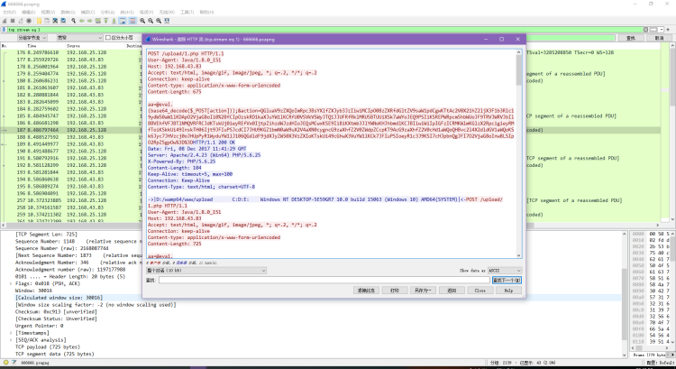

## 背景介绍
在网络犯罪和计算机取证领域，Webshell是一种常见的工具，攻击者可以通过植入Webshell来获取对受攻击服务器的控制权。因此，了解和分析Webshell工具的流量特征对于电子数据取证至关重要。

常见Webshell工具的流量特征包括：

1. 网络通信模式：Webshell工具通常会与控制服务器进行通信，通过特定的网络协议传输数据。这些通信模式与正常的网络通信模式存在差异，如使用非标准端口、频繁的连接和断开等。
2. 数据传输方式：Webshell工具可能使用加密或编码的方式传输数据，以隐藏其真实目的和内容。对于电子数据取证来说，需要解密或解码这些数据，以还原其原始内容。
3. 文件操作行为：Webshell工具通常会对服务器上的文件进行读取、写入、删除等操作。这些文件操作行为可能涉及到敏感文件、系统文件或与被攻击的Web服务器相关的文件。通过分析这些文件操作行为，可以发现潜在的Webshell存在。
4. 系统调用和命令执行：Webshell工具可能会利用系统调用和命令执行来执行一些恶意操作，如执行命令、修改系统配置等。通过监测和分析系统调用和命令执行的行为，可以发现Webshell的存在。

通过对常见Webshell工具流量特征的研究和分析，电子数据取证人员可以识别和提取相关的证据，以支持刑事调查和法律诉讼。同时，也可以为电子数据取证技术的发展和应用提供有价值的参考。
## 常见webshell工具

- 蚁剑
- 菜刀
- 冰蝎
- ……
## 流量特征
### 菜刀
中国菜刀 (Chopper) 是一款经典的网站连接工具支持的服务端脚本有 PHP、ASP、ASPX，具有文件管理数据库管理、虚拟终端等功能。它的流量特征较为明显国内主流防病毒软件/终端安全类软件都将中国菜刀视为黑客类工具进而加入病毒特征库隔离，因此大多都会报毒。 )

1. payload在请求体中，采用url编码+base64编码，payload部分是明文传输。
2. payload中有eval或assert、base64_decode这样的字符。
3. payload中有默认固定的&z0=QGluaV9zZXQ...这样base64加密的攻击载荷，参数z0对应$_POST[z0]接收到的数据，且固定为QGluaV9zZXQ开头。进行base64解码后可看到代码：@ini_set("display_errors","0");@set_time_limit(0);@set_magic_quotes_runtime(0);这段意思是首先关闭报错和magic_quotes，接下来去获取主机的信息。

 

1. `eval``assert`等函数用于执行传递的攻击payload。
2. `(base64_decode($_POST[action]))`将攻击payload 进行 base64 解码。
3. `&action=QGluaV9zZXQoImRpc3BsYXlfZXJyb3JzIiwiMCIpO0BzZXRfdGl……`，该部分是传递攻击 payload，此参数 action 对应 $POST[action] 接收到的数据。

题目来源：BUUCTF-菜刀666
### 蚁剑
蚁剑的很多源码来自菜刀，所以链接流量特征与中国菜刀很相似，但是蚁剑的扩充性很好可以对进行加密，混淆等绕过处理。蚁剑默认支持 ASP以及PHP的Webshell链接，还可以通过插件来扩展其功能。

 

1. 请求时可选择多种编码器，如果采用默认的方式，则仅进行url编码。
2. 进行连接时会进行两次请求，第一次请求的payload和菜刀相似，也是@ini_set("display_errors","0");@set_time_limit(0);@set_magic_quotes_runtime(0);意思是关闭报错和magic_quotes，接下来区获取主机信息。这段代码基本是所有WebShell客户端链接PHP类WebShell都有的一种代码。
3. 第二次请求会把主机的目录列出来。
4. 由于蚁剑中包含了很多加密、绕过插件，所以导致很多流量被加密后无法识别，但是蚁剑混淆加密后还有一个比较明显的特征，即为参数名大多以“_0x.....=”这种形式（下划线可替换为其他）所以，以_0x开头的参数名，后面为加密数据的数据包也可识别为蚁剑的流量特征。
### 冰蝎
冰蝎是一款动态二进制加密 Web 远程管理客户端，以进行动态流量加密，且加密密钥是由使用者来设定，但是该拦截器对 webshell 的需求比较高，无法连接一句话木马。

#### 冰蝎2.0

1. 使用 AES加密+base64编码发起三次请求。
2. 第一次GET请求服务端产生密钥写入 session，session 和当前会话绑定，不同的客户端的密钥也是不同的。第二次GET请求是为了获取密钥 key，服务端会生成16位的AES密钥。第三次使用 key 的AES加密进行通信，通信也采用了base64编码。
3. 进行请求时内置了十几个User-Agent头，每次请求时会随机选择其中的一个。因此当发现一个ip的请求头中的user-agent在频繁变换，就可能是冰蝎。
#### 冰蝎3.0

1. 使用AES加密+base64编码发起两次请求。 
2. 冰蝎3.0取消了动态密钥获取的请求，AES的密钥直接固定为连接密码32位md5的前16位，默认连接密码是"rebeyond"(即密钥是md5('rebeyond')[0:16]=e45e329feb5d925b)。服务端和客户端不再进行密钥的交互传递。两次请求中，第一次请求用于判断是否可以建立连接。第二次发送 phpinfo 等代码执行，获取网站的信息。
3. 其可能作为识别特征的是:Content-Type:application/octet-stream。application/octet-stream 为 http 规范中较少使用的一种 Content-Type，其含义为只能提交二进制，而且只能提交一个二进制，如果提交文件的话，只能提交一个文件 ，后台接收参数只能有一个，而且只能是流 (或者字节数组)。
#### 冰蝎4.0

1. 提供了传输协议自定义的功能，让用户对流量的加密和解密进行自定义，实现流量加解密协议的去中心化。v4.0版本不再有连接密码的概念，自定义传输协议的算法就是连接密码。
2. Accept字段（弱特征），通常是Accept: application/json, text/javascript, */*; q=0.01 意思是浏览器可接受任何文件，但最倾向application/json 和 text/javascript。
3. Content-Type字段（弱特征），通常是Content-type: Application/x-www-form-urlencoded
4. 与冰蝎的前述版本相似，进行请求时内置了十几个User-Agent头，每次请求时会随机选择其中的一个。
5. 连接的端口有一定的特征，冰蝎与webshell建立连接的同时，javaw也与目的主机建立tcp连接，每次连接使用本地端口在49700左右(就是比较大的端口)，每连接一次，每建立一次新的连接，端口就依次增加。
6. 使用长连接，避免了频繁的握手造成的资源开销。默认情况下，请求头和响应头里会带有 Connection：Keep-Alive
7. 有固定的请求头和响应头，请求字节头：dFAXQV1LORcHRQtLRlwMAhwFTAg/M ，响应字节头：TxcWR1NNExZAD0ZaAWMIPAZjH1BFBFtHThcJSlUXWEd
8. 默认时，冰蝎 webshell都有“e45e329feb5d925b” 一串密钥，与冰蝎3.0相同。
### 哥斯拉
哥斯拉是一个基于流量、HTTP 全加密的 Webshell管理工具。和冰蝎类似，哥斯拉为加密的通讯流量，因此通过流量进行检测会有很大的难度，由于 WAF 等流量检测型安全设备无法对加密的流量进行解密，因此只能采用一些比较宽泛的匹配规则进行检测。如哥斯拉客户端使用JAVA 语言编写，在默认的情况下，如果不修改 UserAgent，User-Agent 会包含Java 版本信息。

#### **攻击流程**

1. 在客户端生成shell，生成shell的时候可以设置参数，包括：密码、密钥、有效载荷、加密器。
2. 生成shell.php（文件名可自定义，根据选择的有效载荷不同，可以有jsp、php、aspx等文件格式），该shell.php需要上传到攻击的目标主机上。
3. 哥斯拉客户端进行连接。
4. 连接成功后，进入shell便可以进行操作。
#### 加密过程
##### **客户端发送的request**

1. 先对原始数据进行base64的编码
2. 然后和密钥key按位异或（这个密钥key是取shellsetting时自定义设置的那个密钥的md5值前16位。）
3. 将得到的数据再base64一次，再url编码一次。
4. 最后将得到的数据与密码进行拼接。
5. 相对应的加密函数
#### 动态特征

- User-Agent字段（弱特征），如果采用默认的情况，会暴露使用的jdk信息。不过哥斯拉支持自定义HTTP头部，这个默认特征是可以很容易去除的。
- Accept字段（弱特征），默认是Accept:text/html, image/gif, image/jpeg, *; q=.2, /; q=.2。同上，这个也可修改，只能作为辅助检测的特征。
- Cookie中有一个非常关键的特征，最后会有个分号。估计后续的版本会修复。
- 响应体的数据有一定特征，哥斯拉会把一个32位的md5字符串按照一半拆分，分别放在base64编码的数据的前后两部分。整个响应包的结构体征为：md5前十六位+base64+md5后十六位。

## 参考文章

1. [webshell管理工具的流量特征分析（菜刀、蚁剑、冰蝎、哥斯拉）][https://blog.csdn.net/Bossfrank/article/details/130502488](https://blog.csdn.net/Bossfrank/article/details/130502488)
2. [冰蝎、蚁剑、哥斯拉的流量特征][https://www.cnblogs.com/-andrea/p/17473499.html](https://www.cnblogs.com/-andrea/p/17473499.html)
3. [取证实录2023年2季度]
4. [六方云分享丨哥斯拉v1.0加密分析及特征流量提取][https://baijiahao.baidu.com/s?id=1757791239277975531&wfr=spider&for=pc](https://baijiahao.baidu.com/s?id=1757791239277975531&wfr=spider&for=pc)